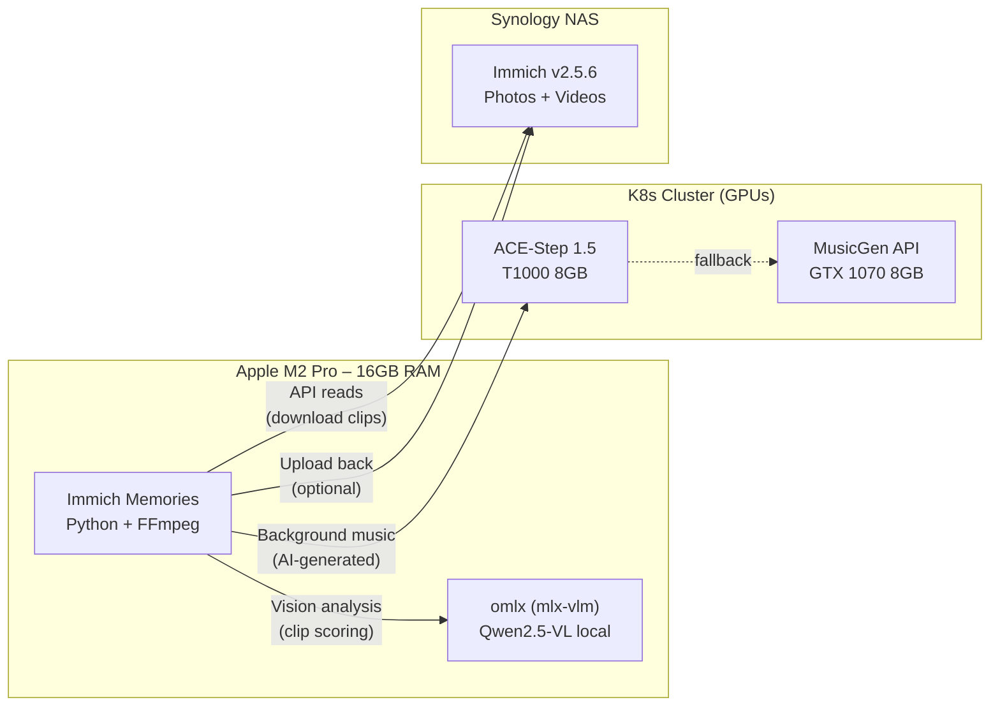

# Immich Memories

[](https://github.com/sam-dumont/immich-video-memory-generator/actions/workflows/ci.yml)
[](https://codecov.io/gh/sam-dumont/immich-video-memory-generator)
[](https://scorecard.dev/viewer/?uri=github.com/sam-dumont/immich-video-memory-generator)
[](https://github.com/sam-dumont/immich-video-memory-generator/actions/workflows/release.yml)
[](https://pypi.org/project/immich-memories/)
[](LICENSE)
[](https://sam-dumont.github.io/immich-video-memory-generator/)

**Turn your [Immich](https://immich.app/) photo library into video memory compilations with music, title screens, and smart cuts.**

Immich Memories connects to your self-hosted Immich server, selects the best moments from your videos *and* photos, and compiles them into shareable memory videos. Year-end recaps, trip highlights, person spotlights, seasonal compilations, monthly highlights, "on this day" flashbacks -- all from a single tool.

> **Full documentation**: [sam-dumont.github.io/immich-video-memory-generator](https://sam-dumont.github.io/immich-video-memory-generator/)

### Reference Setup



*The LLM runs locally on the Mac via [omlx](https://github.com/nicepkg/omlx) (Apple Silicon MLX). Music generation runs on a K8s cluster with dedicated GPUs. Both are optional — the tool works without them, just without AI clip descriptions and generated music.*

---

## Docker (recommended for self-hosters)

```bash
# 1. Download the compose file
curl -O https://raw.githubusercontent.com/sam-dumont/immich-video-memory-generator/main/docker-compose.yml

# 2. Set your Immich connection
export IMMICH_URL="http://your-immich-server:2283"
export IMMICH_API_KEY="your-api-key"

# 3. Start
docker compose up -d

# 4. Open http://localhost:8080
```

### Resource Requirements

| Phase | RAM | CPU | Time estimate |
|-------|-----|-----|---------------|
| Idle (UI) | ~100MB | minimal | — |
| Analyzing clips | 2-4GB | 2+ cores | ~1 min per 10 clips |
| Encoding (1080p) | 4GB | 4 cores | ~2 min for 5 min video |
| Encoding (4K) | 6-8GB | 4+ cores | ~5 min for 5 min video |

Default Docker limits: 4GB RAM, 4 CPUs. This is **not a NAS app** — video analysis and encoding need real compute. Best run on a machine with 8GB+ RAM.

> **Developed and tested on:** Apple M2 Pro, 16GB RAM, macOS. Not yet tested on other hardware. If you run it on Linux/x86, Synology, Unraid, or Raspberry Pi — please [report your experience](https://github.com/sam-dumont/immich-video-memory-generator/issues).

### Supported Immich Versions

Developed and tested against **Immich v2.5.6**. Should work with v1.100+ (uses the `/api/` endpoint prefix), but no guarantees for older versions.

### Optional: LLM for smart clip analysis

For AI-powered content analysis (identifies what's happening in each clip), point to any OpenAI-compatible vision model:

```yaml
# In ~/.immich-memories/config.yaml
advanced:
  llm:
    provider: "openai-compatible"
    base_url: "http://your-llm-server:8080/v1"
    model: "qwen2.5-vl"
```

## Quick Install

```bash
# One-liner (no clone needed)
uvx immich-memories --help

# Or clone and install
git clone https://github.com/sam-dumont/immich-video-memory-generator.git
cd immich-video-memory-generator
uv sync
```

## Quick Start

```bash
# 1. Configure
mkdir -p ~/.immich-memories
cat > ~/.immich-memories/config.yaml << EOF
immich:
  url: "https://photos.example.com"
  api_key: "your-api-key-here"
EOF

# 2. Launch the UI
immich-memories ui
# Opens at http://localhost:8080

# 3. Or use the CLI
immich-memories generate --year 2024 --person "John" --output ~/Videos/john_2024.mp4
```

## Key Features

- **Videos + Photos** — Unified selection pool: videos, photos (Ken Burns / face-aware pan), and Live Photos
- **7 Memory Types** — Year in Review, Season, Person Spotlight, Multi-Person, Monthly Highlights, On This Day, Trip
- **Smart Clip Selection** — Scene detection, interest scoring, duplicate filtering, temporal coverage
- **Cinematic Titles** — GPU-rendered title screens with globe animations, satellite maps, month dividers
- **Face-Aware Cropping** — Keeps faces centered when converting aspect ratios
- **Hardware Acceleration** — NVIDIA NVENC, Apple VideoToolbox, Intel QSV, AMD VAAPI
- **AI Music Generation** — ACE-Step or MusicGen with automatic mood detection and audio ducking
- **Privacy Mode** — Blur all video, muffle audio, anonymize GPS/names for demos
- **Smart Automation** — `auto suggest` detects interesting memories, `auto run` generates them on a schedule
- **Authentication** — Basic auth, OIDC/SSO (Auth0, Authelia, Keycloak), or trusted header proxy
- **Web UI + CLI** — 4-step wizard or headless automation
- **Docker & Kubernetes** — Containerized deployment with GPU support

## Documentation

See the [full documentation](https://sam-dumont.github.io/immich-video-memory-generator/) for:

- [Installation](https://sam-dumont.github.io/immich-video-memory-generator/docs/deploy/installation/docker) (Docker, uv/pip, Kubernetes, Terraform)
- [Web UI Walkthrough](https://sam-dumont.github.io/immich-video-memory-generator/docs/create/web-ui/step1-configuration)
- [CLI Reference](https://sam-dumont.github.io/immich-video-memory-generator/docs/reference/cli-reference)
- [Configuration](https://sam-dumont.github.io/immich-video-memory-generator/docs/deploy/configuration/config-file)
- [Hardware Acceleration](https://sam-dumont.github.io/immich-video-memory-generator/docs/deploy/hardware/overview)
- [Audio & Music](https://sam-dumont.github.io/immich-video-memory-generator/docs/create/pipeline/audio-and-music)
- [Recipes](https://sam-dumont.github.io/immich-video-memory-generator/docs/create/recipes/birthday-compilations) (birthday compilations, automation, best practices)

## Development

```bash
make dev      # Install all dependencies
make check    # Run all checks (lint, format, typecheck, tests)
make ci       # Full CI pipeline
make help     # Show all available targets
```

See [CONTRIBUTING.md](CONTRIBUTING.md) for guidelines.

## Built with AI

> This entire codebase was written with AI (Claude) as an experiment in building complex
> software cleanly with AI assistance. 3,900+ tests, 20+ CI quality gates, 225 source modules.
> See [DISCLAIMER.md](DISCLAIMER.md) for the full story.

## License

MIT License — see [LICENSE](LICENSE) for details.

---

**Made with ❤️ for the Immich community**
