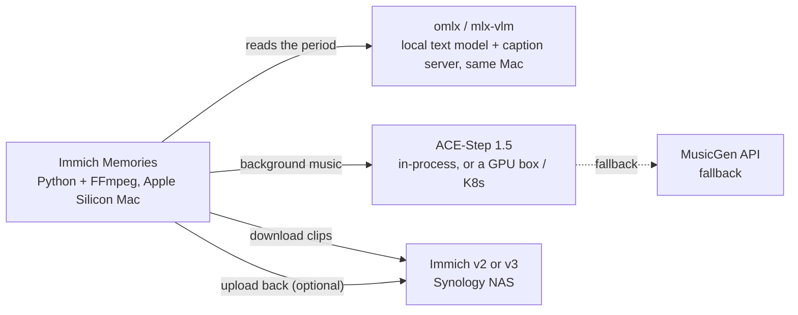

# Immich Memories

[](https://github.com/sam-dumont/immich-video-memory-generator/actions/workflows/ci.yml)
[](https://codecov.io/gh/sam-dumont/immich-video-memory-generator)
[](https://scorecard.dev/viewer/?uri=github.com/sam-dumont/immich-video-memory-generator)
[](https://github.com/sam-dumont/immich-video-memory-generator/actions/workflows/release.yml)
[](https://pypi.org/project/immich-memories/)
[](LICENSE)
[](https://sam-dumont.github.io/immich-video-memory-generator/)

> **Beta, under heavy rework, not stable.** The selection engine has just been replaced by a
> story-driven editor, and `main` and the `latest` Docker tag move with the work that follows.
> Expect runs that fail, photos that go missing, and options that move between releases. Try it
> on one small album first, not your whole library, and file what breaks.

**Cuts your [Immich](https://immich.app/) library into edited memory videos: title screens, music, and only the good five seconds of each clip.**

It connects to your self-hosted Immich server and runs a real editor over your library: a small
vision model captions every picture once, a text model reads the period as a story and weighs its
stories in words, and every picture in the cut carries the one line that says why it is there — a
year in review, a trip with its map, one person across the years. Always chronological, favourites
as indicators rather than gates, and when it can't name a day honestly it refuses rather than
faking it. How it decides is documented in
[The Curator](https://sam-dumont.github.io/immich-video-memory-generator/docs/create/pipeline/the-curator).

> **Full documentation**: [sam-dumont.github.io/immich-video-memory-generator](https://sam-dumont.github.io/immich-video-memory-generator/)

<p align="center">
  <a href="https://sam-dumont.github.io/immich-video-memory-generator/docs/welcome/overview">
    
  </a>
  <br/>
  <sub><a href="https://sam-dumont.github.io/immich-video-memory-generator/docs/welcome/overview">▶ Watch the 60-second demo</a> · <a href="https://sam-dumont.github.io/immich-video-memory-generator/docs/create/first-memory">Make your first memory</a></sub>
  <br/>
  <sub>The GIF predates the new UI and still shows the four-step wizard; the demo video on the docs site shows the Memory page.</sub>
</p>

**Why:** you left Google Photos for Immich and lost the year-in-review / trip / "your kid's year" videos. This brings them back: on your hardware, with pictures you can veto and music that isn't canned. AI music and LLM titles are optional extras; the render runs on CPU, and the models the editor reads with can run on the same box.

---

## Docker (recommended for self-hosters)

```bash
curl -O https://raw.githubusercontent.com/sam-dumont/immich-video-memory-generator/main/docker-compose.yml
export IMMICH_URL="http://your-immich-server:2283"
export IMMICH_API_KEY="your-api-key"
docker compose up -d     # then open http://localhost:8080
```

> **The compose file publishes port 8080 on localhost only.** Authentication is disabled by
> default, and the app holds an Immich API key to your whole library — anyone who can reach the
> port can use it. To get to the UI from another machine, enable
> [authentication](https://sam-dumont.github.io/immich-video-memory-generator/docs/deploy/configuration/authentication)
> first, then change the mapping to `"8080:8080"`. The UI is single-user, single-replica; run one
> instance.

### Resource Requirements

Time depends mostly on where the caption server and the text model run, and on whether the period
has been prepared before. Facts and readings are cached, so the first cut over a period is the slow one.

| Phase | RAM | CPU | Apple Silicon / GPU | CPU-only (4-core NAS class) |
|-------|-----|-----|---------------------|-----------------------------|
| Idle (UI) | ~100MB | minimal | — | — |
| Preparing pictures (first cut) | 2-4GB | 2+ cores | one caption request and one encoder pass per picture; not yet measured on this route | same, slower on the encoder |
| Assembling 1080p | 4GB | 4 cores | ~2 min per 5 min of output | ~10-16 min for a 14-clip monthly (measured) |
| Assembling 4K | 6-8GB | 4+ cores | ~5 min per 5 min of output | not recommended |

Most of that assembly time is the title screens, not the encode: measured at 2 CPUs, title
rendering took ~263 s of a ~339 s assembly, so read
[CPU-Only Mode](https://sam-dumont.github.io/immich-video-memory-generator/docs/deploy/hardware/cpu-only)
before you buy a GPU for the encoder.

Measured once for calibration (2026-08-18): a 14-clip monthly at 1080p, cold cache, in the Docker
image with `--cpus=4 --memory=4g` and no GPU took **10 min with `preset: fast`** and 15.7 min with
the default profile (4 M5 Max cores; a Celeron-class NAS is 2-3× slower). `preset: fast` swaps in
1080p H.264, a fast encoder, static titles and no speech pass; explicit settings still win over it. The
[NAS-only guide](https://sam-dumont.github.io/immich-video-memory-generator/docs/deploy/common-setups/nas-only)
has the Celeron-class table. Field reports from Synology, Unraid, Proxmox and Raspberry Pi are
welcome: [open an issue](https://github.com/sam-dumont/immich-video-memory-generator/issues).

## Without Docker

```bash
uvx immich-memories --help          # no clone needed

mkdir -p ~/.immich-memories
cat > ~/.immich-memories/config.yaml << EOF
immich:
  url: "https://photos.example.com"
  api_key: "your-api-key-here"
EOF

immich-memories ui                  # web UI on http://localhost:8080
immich-memories generate --year 2024 --person "John" --output ~/Videos/john_2024.mp4
```

### Supported Immich Versions

Immich Memories supports **Immich v2 and v3**, detected at runtime:

```yaml
immich:
  api_version: auto  # auto | v2 | v3
```

Leave this on `auto`. The app detects the server major version and uses the matching API contract;
you do not choose a version for each run. The explicit `v2` and `v3` values are manual
troubleshooting overrides: escape hatches for proxies or unusual deployments that hide or rewrite
the version endpoint. They force that contract, so don't use them as upgrade flags.

`immich-memories config test` reports the detected contract and checks your credentials without
generating or uploading anything.

### Editorial model setup

The editor reads; it does not score. Before its first cut it needs three things, all of which can
run on your own hardware:

- a **caption server** for a public 500M vision model, on any OpenAI-compatible endpoint — it
  describes every picture once, and the description is kept;
- the pinned **DINOv2-small encoder** and two CPU **detectors** — `pip install "immich-memories[editorial]"`
  plus the pinned weights;
- a **text model** on any OpenAI-compatible chat endpoint — it reads the period, weighs its
  stories and picks the moments. Developed and tested against Qwen3.6-27B and Qwen3.6-35B-A3B.

A cut with one of them missing stops and says which. The pinned versions, digests and the
caption server contract are on
[Editorial annotation setup](https://sam-dumont.github.io/immich-video-memory-generator/docs/deploy/configuration/editorial-preparation).

```yaml
# In ~/.immich-memories/config.yaml
advanced:
  llm:
    provider: "openai-compatible"
    base_url: "http://your-llm-server:8000/v1"
    model: "mlx-community/Qwen3.6-27B-8bit"
  editorial:
    preparation:
      caption_base_url: "http://localhost:8092/v1"
```

## What it does

- Reads the period as a story: every eligible picture gets a caption and facts once, the text
  model weighs the period's stories in words (dominant, major, minor, glimpse), and each story is
  granted the pictures its weight earns — capped by the moments it actually holds. No clip scores,
  no ranking against a bar; when the moments run out the film is shorter, and it says so.
- 10 memory types: year in review, monthly, person spotlight, multi-person, season, on this day,
  album, trip (GPS-detected, with an animated satellite map fly-over), holiday, and surprise me —
  a day the library itself flagged, found by `discover-days` rather than asked for. The web UI
  offers the same ten plus a custom date range.
- Photos share one pool with videos: Ken Burns, face-aware pan, blurred fill behind anything that
  doesn't fill the frame. A Live Photo plays its motion when the editor thinks it earns it, and is
  held as a still otherwise.
- Title screens with satellite map fly-overs, month dividers and particles, GPU-rendered through
  Taichi (static PIL titles without it). This is what makes the output look edited, not concatenated.
- Music: bring your own file, use the 28 bundled tracks (the `music` extra, already in the Docker
  image), or generate with ACE-Step or MusicGen. Ducking drops the music when someone talks.
- Runs as a one-page web UI — brief, cut, story, export — (basic auth, OIDC/SSO, or a trusted
  header proxy) or a headless CLI, in Docker, Kubernetes or a plain venv. Every cut is kept under
  the cache directory with the plan and the reason for every picture. Privacy mode blurs and mutes
  everything for demos.

## Daily automation

Schedule one daily `immich-memories auto run`. It retries the oldest pending Immich upload if a
finished video still needs delivering, otherwise it generates a single eligible memory: never
several in one invocation. It ends `skipped`, `dry_run`, `completed` or `failed`, only `failed`
exits non-zero, and `--quiet` gives a scheduler stable JSON to read. In Docker skip cron entirely:
`IMMICH_MEMORIES_AUTOMATION__ENABLED=true` (plus `…__DAILY_AT=09:00`) and the UI process runs that
same decision once a day. The variety rules that stop it repeating itself are in the
[auto CLI docs](https://sam-dumont.github.io/immich-video-memory-generator/docs/create/cli/auto).

## Documentation

The [full documentation](https://sam-dumont.github.io/immich-video-memory-generator/) covers
installation (Docker, uv/pip, Kubernetes, Terraform), the web UI walkthrough, the
[CLI reference](https://sam-dumont.github.io/immich-video-memory-generator/docs/reference/cli-reference),
every [config key](https://sam-dumont.github.io/immich-video-memory-generator/docs/deploy/configuration/config-file),
hardware acceleration, [audio and music](https://sam-dumont.github.io/immich-video-memory-generator/docs/create/pipeline/audio-and-music)
and per-setup recipes.

## How the maintainer runs it


```mermaid
graph LR
    IM["Immich Memories<br/>Python + FFmpeg, Apple Silicon Mac"]
    LLM["omlx / mlx-vlm<br/>local text model + caption server, same Mac"]
    ACE["ACE-Step 1.5<br/>in-process, or a GPU box / K8s"]
    MG["MusicGen API<br/>fallback"]
    Immich["Immich v2 or v3<br/>Synology NAS"]

    IM -->|"download clips"| Immich
    IM -->|"reads the period"| LLM
    IM -->|"background music"| ACE
    ACE -.->|"fallback"| MG
    IM -->|"upload back (optional)"| Immich
```

*One example, not a requirement. The music generator is optional: without it you get your own
music, or silence. The text model and the caption server are not — the editor reads with them —
but they speak any OpenAI-compatible endpoint, local ([omlx](https://github.com/nicepkg/omlx)) or not.*

## Development

`make dev` installs everything, `make ci` runs the full pipeline, `make help` lists the rest.
Guidelines in [CONTRIBUTING.md](CONTRIBUTING.md).

## Built with AI

> This entire codebase was written with AI (Claude) as an experiment in building complex
> software cleanly with AI assistance. 8,700+ tests (600+ of them integration/E2E),
> 20 static analysis gates in CI (15 quality, 5 security), 490+ source modules.
> See [DISCLAIMER.md](DISCLAIMER.md) for the full story.

## License

MIT License, see [LICENSE](LICENSE) for details.
