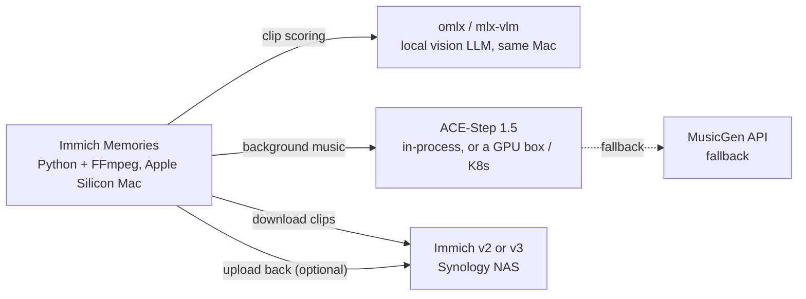

# Immich Memories

[](https://github.com/sam-dumont/immich-video-memory-generator/actions/workflows/ci.yml)
[](https://codecov.io/gh/sam-dumont/immich-video-memory-generator)
[](https://scorecard.dev/viewer/?uri=github.com/sam-dumont/immich-video-memory-generator)
[](https://github.com/sam-dumont/immich-video-memory-generator/actions/workflows/release.yml)
[](https://pypi.org/project/immich-memories/)
[](LICENSE)
[](https://sam-dumont.github.io/immich-video-memory-generator/)

**Turn your [Immich](https://immich.app/) photo library into video memory compilations with music, title screens, and smart cuts.**

Immich Memories connects to your self-hosted Immich server, selects the best moments from your videos *and* photos, and compiles them into shareable memory videos: year-end recaps, trip highlights, person spotlights, seasonal compilations, monthly highlights, "on this day" flashbacks.

> **Full documentation**: [sam-dumont.github.io/immich-video-memory-generator](https://sam-dumont.github.io/immich-video-memory-generator/)

<p align="center">
  <a href="https://sam-dumont.github.io/immich-video-memory-generator/docs/welcome/overview">
    
  </a>
  <br/>
  <sub><a href="https://sam-dumont.github.io/immich-video-memory-generator/docs/welcome/overview">▶ Watch the 60-second demo</a> · <a href="https://sam-dumont.github.io/immich-video-memory-generator/docs/create/first-memory">Make your first memory</a></sub>
</p>

**Why:** you left Google Photos for Immich and lost the year-in-review / trip / "your kid's year" videos. This brings them back: on your hardware, with clips you can veto and music that isn't canned. LLM titles and AI music are optional extras; the core pipeline runs on CPU.

---

## Docker (recommended for self-hosters)

```bash
curl -O https://raw.githubusercontent.com/sam-dumont/immich-video-memory-generator/main/docker-compose.yml
export IMMICH_URL="http://your-immich-server:2283"
export IMMICH_API_KEY="your-api-key"
docker compose up -d     # then open http://localhost:8080
```

> **Do not expose the default UI as-is.** Authentication is disabled by default, and the
> container listens on `0.0.0.0`. Anyone who can reach port 8080 can use it. Enable
> [authentication](https://sam-dumont.github.io/immich-video-memory-generator/docs/deploy/configuration/authentication)
> before publishing the port. The UI is single-user, single-replica; run one instance.

### Resource Requirements

Time depends mostly on whether analysis runs on a GPU/Apple Silicon or a CPU-only box. Results are
cached, so the first run of a library is the slow one.

| Phase | RAM | CPU | Apple Silicon / GPU | CPU-only (4-core NAS class) |
|-------|-----|-----|---------------------|-----------------------------|
| Idle (UI) | ~100MB | minimal | — | — |
| Analyzing clips (first run) | 2-4GB | 2+ cores | ~1 min per 10 clips | ~1-2 min per clip |
| Assembling 1080p | 4GB | 4 cores | ~2 min per 5 min of output | ~15 min for a 30-clip video |
| Assembling 4K | 6-8GB | 4+ cores | ~5 min per 5 min of output | not recommended |

Most of that assembly time is the title screens, not the encode: measured at 2 CPUs, title
rendering took ~263 s of a ~339 s assembly, so read
[CPU-Only Mode](https://sam-dumont.github.io/immich-video-memory-generator/docs/deploy/hardware/cpu-only)
before you buy a GPU for the encoder.

Measured once for calibration (2026-08-18): a 14-clip monthly at 1080p, cold cache, in the Docker
image with `--cpus=4 --memory=4g` and no GPU took **10 min with `preset: fast`** and 15.7 min with
the default profile (4 M5 Max cores; a Celeron-class NAS is 2-3× slower). `preset: fast` swaps in
1080p H.264, a fast encoder, static titles, no speech pass and favorites-first analysis; explicit
settings still win over it. The
[NAS-only guide](https://sam-dumont.github.io/immich-video-memory-generator/docs/deploy/common-setups/nas-only)
has the Celeron-class table. Field reports from Synology, Unraid, Proxmox and Raspberry Pi are
welcome: [open an issue](https://github.com/sam-dumont/immich-video-memory-generator/issues).

## Without Docker

```bash
uvx immich-memories --help          # no clone needed

mkdir -p ~/.immich-memories
cat > ~/.immich-memories/config.yaml << EOF
immich:
  url: "https://photos.example.com"
  api_key: "your-api-key-here"
EOF

immich-memories ui                  # web wizard on http://localhost:8080
immich-memories generate --year 2024 --person "John" --output ~/Videos/john_2024.mp4
```

### Supported Immich Versions

Immich Memories supports **Immich v2 and v3**, detected at runtime:

```yaml
immich:
  api_version: auto  # auto | v2 | v3
```

Leave this on `auto`. The app detects the server major version and uses the matching API contract;
you do not choose a version for each run. The explicit `v2` and `v3` values are manual
troubleshooting overrides—escape hatches for proxies or unusual deployments that hide or rewrite
the version endpoint. They force that contract, so don't use them as upgrade flags.

`immich-memories config test` reports the detected contract and checks your credentials without
generating or uploading anything.

### Optional: LLM for smart clip analysis

Everything runs on your own hardware by default: analysis, encoding, titles, music. The LLM below
is the one piece you can point somewhere else, and it speaks any OpenAI-compatible endpoint. That
path exists for people who don't have the hardware or the patience to run a local model, not
because the tool needs a cloud.

```yaml
# In ~/.immich-memories/config.yaml
advanced:
  llm:
    provider: "openai-compatible"
    base_url: "http://your-llm-server:8080/v1"
    model: "qwen2.5-vl"
```

## What it does

- Scores every clip on faces (35% of the weight), motion, camera stability and audio, then keeps
  the best ~5 seconds of a 45-second recording instead of all 45. LLM scene understanding is an
  optional fifth signal.
- 10 memory types: year in review, monthly, person spotlight, multi-person, season, on this day,
  holiday, then-and-now, trip (GPS-detected, with an animated satellite map fly-over) and album.
  The wizard shows 11 cards: those ten plus Custom.
- Photos share one selection pool with videos: Ken Burns, face-aware pan, blurred fill behind
  anything that doesn't fill the frame. Live Photos are scored like any other clip.
- Title screens with satellite map fly-overs, month dividers and particles, GPU-rendered through
  Taichi (static PIL titles without it). This is what makes the output look edited, not concatenated.
- Music: bring your own file, use the 28 bundled tracks (the `music` extra, already in the Docker
  image), or generate with ACE-Step or MusicGen. Ducking drops the music when someone talks.
- Runs as a 4-step web wizard (basic auth, OIDC/SSO, or a trusted header proxy) or a headless CLI,
  in Docker, Kubernetes or a plain venv. Privacy mode blurs and mutes everything for demos.

## Daily automation

Schedule one daily `immich-memories auto run`. It retries the oldest pending Immich upload if a
finished video still needs delivering, otherwise it generates a single eligible memory: never
several in one invocation. It ends `skipped`, `dry_run`, `completed` or `failed`, only `failed`
exits non-zero, and `--quiet` gives a scheduler stable JSON to read. In Docker skip cron entirely:
`IMMICH_MEMORIES_AUTOMATION__ENABLED=true` (plus `…__DAILY_AT=09:00`) and the UI process runs that
same decision once a day. The variety rules that stop it repeating itself are in the
[auto CLI docs](https://sam-dumont.github.io/immich-video-memory-generator/docs/create/cli/auto).

## Documentation

The [full documentation](https://sam-dumont.github.io/immich-video-memory-generator/) covers
installation (Docker, uv/pip, Kubernetes, Terraform), the web UI walkthrough, the
[CLI reference](https://sam-dumont.github.io/immich-video-memory-generator/docs/reference/cli-reference),
every [config key](https://sam-dumont.github.io/immich-video-memory-generator/docs/deploy/configuration/config-file),
hardware acceleration, [audio and music](https://sam-dumont.github.io/immich-video-memory-generator/docs/create/pipeline/audio-and-music)
and per-setup recipes.

## How the maintainer runs it


```mermaid
graph LR
    IM["Immich Memories<br/>Python + FFmpeg, Apple Silicon Mac"]
    LLM["omlx / mlx-vlm<br/>local vision LLM, same Mac"]
    ACE["ACE-Step 1.5<br/>in-process, or a GPU box / K8s"]
    MG["MusicGen API<br/>fallback"]
    Immich["Immich v2 or v3<br/>Synology NAS"]

    IM -->|"download clips"| Immich
    IM -->|"clip scoring"| LLM
    IM -->|"background music"| ACE
    ACE -.->|"fallback"| MG
    IM -->|"upload back (optional)"| Immich
```

*One example, not a requirement. Both the LLM ([omlx](https://github.com/nicepkg/omlx)) and the music
generator are optional: without them you get template titles and your own music, or silence.*

## Development

`make dev` installs everything, `make ci` runs the full pipeline, `make help` lists the rest.
Guidelines in [CONTRIBUTING.md](CONTRIBUTING.md).

## Built with AI

> This entire codebase was written with AI (Claude) as an experiment in building complex
> software cleanly with AI assistance. 5,600+ tests (5,000+ unit, 600+ integration/E2E),
> 20 static analysis gates in CI (15 quality, 5 security), 300+ source modules.
> See [DISCLAIMER.md](DISCLAIMER.md) for the full story.

## License

MIT License, see [LICENSE](LICENSE) for details.
