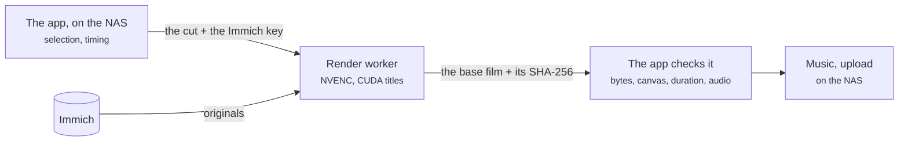

# Render on a GPU box

Reader: power user.

On a plain NAS the render is the long part of every run: what the editor read is banked, the
encode is not, so a second cut of the same month still encodes the whole film on the NAS's cores.
The render worker takes that one stage to a machine with an NVIDIA card. Selection stays on the
NAS, and so do music and the upload back to Immich.



## What it holds

Every job carries the app's own Immich API key, the same one with the same permissions, so the
worker can fetch the selected originals itself. It keeps the key in memory for the job and redacts
it from its messages, but anyone who controls the worker process can read it. Run the worker
somewhere you trust as much as the NAS. If the app never uploads back, give it a read-and-download
key, and that is then all the worker holds.

## Set it up

Use the same app version on both sides: the app refuses a worker on another version before it
sends any footage. On the GPU box, with the NVIDIA container toolkit installed, copy
[`services/render-worker/compose.yaml`](https://github.com/sam-dumont/immich-video-memory-generator/blob/main/services/render-worker/compose.yaml)
into an empty directory with this `.env`:

```dotenv
IMMICH_MEMORIES_IMAGE=ghcr.io/sam-dumont/immich-video-memory-generator:YOUR_APP_TAG
IMMICH_URL=https://photos.example.com
RENDER_WORKER_TOKEN=replace-with-openssl-rand-hex-32
RENDER_BIND_ADDRESS=192.168.1.50    # the worker's LAN address; 127.0.0.1 behind a reverse proxy
```

`docker compose up -d` starts it on port 8093. For Kubernetes the same folder has
`kubernetes.yaml`: it wants a Secret with `token` and `immich-url`, one NVIDIA device and the
`nvidia` runtime class. Every worker setting is in the
[worker's README](https://github.com/sam-dumont/immich-video-memory-generator/tree/main/services/render-worker).

Then on the NAS:

```yaml
render:
  worker_base_url: https://render.example.com
  worker_token: ${RENDER_WORKER_TOKEN}
  fallback_to_local: false
```

The request carries your Immich key, so a non-loopback `http://` worker is refused until you set
`render.allow_insecure_http: true` to say the network is trusted. HTTPS needs no opt-in.

## Check it

```bash
immich-memories preflight -v
```

It reports the worker's reachability, version, CUDA titles and encoders. The worker's own
`/health` says `accelerated: true` only when the CUDA title kernels and NVENC both opened; false on
a box with a card usually means `NVIDIA_DRIVER_CAPABILITIES` lacks `video`
([NVIDIA prerequisites](../run/hardware.md#nvidia)).

## What to expect

- A worker failure fails the run. `fallback_to_local: true` renders the same cut on the NAS instead
  and says so.
- A worker that can't open NVENC still renders, in software, and reports it on `/health` and in the
  job record. A dropped clip is a failed job, never a different film.
- Output is H.264 or H.265 MP4. MOV and ProRes render locally.
- When the film the NAS downloads matches the worker's digest, the NAS keeps the worker's decode
  check instead of decoding the film again, unless music was mixed in.

How long a handoff takes against a NAS render is on [Measured](./measured.md).
