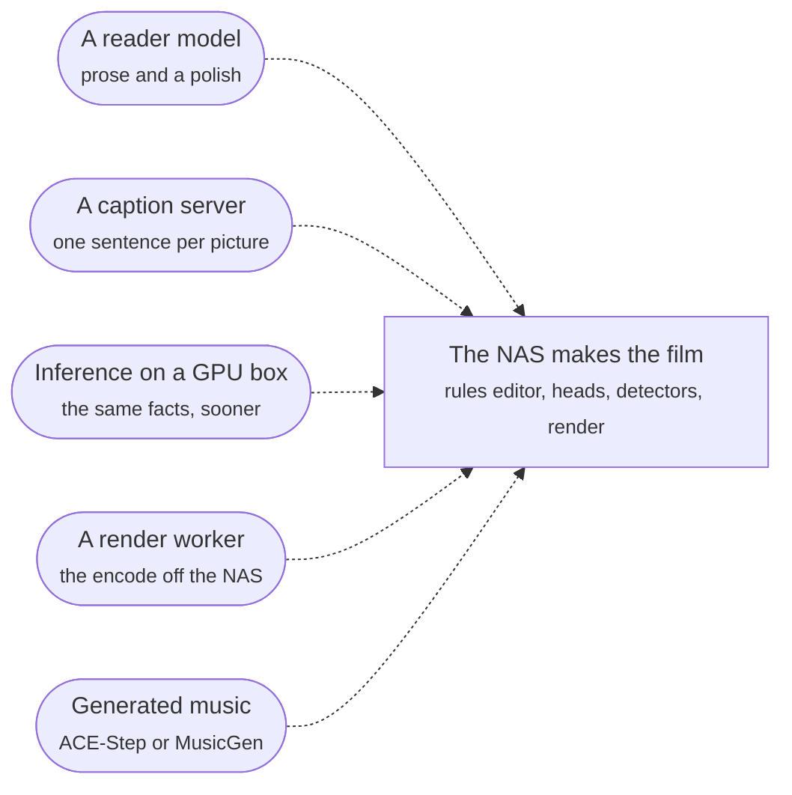

# What a model adds, what it costs

Reader: newcomer and power user.

Immich Memories works on a plain NAS: one container, one `models fetch`, and the whole film gets
made there. Each add-on on this page makes it better or faster. None is required, they all plug
into the same install, and what each one works out is banked beside what the NAS already has, so
turning one off later loses nothing and re-reads nothing.

## The add-ons

| Add-on | What it buys | What it needs | What leaves the box |
|---|---|---|---|
| [A reader](./reader.md) | Prose (what happened in each episode, an account of the period, the title, the music's mood) and a polish of the draft | A text model with a 32k context: local (about 17 GB resident for the graded 30B at 4-bit) or a hosted API key | The candidates' annotation lines, people and place names included, to the model. Never a picture |
| [Captions](./captions.md) | One sentence under every picture. The reader reads it, and a caption lets the family-viewing check see the private moments no detector does, before a picture goes into a shareable film | A 500M vision model behind any OpenAI-compatible server, 1 to 2 GB | A 400 px tile of each picture, once, to your caption server |
| [Inference on a GPU box](./inference.md) | The encoder, its eight heads and the two detectors on a card or a bigger CPU | A second machine, CPU or NVIDIA | A preview of each picture, once, to your service |
| [A render worker](./gpu-render.md) | The encode on a GPU box instead of the NAS | An NVIDIA box running the same app version | The chosen cut and your Immich key; the worker fetches the originals itself |
| [Generated music](./music.md) | An original track per film instead of a bundled one | ACE-Step on a Mac or an NVIDIA box (7 to 29 GB free for its weights), or a MusicGen server | A text prompt (mood, tempo, length) to your music server |

Every destination defaults to `localhost` or off. Pointing one at another host is the consent step,
and [Privacy](../run/privacy.md) lists every switch.

## What the model does, and what it doesn't

The rules editor makes the film on every tier. With a reader configured it still builds the draft,
from dates, places, favourites, known people and what the heads said. The model then does two
things with it:

- **It writes the prose.** It reads the episodes the draft's shots sit in (only those, not the
  whole period), says what happened in each, then writes an account of the period, a title and a
  mood for the music. All of it is banked, so the next film over the same weeks reads nothing again.
- **It polishes.** It reads the finished draft in blocks of 12 shots and names the ones that add
  nothing. A shot both of its readings name leaves, one named once is offered a better replacement
  from its own story, and favourites, a close relative's only shot and a record the catalogue holds
  stay put. So does a year's only shot in a film that gives every year a voice, and a year whose
  every shot is named keeps one. A refill that picks a picture takes its moment's favourite instead
  when the page has one. It drops and refills; it never re-plans the film or adds a story. On the `full` tier it
  also answers the family-viewing check's activity question (a bath, a nappy change) from each
  shot's caption.

No model looks at a picture while a film is cut, on any tier. A model looks at each picture once,
at ingest (the caption model on `full`, the heads and the detectors), and everything after that is
text over what ingest banked. So the reader needs no vision.

Two cases skip the polish, and the log says which:

- A film over several windows (the same day across years) has no single period to polish over. The
  model plans it whole with the story planner.
- A period account the model can't read, asked twice, ships the rules draft with the passes a
  no-model film gets, and one line: `The model polish did not run (<reason>); the film is the rules draft`.

`advanced.editorial.thin_model_layer: false` makes the model plan every film whole instead. How the
polish decides, with diagrams: [What a model adds](../how-it-chooses/what-a-model-adds.md).

## What it costs

Time, memory and euros per setup (cold month, warm month, cold year) go on
[Measured](./measured.md), from one measurement of today's code. The sizes that don't move with the
code:

- A reader holds its weights for as long as its server is up: about 17 GB for the graded 30B at
  4-bit, so a 32 GB Mac or a 24 GB card.
- A caption on four Celeron cores takes about 31 s, and well under a second on a Mac or a GPU.
  That is why the NAS default is `no_captions`.
- A hosted reader bills tokens, and the prose is banked, so a week is paid for once, not once per
  film.
