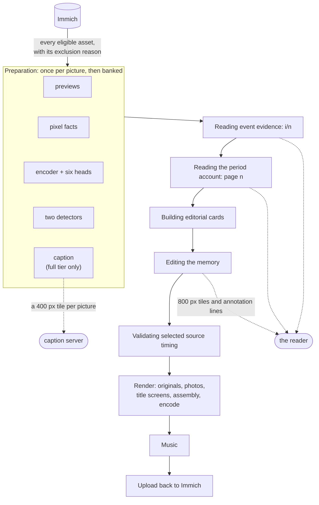
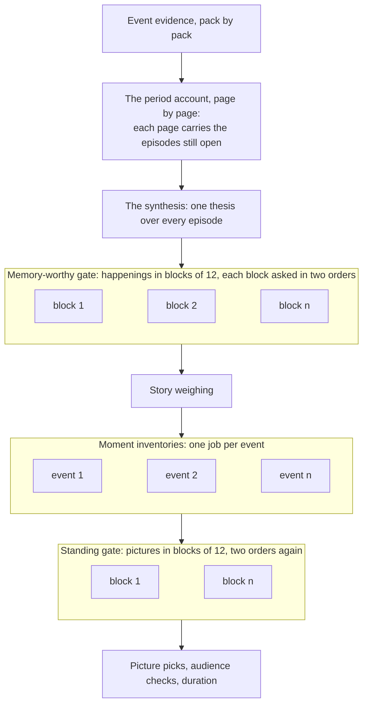

# How a memory gets cut

Every photo app has an automatic memories feature and they all work the same way: rank the pixels
(sharpness, faces, smiles), pick the winners, add music. The result is a highlight reel. Technically
fine, emotionally random, and after the third one you stop watching.

This one reads the period as a story instead. It prepares a description, people, place context and
picture facts for every eligible picture in the range, decides which stories matter and which
distinct moments show them, and only then allocates the film's duration. One
`immich-memories generate` and one **Cut** on the Memory page take the identical route.



Solid arrows are this box. The two dotted ones are the only seats that can live somewhere else, and
the only things a picture is ever sent to.

## The rules it obeys

These are constraints, not preferences it weighs.

**Always chronological.** A memory plays in the order things happened. No model may resequence a
cut for drama: chronology is the one thing you can check against your own recollection, and a
reordered memory is subtly a lie about the day. The editorial decisions are what to include and how
long to dwell, never when.

**Favourites win their moment.** Where you have flagged a photo, nothing overrules you with a score.
Favourites also help establish a story's importance, subject to source and audience eligibility.

**The audience is FAMILY.** A shirtless baby is ordinary family content and can be included. Eight
findings are not, at any audience, and a carrier that draws one is replaced rather than shown:
breastfeeding or expressing milk, bathing, toileting or changing, intimate hygiene, graphic medical
procedures, identifying records, sexual content, adult changing. The model is told that newborn care
is ordinary family content, which keeps it from filing a bath as something worse, and the code holds
all eight out of the cut regardless of what the model was told.

**A day's title claims only what the evidence shows.** A special day's title is checked against the
evidence lines it was written from, and an unsupported claim is dropped rather than printed. Trip
titles are a different path, written from dates and place names, with no such check.

**Refuse over fake.** A day the model could not name does not get a generic "Memories of June 12th"
card: it does not render. An empty special-days catalogue produces instructions for building one,
not an invented occasion.

**Emergent, not queried.** Nothing searches your library for "beach" or "dog". The
[special days catalogue](./cli/prepare.md#discover-days) is built by looking at what your days actually
contain and asking whether anything happened, which is how it finds the day that mattered with 30
photos. A day has to clear 20 photos and six active hours before the question is worth a model call.

## Judging content, not pixels

Descriptions do the discriminating that scores cannot. Two clips of the same cake a couple of
minutes apart are one moment: keep the better one. Two toasts at the same party are two moments.
Perceptual hashing cannot tell those apart; a sentence about each can. Time on its own settles
nothing: the five-minute `photos.burst_window_seconds` groups a burst, it does not say two things an
hour apart are separate moments.

The story reading comes before the duration allocation, so a short and a long memory can share an
understanding of the period while showing different amounts of it. More time lets an important story
show more distinct moments (arrival, the main activity, people together, how the day ended) rather
than making every extra frame a new event. Matching facts are reused: descriptions and model
decisions are cached by producer and input.

Coverage is checked, not assumed. Required source and annotation coverage is verified before
selection, and an incomplete run is never reported as complete.

The shipped design (the source model, the annotation store and its banks, the six stages, the two
readings, the structure and story planners, carriers and durable attempts) is written up in
[Story-first selection](https://github.com/sam-dumont/immich-video-memory-generator/blob/main/docs/designs/2026-09-10-story-first-selection.md)
in the repository.

## Twins and near-duplicates

You held the shutter down. You imported the same clip twice. You shot the cake from two steps left.
None of that should cost three slots in a two-minute film. Sameness is decided in three places,
cheapest first, and only the last one asks a model.

**1. Bursts, on capture time and pixels.** Photos within `photos.burst_window_seconds` of each other
**and** within `photos.burst_hash_threshold` bits on an average hash of their Immich previews are
one burst, and only the best frame survives it.

```yaml
photos:
  burst_window_seconds: 300   # 0 disables burst de-duplication
  burst_hash_threshold: 8     # hash bits two frames may differ by
```

Both conditions are required: time alone would collapse a busy minute at a party, similarity alone
would merge the same kitchen photographed a month apart. A photo whose preview never arrived is
always kept, because redundancy is measured and never assumed. Measured on one real June library, 64
of 303 photos went, 21 % of the pool, in groups of up to five. It saves no model calls (captions,
heads and detectors are paid for the whole eligible period first); what it saves is a cut with five
near-identical frames in it.

**2. Neighbours, asked as a pair.** Two pictures side by side, two numbered tiles, judged in both
arrangements: only the two orders agreeing counts as one picture, so a verdict bought once is a
cache hit everywhere. Perceptual distance is the second vote, never the only one. Measured on 653
real pairs the model contradicted itself on 39, and only 4 of those were pixel-close: its
uncertainty lives on pixel-*distant* pairs. At a corroboration distance of 10 the rule reproduced
all 653 decisions exactly while removing 30 % of the calls, and the first changed decision appears
at 12. That 10 is a constant in the code, not a setting.

**3. The final film, over what actually shipped.** The pictures in the cut are checked against each
other again. A pair is nominated when either signal fires: hashes within 10 bits, or descriptions
that read as the same thing (Jaccard over words of four letters or more, at 0.60). That 0.60 is the
knee of a measured curve over 1,124,250 real pairs from the cache: 0.60 collapses 33 pairs, 0.55
collapses 74, 0.50 collapses 135. The count triples per step below it, which is where genuinely
different shots start merging. Nominated pairs are then asked as pairs, by the same question as
step 2.

Which one survives, in order: protected carriers, favourites, pictures with a known quality figure,
quality itself, capture time, then asset id. A favourited copy wins even at a lower resolution: you
flagged that one on purpose. Each removal writes which picture went, which kept its slot, the
hamming distance, and which signal nominated the pair.

There is no `duplicate_hash_threshold`. That key belonged to the retired clip scorer, and a config
file naming it starts normally and logs one warning instead of keeping a setting that quietly does
nothing.

## Editing without a language model

Set `advanced.editorial.reader: rules` (or leave it on `auto` with no `llm.model`) and the editor
runs the same six stages with a rule answering each question a model would answer. Same stages, same
records, same storyboard. It costs nothing in API fees and runs on a 4-core NAS.

| Question | Rule |
|---|---|
| Is this happening memory-worthy? | Remarkable when the day clears four times the median photographed day or the 75th percentile, whichever is higher, or when its pictures are away from the usual cities (or more than 10 km from `trips.homebase_*`). An album product is remarkable outright. Maybe when a favourite, a close family member, a video, or the only happening in a required partition is in it. Background otherwise |
| How do days group into stories? | A run of consecutive photographed days is a story; a day splits into two episodes when more than 90 minutes pass and the dominant place changes |
| What is the story called? | Templated from facts: the activity at the place, or the place, or the date. Never retitled, never joined |
| How much does a story weigh? | From the gate: remarkable seeds `minor`, maybe seeds `glimpse`, background gets nothing; three favourites raise a story to `major`. `dominant` comes from the thesis pass that names a central story, the same one the model path uses |
| Which pictures show a moment? | A capture group is a moment; the favourite wins it, then sharpness, then capture order. Thumbnail hashes collapse near-identical frames inside a group; they never merge two groups into one moment |
| Does a picture stand on its own? | From the facts on its line: a favourite stands; a document, a sensitive-content hit, a blurry, dark or blown-out frame is weak; a picture with people, an activity or a real venue stands |
| Who may see it? | Any flag from the detectors keeps a picture at family-only viewing. Nothing clears a flag except you, on the pool page |

Every answer stays inside the vocabulary the model path uses, so the planners downstream do not know
which reader spoke.

What you lose: the thesis (the page hides the quote rather than showing a templated one), an
editor's sentence under each picture (you get `<story>: <n> pictures at <place>` instead), moments
merged by content across capture groups, sampled duplicate review, the choice to play a Live Photo's
motion, and the ability to clear a flagged-but-innocent picture for sending.

Measured against the model editor's reference cut over the same periods, the rules reader kept 100 %
of the known occasions for a special day, on-this-day and album, 94 % for a person, 86 % for several
people, 67 % for a trip, and between 43 % and 62 % for a month, a season or a year. The per-type
table is on [Running modes](../deploy/running-modes.md#what-the-rules-cut-keeps-per-memory-type).

Rules need nothing beyond the app on `tier: metadata_only`. With `tier: no_captions` and
`immich-memories models fetch`, the two detectors and six context heads give the standing and
audience rules something to read. The Memory page's note under the title is keyed to the tier rather
than the reader, so a rules cut on `full` gets none; on `no_captions` it reads *Edited without
descriptions: picture content was classified, not read.*

Rules are a degraded mode, not an equal-quality alternative. Prefiltered requests (a person, an
album, one event, a trip) survive it well; broad recaps are where the model earns its cost.

## The stages, and what each one costs

The stage names are what the run reports: a row on the Memory page, a line in the terminal.

| Stage | What runs | Where it can run |
|---|---|---|
| **Reading dates, places and people** | The source model, then preparation per producer: previews, pixel facts, the encoder with six context heads, the two detectors, and on `full` one caption per picture. Nothing banked is produced twice | previews over the network; captions remotable; heads, detectors and pixels on this box or the [inference service](../deploy/installation/inference-service.md) |
| **Reading event evidence: i/n** | Paged episode reading over the annotation lines, the cull asked inside each episode. Banked per group and evidence key | the reader |
| **Reading the period account** | The period read as an account with a thesis, one bounded repair if malformed. Banked | the reader |
| **Building editorial cards** | One card per moment, rendered into the wall the planner reads | this box, cheap |
| **Editing the memory** | The structure and story planners: the memory-worthy gate, story weighing, moment picks, standing gate, audience checks. Each a banked question, the gates asked in two orders. Motion is measured for the chosen Live carriers | the reader; motion locally |
| **Validating selected source timing** | Intervals bound to their sources, duration realised | this box, cheap |

If the reader stops answering, the Editing stage reports *Waiting for the reader at host:port* and
retries three times before failing.

A cold cut pays for every picture never read and every reading of a period nobody has cut. A warm cut
over the same period is mostly the render. There is no depth knob and no shortlist at the source:
every eligible picture is prepared, because a picture the editor never saw is one it cannot weigh.
The levers are putting the caption server and the reader where they are fast, preparing a library
ahead with [`prepare`](./cli/prepare.md), and keeping the cache. If the render is
the slow part none of that helps: that is decode, scale, blend and encode, and the levers are a
hardware encoder, a lower resolution and fewer clips.

### What overlaps, and what cannot

Reading is mostly a queue of one. Each page of the period account carries the episodes still open
from the pages before it, so page 5 cannot be asked until page 4 has answered, and every pick below
reads the stages above. Two places hold independent questions: the moment inventory of one event
knows nothing about the next event's, and the worthiness and standing gates ask in blocks of twelve
that do not see each other. Those are what `advanced.llm.reader_concurrency` overlaps, and nothing
else in the reading can be made to overlap by raising it.



Unset, the concurrency limit is 1 for a model on your own machine or network and 4 for a public
host, because a local server is one process in front of one accelerator and four requests there
queue instead of overlapping.

## Render

`generate_memory()` takes over from the plan under a file lock.

- **Originals** of the selected sources are downloaded (3 workers by default,
  `analysis.download_workers`) and each interval trimmed with FFmpeg. A Live Photo chosen for its
  motion plays its video; one chosen as a still is held. Live companions of different sizes
  are fitted to a common frame without stretching or changing their selected timing.
  ProRes MOV clips keep their original video, HDR metadata and audio during trimming.
- **Photos** render frame by frame in Python: Ken Burns is a `cv2.warpAffine` per frame at 30 fps
  for the seconds granted, two of them on the blurred-background path. HEIC decode and gain-map HDR
  happen here, and sources are capped at 1.5x the output size.
- **Title screens** render on the GPU when the kernel library initialises, PIL otherwise, and encode
  with the final video's encoder.
- **Assembly and encode** stream: one FFmpeg decode per clip at a time, crossfades blended into one
  preallocated buffer, raw frames piped into one encode process. Memory stays flat with clip count,
  which is what makes 4K output possible.

Encoder selection is a real probe: NVIDIA, Apple, QSV, VAAPI, each having to encode one 256x256
frame before it is used. A hardware encoder that fails mid-run is retried once in software with the
same codec. Assembly uses a hardware **encoder** and a software **decoder**: a GPU speeds up the
write side, not the read side. See [Hardware acceleration](../deploy/hardware.md).

Music resolution walks a fixed chain: an explicit file, then a generator if one is enabled, then a
bundled track chosen by mood. A failed generator falls through and the run is told. Delivery, the
optional upload back to Immich, is non-fatal on failure: the video stays on disk, the run is marked
delivery-pending, and secrets are scrubbed from the logged error.

## What a cut leaves behind

Every attempt is durable under `<cache>/editorial-runs/<key>/attempts/<id>/`, with
`latest-attempt.private.json` pointing at the newest. Inside: the status (stage, request, outcome,
duration realisation, and a lease that tells an interrupted run from a slow one), the plan (thesis,
stories with weights, every carrier with its reason, which is what `runs story` reads), the render
projection, the selection trace that `runs why` reads, every model request and answer, and the
evidence hashes per episode.

| Cache | Location | Holds |
|---|---|---|
| Annotation store | `~/.immich-memories/cache/annotations.sqlite` | every fact per picture and producer; the episode, period, cull and judgment banks |
| Structure banks | `~/.immich-memories/cache/structure-banks/` | the memory-worthy and standing votes, thumbnail hashes, demanded motion |
| Attempts | `~/.immich-memories/cache/editorial-runs/` | one directory per cut |
| Downloaded videos | `~/.immich-memories/cache/video-cache` | 10 GB, 7 days |
| Immich previews | `~/.immich-memories/cache/thumbnails` | 10 GB |
| Clip previews | `~/.immich-memories/cache/preview-cache` | 2 GB |
| Run database | `~/.immich-memories/cache.db` | run history |

Facts are keyed by producer version, so changing a version names a new fact generation and the next
cut produces it. Readings are keyed by the exact request, prompt included.
