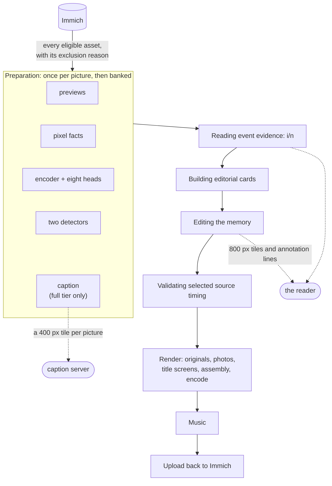
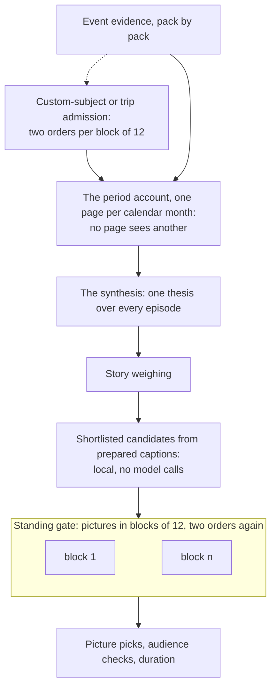

# How a memory gets cut

Every photo app has an automatic memories feature and they all work the same way: rank the pixels
(sharpness, faces, smiles), pick the winners, add music. The result is a highlight reel. Technically
fine, emotionally random, and after the third one you stop watching.

This one reads the period as a story instead. It prepares a description, people, place context and
picture facts for every eligible picture in the range, decides which stories matter and which
distinct moments show them, and only then allocates the film's duration. One
`immich-memories generate` and one **Cut** on the Memory page take the identical route.



Solid arrows are this box. The two dotted ones are the only seats that can live somewhere else, and
the only things a picture is ever sent to.

## The rules it obeys

These are constraints, not preferences it weighs.

**Always chronological.** A memory plays in the order things happened. No model may resequence a
cut for drama: chronology is the one thing you can check against your own recollection, and a
reordered memory is subtly a lie about the day. The editorial decisions are what to include and how
long to dwell, never when.

**A favourite wins its moment, not its story's slot.** Where you have flagged a photo, nothing
overrules you with a score: a star leads the rows the pick reads, keeps a slot on the page it sits
on, is never displaced by a replacement, and wins the frame of the moment the pick chooses. What it
does not do is buy the moment. The editor is still asked which moments tell a story, unless that
story offers a single moment and the grant reaches it, because a dense tail of favourites would
otherwise bury a story's beginning. Favourites still help establish a story's importance, subject to
source and audience eligibility, but they do not order which stories a film funds. When a period
holds more stories than the film has slots, a detected trip goes first among the stories of its
weight; then the existing episode reading and number of distinct moments decide, then the order
the reader listed its stories in, then the order things happened. Custom-subject and trip films
use their admission reading instead. A well starred December cannot push
January out of the year. A refused favourite loses its frame rather than its moment: without a model to come back and compare pictures, the no-model editor keeps the rest of a starred moment instead of discarding it, with the favourite still in front of them, so a star the standing gate or a source rule refuses no longer takes the whole moment out of the film. Every carrier's row names the other pictures of its own moment.

**General films skip the preliminary importance ballot.** The model-backed editor reuses the
monthly episode reading's assessment for year, month and other general films. A central occasion
keeps its minimum importance even if a later weighting answer dismisses it. Custom-subject and trip
films still check which happenings belong before building their story. Source eligibility,
audience checks and duration limits still apply.

**A period can be about someone arriving.** Where your people file knows a person, it also knows
the month the library first holds a picture of them and the month they start appearing regularly.
Both are facts about the library, never a claim about a relationship, and each one is attached to
the episodes actually taken in that month. So the episode card the reader groups and weighs says
who is present by their relation to you, and separately who the library first holds here. The
reader is told what that is and that it earns no picture by itself. A month whose meaning is that
someone new is in it can now be read that way, and a month where it does not matter reads exactly
as before. Nothing forces their picture into the cut.

**A trip is one story, and it gets room for its length.** The editor runs the app's own trip
detection over the film's pictures, with your `trips` home base, distance, duration and gap, and no
network: a trip is named from the place names its pictures carry. Every day of a detected trip is one
story whatever the reader grouped, and the weighing sees it as a trip, with its days and stops on the
row. A trip weighed as an occasion takes more than one picture where the other stories take their
first: half the film for a trip that is the whole film, the square root of its share of the film's
photographed days below that. A ten-day trip in a five-minute year gets about five, a six-day
holiday in a 90-second year two or three, and never more than the distinct moments it holds. With no
home base configured nothing is away from home, so there are no trip stories, and the run's
`trip-stories` record says so. A trip film is already one journey: its days stay the stories.

**A recurring activity is one thread, in the context of the film.** Four Saturdays at the same
pool are not four occasions in a year's film. After the weighing, stories at the same place on
separate days are put to the reader as a possible thread when its own words link them. Near home
that takes an activity: the same activity in their titles, or an activity word the film uses there
more than anywhere else. Away from home the name the reader gave them is enough, so repeated visits to the same
garden are asked about. The home place itself never holds a thread, because its days are the film,
and a place alone never links two days; neither does a name, a relation, a time of day or a word
like "moments", "life" or "stay". The reader is then asked, with the
film's dates and contract, which of them are one recurring activity and which are steps worth showing
apart, and a confirmed thread becomes one story with the weight of its heaviest day. A film longer
than about 18 months is read in calendar years (for a person film, only the years that hold a
picture of the person), and keeps one thread per year, so a child getting
better at swimming still shows the progress. Trip films and subject memories ask nothing: their days
are already their stories.

**One place does not take a film.** The thread question needs two stories at one place on separate
days, which leaves the case next to it uncovered: one building, on one day or across one stay,
holding most of the slots. A trip is already one story before the weighing, and a trip film asks no
thread question at all, so nothing there could notice. Now each stretch the film funds as one thing
(a trip film, or any single story) bounds its places against each other: a place may hold as many
pictures as a trip of the same share of that stretch would be allowed, measured in its days, or in
its moments when the stretch is one day. That is the same curve the trip allowance uses, and no
number in it is set per film or per duration. A stretch that only ever visited one place is never
bounded, and a picture refused for its place joins the same ledger as one refused for looking like
another: it frees the slot for somewhere else first, and comes back when nothing else can take it.
So a stay that really is one venue still fills its film, and the run's `story-places` record says
what each place was allowed and what it held.

**The audience is FAMILY.** A shirtless baby is ordinary family content and can be included, and so
is a parent holding a baby in a pool or a baby's swimming lesson: swimming is not bathing. Eight
findings are not, at any audience, and a carrier that draws one is replaced rather than shown:
breastfeeding or expressing milk, bathing, toileting or changing, intimate hygiene, graphic medical
procedures, identifying records, sexual content, adult changing. The model is told that newborn care
is ordinary family content, which keeps it from filing a bath as something worse, and the code holds
all eight out of the cut regardless of what the model was told. Two of them need a fact under
them, because the model's say-so has been wrong: an identifying record needs the document detector
to call the picture a document, or the description to name one (an ID card, a passport, a patient
wristband). Readable text alone, a race bib, a logo or a sign, holds nothing. Adult changing needs
the description to say someone is undressing or exposed; without that, the picture stays
family-only instead of being cut. The gate judges the finished cut
rather than every picture the editor considered: one verdict per carrier, plus one for each
replacement a refusal pulls in from the same moment.

**A detector's hold is never lifted by a later reading.** When the exposure detector flags a
still, any frame of a video, or a Live Photo's clip, that shot stays family-only on every tier.
A model reading can add a hold but never remove one: not a caption that describes everyone as
clothed, and not a direct look at the picture that reports nobody uncovered. A false positive
costs a shot; a false negative puts the wrong picture in front of the wrong people. Only you can
clear it, on the pool page.

**A video is read across its length, not at its start.** Immich's preview for a video is a single
frame near its beginning, and the exposure detector used to decide the whole clip on it. It now
reads up to eight frames spread over the clip (the keyframes nearest eight evenly spaced moments,
fetched by byte range from the same playback index the motion line reads, so a clip costs a few
hundred kilobytes rather than the whole rendition), plus that preview, and keeps the strongest
answer: a hold anywhere in a clip holds the clip, and a clip only the preview holds stays held. Measured on four test clips, the preview alone held two of them (0.30,
0.28); eight frames held all four (0.93-0.95). This is a new producer version (`nsfw_marqo` moves
from `det-v2` to `det-v3`), so an existing annotation store re-reads that head for **every** source,
pictures included: the banked row does not record which kind of source it came from. Nothing else
changes. Docling still reads the one preview, and the public heads are untouched. A clip whose
playback cannot be read falls back to its preview, and `preparation.private.json` names it. When the
inference service is answering for your heads, videos keep this head in process, because the service
is handed one picture per source and cannot be handed eight.

**A Live Photo's clip is read too, and a held clip holds its still.** The clip is not a candidate:
nothing selects it, it plays inside its still's shot, so nothing ever prepared it and the gate's
companion evidence was empty for every Live Photo in the library. Now every Live Photo in scope has
its clip read the same way any clip is read, and the answer is banked under the clip's own asset id.
That pass is deliberately narrow: the exposure detector only, no caption, no context head, no pixel
fact, so it costs the same 0.3 to 0.4 s per clip as any other. A shot whose clip is flagged is held
to family viewing whatever its own captions say, because the captions describe the still and a still
is not evidence about the seconds of motion hanging off it. Immich keeps no preview for many of these clips (120 of 193 in one month) but plays all
of them, so a clip with no preview is read on its frames alone. A clip Immich will neither preview
nor play leaves its still in the film and one named failure behind, which is exactly the evidence
every Live Photo carried before.

**A run of flagged captures holds the clean captures inside it.** The detector decides one picture at
a time, and a nappy change or a bath is not one picture: it is three minutes of them, of which the
detector catches some and misses the rest. A capture joins the run of the one before it when it was
taken within five minutes of it, the same five-minute capture spacing the selector already uses.
A Live Photo is one capture, not two: its clip is not a clean capture of its own in the run, and a
flagged clip counts as a flagged capture.
A run is held to family viewing as a whole when at least **half** of it is flagged and at least
**three** of its captures are. Both bounds are needed: half keeps a mostly ordinary run from being
swept by a corner of it, and three is what stops one breastfeeding picture, or two, from holding the
minutes of family pictures around it. The three numbers are measured constants in
`analysis/editorial_exposure_chains.py`, not configuration. Measured on the owner's library: normal
months moved from 2.6 % to 2.8 % held, baby months from 18.5 % to 21.0 %, and 319 clean captures out
of 66,597 were swept in; a fifteen-minute window added nothing. A carrier swept in this way gets the
reason `exposure_chain`, with the run's length and how many of it were flagged.

**Between 0.2 and 0.5, the run writes you a list.** The exposure detector holds at 0.5 and stays
there (dropping the cut to 0.1 holds 51 % of a baby month, which is not a film), but underwear in
particular sits in the band below it, neither caught nor clearly fine. Every run writes
`review-before-sharing.private.json` into its attempt directory: the shots of the finished cut whose
detector probability is between 0.2 and 0.5 and that no other hold already keeps to the family, with
the probability. The run's summary prints how many there are, and `runs why <asset id>` says so for
one picture. Nothing in the cut changes. It is a list for you, and it matters most before a
`sendable` export, where the rules tier's blanket `family_only` is not what is being asked.

**A day's title claims only what the evidence shows.** A special day's title is checked against the
evidence lines it was written from, and an unsupported claim is dropped rather than printed. Trip
titles are a different path, written from dates and place names, with no such check.

**A record is what the summary would lose.** The same reading that says what an episode was also
names the moments of it worth a record of their own, and why: a discovery, a milestone, a change,
something that happened once. Most episodes have none, and nothing is inferred from the order
things happened in. Those records are what the polish layer's first seat is for, and a picture
carrying one keeps its place in the cut whatever the vote says, exactly like a picture you
starred. The question is part of the episode prompt, so a library banked before it existed re-reads
its episodes once, and never again.

**An episode reading names nothing the facts do not name.** Words on a banner, a shirt, a sign, a
screen or a poster name the thing they are printed on, never the day, the place or the event: a
festival poster in the background of one picture does not make the weekend that festival. A name
has to come from a fact line, and the Immich albums holding an episode's pictures are one of those
lines. If your album calls that weekend "Summer Festival 2022", the reading may call it that too,
and everything downstream (the period thesis, the story titles, the film title) inherits a name you
typed rather than one the model read off a banner.

**Refuse over fake.** A day the model could not name does not get a generic "Memories of June 12th"
card: it does not render. An empty special-days catalogue produces instructions for building one,
not an invented occasion.

**A film this app made is not footage of anything.** A finished memory uploaded back into Immich looks exactly like a source video: its duration sits under the source cap and its filename matches no pattern, so it was being filmed again. Two independent records now refuse it at source admission, beside the Live Photo component rule: the `immich-memories/generated` tag Immich holds, and this install's own upload receipts in `cache.db`. Neither is complete alone, the tag because an older upload never got one and the receipts because an upload from another machine is not in them, and a server that refuses the tag query leaves the receipts answering rather than failing the run. On one real library three of a month's four "videos" were the app's own output.

**A clip under two seconds is a stub, not a shot.** It is over before the eye settles and the film pays a transition for it either way, so no video shorter than that is admitted. At the other end, letting a carrier finish its sentence is a courtesy rather than a licence: the speech-safe end now stops at twice the six-second motion cap, because one utterance once carried a clip to the end of a seventeen-second source.

**A screenshot was never a source.** A phone-screen pixel size already refused a picture as a carrier, and admitted it as a source, where it still counted toward day masses and moment structure. It is metadata rather than caption text, so it answers the same with and without a caption seat, and it now refuses at the source gate too.

**Emergent, not queried.** Nothing searches your library for "beach" or "dog". The
[special days catalogue](./cli/prepare.md#discover-days) is built by looking at what your days actually
contain and asking whether anything happened, which is how it finds the day that mattered with 30
photos. A day has to clear 20 photos and six active hours before the question is worth a model call.

## Judging content, not pixels

Descriptions do the discriminating that scores cannot. Two clips of the same cake a couple of
minutes apart are one moment: keep the better one. Two toasts at the same party are two moments.
Perceptual hashing cannot tell those apart; a sentence about each can. Time on its own settles
nothing: the five-minute `photos.burst_window_seconds` groups a burst, it does not say two things an
hour apart are separate moments.

The story reading comes before the duration allocation, so a short and a long memory can share an
understanding of the period while showing different amounts of it. More time lets an important story
show more distinct moments (arrival, the main activity, people together, how the day ended) rather
than making every extra frame a new event. Matching facts are reused: descriptions and model
decisions are cached by producer and input.

**Videos lead the pick.** This is a film. When a story chooses its moments, the ones a video
carries, or a Live Photo whose motion passed the check, are listed ahead of the stills, each with a
sentence saying what happens in it, and the reader is told to choose the video over a still of the
same moment. That sentence is written once per video at preparation by the caption server, from
three keyframes, so the reader never sees a video frame. On `no_captions` and `metadata_only` the
row carries the plain facts instead: how long the clip is, and how much a Live Photo moves. The pick is asked in two orders; when they disagree, the moment that moves
wins. That holds at every length: a 90-second memory gives most stories one picture, and that one
slot is still a choice between a video and a still. Only the question is reordered; the film still
plays in the order things happened. A chosen video holds about 6 seconds where a photo holds 4,
longer when someone is mid-sentence at the cut. When the videos push the cut past its length, the
longest holds are shaved half a second at a time, never below 3.5 seconds or through a sentence; a
video is never dropped for being long.

**Motion reaches the pick.** Before the reader is asked anything, a story samples the moments its
grant can reach, and that sample used to be where the motion went. Three things carry it through
now. A moment that holds something playable is taken ahead of a still that would otherwise fill its
place. When the sample fills up anyway, on a story dense in favourites, it reaches for as many more
playable moments as the story has slots, appended rather than swapped in, so no favourite loses its
place and the spread of times and people already chosen is left alone. And when a capture group
holds both a still and a video of the same instant, the video takes the frame unless a favourite
claims it: a video carries no sharpness measurement, so on a tie of everything else it used to lose
to any still in the group.

**A frame has to show the person it names.** Immich says which people it recognised in a
picture, and until now that was the whole fact: present or not. A finish-line photo of a race
named the runner it was taken for, and he was a speck against the right edge behind a dozen
nearer faces. Two frames of that moment looked identical to the pick, so it took the sharper
one and the film showed a crowd. Preparation now banks where every face Immich found sits in
the frame, and each picture's line says how much of the frame the named person covers, whether
he has a face's width of air between him and every border, and whether he is the largest face
in the picture or one of the small ones. Inside a capture group the frame that shows him wins
over the frame he is lost in, and between two frames that both show him the one showing more of
him wins. A favourite still takes its own moment, a video still beats a still of the same
instant, and a picture naming nobody is ordered exactly as before. Each box keeps the Immich id
of the person matched to it (never the name), because in a memory about one person the framing
has to be that person's: a frame where they are a speck beside a large, well-framed relative is
not a frame of them. A memory about several people reads the best-shown of them, and a picture
naming none of them reads like a picture naming nobody. A memory with no one in particular
reads any named face, as before. The boxes are read once per picture and banked; boxes banked
before they carried an id are read again on the next preparation.

**The standing gate reads a video as a video.** The gate asks, of each candidate picture, whether it
would stand on its own. A video used to arrive on that list looking like a still, described by
whatever its one line said, and a real share of the videos that got that far were named weak: 9 of
them in a 600-second year, 12 in a film spanning two and a half years. A moving row now says what it
is, how long the source runs, and what happens across it, taken from
the one motion sentence preparation banked. The criterion tells the reader to judge that, not
whether one frame would make a good photograph. Standing votes are banked per picture, so the bank
key carries the caption seat that wrote those sentences: a different seat writes different rows and
its predecessor's verdicts are not replayed against them.

Speech boundaries measured after a cut guide playback timing. Finding those boundaries does not
reopen a settled standing judgment: speech presence alone says nothing about what was said.

A video or moving Live Photo needs at least one standing approval. Two weak votes exclude the
clip even from an important story or an occasion fallback. Approved scenery and action remain
eligible; a clip does not need to show people to earn its place.

A motion sentence counts only where the motion is measured. A 500M captioner reading three small
keyframes can describe somebody dancing in an empty room. A Live Photo's sentence therefore reaches
the gate and the pick only once its companion measured at least 1.5. Until then the Live Photo is
judged as the photograph it is: its media kind is not evidence that anyone is in it. A Live Photo
whose action differs from its still keeps its sentence once the measurement backs it. A true video
always plays and keeps its sentence, because no residual is measured for videos.

Importance and standing votes must name the exact offered identifiers. An unreadable reply or an
unknown identifier gets a bounded retry, then stops selection if it remains invalid. It cannot be
cached as an empty vote. A valid empty mapping still means the reader chose none of the offered items.

Coverage is checked, not assumed. Required source and annotation coverage is verified before
selection, and an incomplete run is never reported as complete.

Large annual memories are read in batches. Each story-weighting batch keeps the period's account
and main-story context, with at most 60 stories in its initial request. If the possible main stories
would crowd out a batch, they are compared first; every story is still evaluated afterward. A batch
that returns missing decisions or repeatedly truncated text is split into smaller groups while
keeping parts of the same occasion together. All batches must finish before the decisions are used.

The shipped design (the source model, the annotation store and its banks, the five stages, the episode
readings, the structure and story planners, carriers and durable attempts) is written up in
[Story-first selection](https://github.com/sam-dumont/immich-video-memory-generator/blob/main/docs/designs/2026-09-10-story-first-selection.md)
in the repository.

## Twins and near-duplicates

You held the shutter down. You imported the same clip twice. You shot the cake from two steps left.
None of that should cost three slots in a two-minute film. Sameness is decided in four places,
cheapest first, and only the first one is free of model calls.

**1. Bursts, on capture time and pixels.** Photos within `photos.burst_window_seconds` of each other
**and** within `photos.burst_hash_threshold` bits on an average hash of their Immich previews are
one burst, and only the best frame survives it.

```yaml
photos:
  burst_window_seconds: 300   # 0 disables burst de-duplication
  burst_hash_threshold: 8     # hash bits two frames may differ by
```

Both conditions are required: time alone would collapse a busy minute at a party, similarity alone
would merge the same kitchen photographed a month apart. A photo whose preview never arrived is
always kept, because redundancy is measured and never assumed. Measured on one real June library, 64
of 303 photos went, 21 % of the pool, in groups of up to five. It saves no model calls (captions,
heads and detectors are paid for the whole eligible period first); what it saves is a cut with five
near-identical frames in it.

**2. Neighbours, asked as a pair.** Two pictures side by side, two numbered tiles, judged in both
arrangements: only the two orders agreeing counts as one picture, so a verdict bought once is a
cache hit everywhere. Perceptual distance is the second vote, never the only one. Measured on 653
real pairs the model contradicted itself on 39, and only 4 of those were pixel-close: its
uncertainty lives on pixel-*distant* pairs. At a corroboration distance of 10 the rule reproduced
all 653 decisions exactly while removing 30 % of the calls, and the first changed decision appears
at 12. That 10 is a constant in the code, not a setting.

**3. Inside a story, while the cut can still change.** A story's second or third picture is kept
only if it does not look like one the story already holds. Trips and long stays are where this
matters: three one-day stories of a weekend away used to ship three near-identical selfies. The
question is step 4's repetition question, asked in both arrangements: a pair from the same 90-minute
episode is asked exactly as step 4 asks it, so the answer is shared, and a pair days apart is asked
with a premise that says so. A refused picture frees its slot for the story's next distinct moment,
or for the next story in line. A favourite is never refused for looking like a picture you did not
star, and when nothing else can take the slot the refused picture comes back, so this check alone
never makes a film short. A picture is compared with the frames its story
already holds around it: its own moment's, and the kept frame just before and just after it in time,
which is where a repetition lives. The check asks at most twice as many pairs as the film has slots
and records every refusal in the run's `story-selection` record.

The same question lets a dense occasion fill its film. Five minutes of spacing inside a capture group
keeps a burst from taking several slots, and on a busy afternoon it also kept every moment after the
first of each group out of the cut: a 90-second special day with 27 usable pictures shipped four. A
film that is still short after every selection pass now spends its free slots inside the moments its
stories already show, in funding order: captioned candidates no pick took, alternating
between capture groups, then up to three frames of each chosen moment. A frame gets in only when the
question confirms it looks different from the kept frames of its moment and the ones just before and
after it. Nothing unasked and no look-alike fills a slot this way, so a film of one repeated scene
stays short. The three rungs are spent on pictures that could carry a frame: the ladder walks a moment's members in order, so a member the standing gate or a source rule already refused used to consume one. Where the members were ranked on capture facts rather than by a model, position says little, and a moment of eight pictures whose third-ranked frame scored nothing shipped two frames with five usable ones left behind. Those are now skipped rather than counted, and the spares that remain are offered furthest first in capture time from the frames of that moment already in the cut. One single-day memory went from 15 shots and 80.9 s to 18 and 89.8 s of a 94 s target.

**Steps 3 and 4 ask the hashes first, whatever the reader is.** Step 2 needs a reader, so the no-model editor reported `lookalike: unavailable` and asked nothing. The question is now built from the perceptual hashes the burst pass already caches, at the same corroboration distance of 10 bits, bounded to one story or one calendar day. A frame that plays is never a repeat of a still, a preview with no cached hash answers unknown rather than distinct, and a favourite is still never refused for looking like a picture you did not star. A film with a model asks the hashes first too, and pays a look-alike call only where they do not corroborate: a pair they call alike is a repeat with no call at all, and a pair they answer differently or cannot settle is put to the reader exactly as before. The measured reason: the look-alike stage was 61 % of a film's recovery calls and 60 % of its answers disagreed between the two pair orders, while the hashes settle the near-identical half for nothing. That matters for more than repetition: the depth pass refuses to run without a look-alike relation, so a no-model film could not deepen the moments it already showed. With one, a sparse year film went from 98 shots and 384 s of a 600 s target to 159 and 599.7 s, a single-day memory from 7 shots to 15, and a day that produced no film at all produced one.

**4. The final film, over what actually shipped.** Only pictures selected from the same capture
episode, within the 90-minute window, are compared. Matching hashes or similar captions from
unrelated episodes do not buy a model call. Within an episode, a hash distance of at most 10 bits
can corroborate the same-picture question from step 2.

**The same scene, not only the same frame.** A hash only agrees about one framing. The same path at
dusk shot twice twenty minutes apart, the same couple's selfie a week later, the same stage filmed
twice in one evening, or four weekend rides down the same kind of farm road all hash as strangers,
and a viewer still sees the film say one thing twice. So the free pass also reads each frame's scene
print: the pooled DINOv2 features of its preview, from the same pinned encoder the public heads
already run, banked per preview in `scene-prints.sqlite` next to the hash bank. No model call, no
download beyond the previews the cut already reads. Two frames whose prints agree at a cosine of
0.65 or more are one scene when they sit within 14 days of each other, across stories. Two
favourites are one scene only on the same day: across days you starred two moments. A favourite is
never refused for a picture you did not star, and a frame that plays is never refused for a still.
The frame that stays follows the same order as below, with a true video before a Live Photo's clip.

A scene repeat is less certain than a hash repeat, so it leaves only when its slot can be spent
elsewhere: a replacement from its moment or story takes it, or the film still reaches its target
within the 15 % shortfall it already accepts. A film that is already short of material keeps its
repeats. Measured on five recorded cells, 0.65 caught every repeat the owner named (0.65 to 0.85)
and nothing else in the year film; the closest pair of same-day favourites the owner kept as two
moments sat at 0.63.

Audience-safe replacements must also respect the existing five-minute capture spacing. The gate
reserves all surviving pictures first, then checks each replacement against those survivors and
earlier replacements. It skips a conflicting candidate before asking for an audience verdict.
If no suitable alternative remains, the film gets shorter.

The episode signal is there because the other two miss the obvious case. Two frames of the same
minute on a dark bus, shot from slightly different angles, have distant hashes and get two
unrelated descriptions, so nothing ever put them side by side and both shipped. A pair that only
its episode nominated is asked a different question, whether the two show similar content so that
keeping one avoids repetition, and it always needs both arrangements to agree: the corroboration
distance of step 2 was measured on the same-picture question, so it buys nothing here. Pair work
stays inside the same fixed bound of twice the number of pictures in the cut, and a comparison the
bound cut short keeps both pictures and says so in the record.

Which one survives, in order: protected carriers, favourites, pictures with a known quality figure,
quality itself, capture time, then asset id. A favourited copy wins even at a lower resolution: you
flagged that one on purpose. Each removal writes which picture went, which kept its slot, the
hamming distance, and which signal nominated the pair.

The cached hashes get the finished film first, on every tier. Nothing nominates a pair from what
its pictures were described as holding, so this pass reads every frame of one story or one day
against every other rather than only the ones inside a 90-minute episode: two frames of the same
subject four shots apart on a thin day are never asked about until here. It stops at the edge of a
story and a day, and at 6 bits rather than the 10 a nominated pair is confirmed at. Nothing
corroborates a pair here, so the hash is the whole verdict; measured over thirty no-model runs at
10 bits, 50 of 61 refusals sat at 9 or 10 bits and 20 of those were between frames months apart.
Which picture survives, in order: a carrier you ticked, then the favourite, then the frame that
moves, then the earlier one. A film with a model then runs the sampled review above over what
this pass left, and the run's `final_duplicate_review` record lists both passes' removals with
the free one's own record under `hash_review`.

A refused frame does not leave a hole in the film. Its slot is offered the same pictures the
family-viewing gate would offer: the moment's own other frames first, in the order the quality
key ranked them, then a moment of the same story the film has not shown. It takes the
first that is not itself a repeat of something already kept. The film only gets shorter when
neither rung has one, and the record says how many slots each rung filled. A frame whose preview was
never cached is kept and named, and the run's `final_duplicate_review` record then says
`incomplete` rather than claiming a review it could not finish.

There is no `duplicate_hash_threshold`. That key belonged to the retired clip scorer, and a config
file naming it starts normally and logs one warning instead of keeping a setting that quietly does
nothing.

## Editing without a language model

Set `advanced.editorial.reader: rules` (or leave it on `auto` with no `llm.model`) and the editor
runs the same five stages with a rule answering each question a model would answer. Same stages, same
records, same storyboard. It costs nothing in API fees and runs on a 4-core NAS.

| Question | Rule |
|---|---|
| Is this happening memory-worthy? | Remarkable when the day clears four times the median photographed day or the 75th percentile, whichever is higher, or when its pictures are away from the usual cities (or more than 10 km from `trips.homebase_*`). An album product is remarkable outright. Maybe when a favourite, a close family member, a video, or the only happening in a required partition is in it. Background otherwise |
| How do days group into stories? | A run of consecutive photographed days is cut into stories. Days at home break on the ISO calendar week; a stretch away from home stays whole however long it lasts, because a trip is one story. A day back at home ends a trip, so two trips either side of a week at home are two stories. "Away" is the same 10 km `trips.homebase_*` radius the worthiness rule uses, and an install that never set a homebase reads as unknown, which leaves every run chunked by week. A day splits into two episodes when more than 90 minutes pass and the dominant place changes |
| What is the story called? | Templated from facts: the activity at the place, or the place, or the date. Never retitled, never joined |
| How much does a story weigh? | From the gate: remarkable seeds `minor`, maybe seeds `glimpse`, background gets nothing; three favourites raise a story to `major`, and so does a story that is both unusually dense and mostly close family: at least twice the period's median photographed day in pictures per day, with at least 30 % of its pictures naming a partner, child or parent. Picture count alone never does it: a dense day of strangers (a race, a fair) has the pictures and not the people, and a quiet week with the family has the people and not the pictures. Both numbers were measured on six real months, where ordinary stories sat at or under 1.8 times the median day and dense occasions at 2.1 to 10 times, and dense stories of strangers at 0 to 6 % close family against 39 to 73 % for dense family occasions; every story's two numbers are recorded under `big_stories` in the period-story record (`advanced.editorial.people.big_story_density`, `big_story_family_share`). `dominant` comes from the thesis pass that names a central story, the same one the model path uses |
| Which pictures show a moment? | A capture group is a moment. Which picture carries it is one readable order over facts a CPU-only install already has: the owner's favourite, then a frame that moves (a video, or a Live Photo whose measured motion clears the threshold), then Immich's named people (more of them first), then the frame that shows the named person over the frame he is a speck in, then the absence of a `SOFT`/`DARK`/`BLOWN OUT` pixel warning, then whether the people head saw anybody, then the middle of the burst rather than its ends, and only then the clock. The episode card names the same picture. Thumbnail hashes collapse near-identical frames inside a group; they never merge two groups into one moment |
| Does a picture stand on its own? | From the facts on its line: a favourite stands; a document, a screen, a frame the `frame_kind` head calls an empty room, a lone everyday object or a body-part close-up, and a blurry, dark or blown-out frame are all weak, and so, in a film for outside the family, is a sensitive-content hit or a second-opinion exposure hit. In a family film an exposure-flagged picture is judged like any other: the hold says who may see it, and the household may. The hold itself stays, and still keeps the picture out of a film sent further. Otherwise: nobody, nothing happening and a private or utility interior (`bedroom`, `medical`, `private_facility`) does not stand on its own; people, an activity, or an outdoor or public place does; an unlabelled indoor scene is context. Every label named there is one the shipped head bundle can emit, which a test asserts against the bundle itself |
| Does a picture show somebody? | From the caption where there is one. Where there is none, from Immich's own named faces first and the `people` head second, so a picture on a `no_captions` install is not reduced to "is it a video, a burst or a favourite". This one is not the rules reader's: a line with no prose on it is read this way whatever the reader, because a blank line is not evidence that nobody is in the picture, and on a captioned tier it only ever answers for the pictures the captioner could not describe |
| Who may see it? | Any flag from the detectors keeps a picture at family-only viewing, and the distilled `uncovered_person` head is a second opinion that can add one. A picture in a five-minute capture run that is at least half flagged, with at least three flagged captures in it, is held with the run (`exposure_chain`), and a Live Photo whose attached clip the detector flags is held with its clip (`clip_exposure`). A `no` from any of it lifts nothing: nothing clears a flag except you, on the pool page |
| How long is a picture held? | A still the owner starred, or one with somebody Immich knows in it, keeps the nominal four seconds; an empty scene gives half a second back. Every hold stays inside the production 3.5 s to 5.0 s band. A clip keeps the length its own material gave it. The ends are not the rules reader's: on every tier the film's first and last shot are held half a second longer once the cut is settled, and the shave that follows can take it back when the target leaves no room |

| Has anything already been answered about this picture? | On a library a model has read before, yes, and the draft reads it. A picture an earlier cut of any scope refused for this same audience is not offered, unless the refusal was a caption reading under an older audience prompt; a picture a banked episode reading culled is not offered; a picture a model gave no standing to does not carry its moment while anything else in its group could; a picture a banked reading named for its episode leads that episode's order. Nothing is asked to find this out, and nothing is written |

Every answer stays inside the vocabulary the model path uses, so the planners downstream do not know
which reader spoke.

### The family seat

Grants follow favourites, so someone photographed all month and never starred could end up in no
shot at all: on hundreds of a month's pictures, none starred, while every story holding them was
funded for one favourite. So once the draft is cut, and after the model's
polish on a tier that has one, every close family member (partner, child or parent, as the people
file names them) who is on at least 20 of the period's pictures, or 5 % of them, and in none of its
shots gets one seat. It is their best frame by the rules' own standing answer that clears the
story's usual standing bar, in the story holding most of their pictures. The seat is appended when
the film has a slot left and its timing budget allows one more carrier; otherwise it replaces that
story's weakest shot that is neither a favourite nor another close family member's only shot. A
favourite is never displaced. A frame any hold refuses (an earlier `do_not_show`, a banked
refusal, a source rule, or an exposure hold on a film for outside the family) is never the seat,
and the family-viewing gate still judges the cut afterwards. When no frame of theirs clears the bar,
or their stories hold nothing but favourites and the film is full, nobody is seated and
`derived-decisions/family-seat.private.json` says so, by relation only. Nothing is asked of a model
on any tier. The two numbers are `advanced.editorial.people.seat_min_pictures` and
`seat_min_share`.

### Reading what a model already answered

On a fresh install the draft has nothing to read and cuts exactly the film it cut before. On an
install where a model has answered questions in earlier runs, those answers are already on disk and
the draft was ignoring them, so it kept offering shots a gate had refused on sight and the film came
out short of its target. The draft now opens those banks read only. It still asks nothing.

Three rules bound it. A picture you starred is never withheld by a banked answer: your choice
outranks it, exactly as it outranks the rules reader's own verdict. Only refusals carry over, never
clearances: one cut's `share` never stands in for a check this cut did not make, and a banked
standing vote can only lower the rules reader's own answer, because its zero covers a document, a
photographed screen, a flag and an empty frame, which are eligibility rather than an opinion. And an answer is
read only under the name the asking side wrote it under: the criterion, the picture and the line it
was asked about, and for a standing vote the model that replied, so a bank written by another reader
is not mistaken for one written by yours. Episode readings are the exception, on purpose: they are matched on the
episode and on the exact pictures that were read, whoever read them, because a cull is a refusal and
a representative is a nomination the rules order still has to rank. Neither can let in a picture the
rules would refuse.

A moment whose every picture is withheld keeps them all. There is nothing left to offer in its
place, and the gates decide its fate the way they always did.

Every rules run writes `banked-facts.private.json` beside its other derived decisions, with the
count of each kind of answer it found. A run that read nothing says so there, which is how you tell
a bank that had nothing to say from one that was never opened.

What you lose: the thesis (the page hides the quote rather than showing a templated one), an
editor's sentence under each picture (you get `<story>: <n> pictures at <place>` instead), moments
merged by content across capture groups, sampled duplicate review, the choice to play a Live Photo's
motion, and the ability to clear a flagged-but-innocent picture for sending.

Measured against the model editor's reference cut over the same periods, the rules reader kept 100 %
of the known occasions for a special day, on-this-day and album, 94 % for a person, 86 % for several
people, 67 % for a trip, and between 43 % and 62 % for a month, a season or a year. The per-type
table is on [Running modes](../deploy/running-modes.md#what-the-rules-cut-keeps-per-memory-type).

Rules need nothing beyond the app on `tier: metadata_only`. With `tier: no_captions` and
`immich-memories models fetch`, the two detectors and eight context heads give the standing and
audience rules something to read. The Memory page's note under the title is keyed to the tier rather
than the reader, so a rules cut on `full` gets none; on `no_captions` it reads *Edited without
descriptions: picture content was classified, not read.*

Rules are a degraded mode, not an equal-quality alternative. Prefiltered requests (a person, an
album, one event, a trip) survive it well; broad recaps are where the model earns its cost.

## Letting the model polish a rules cut instead of planning one

On a model install the two readers run in series rather than making you choose. The rules reader builds the whole cut with no model call at all, and the model is then
asked one closed question over the finished film: which of these shots adds nothing to it? Blocks
of at most twelve, reject-only. Each block is asked in its source order first, and in a second,
hashed order only when the first named a shot the vote may move: the local 30B's reject-only
answers flip with the order of the rows at about half the named set, so one order's doubt is never
a verdict. A shot both orders name leaves; a shot one order names is offered a replacement from
its own story and keeps its place until one passes. A picture you starred, or one the period's
readings recorded as worth a record, keeps its place whatever the vote said; only a gate takes it
out, and a block made only of such pictures is not asked at all. The same holds for the only shot
of a close family member (your partner, a child, a parent, from `people.yaml`): the vote cannot
remove the one shot that puts them in the film. The vote is told whose film it is and who the film
is about, and each shot carries its people's relation to you, so a partner in a month about a
newborn is not read as "unrelated to the main subject".

Before the vote, every shot of the draft faces the gates a model install can ask: the standing
gate, the family-viewing gate, the five-minute capture spacing and the cached-hash duplicate
review. Standing asks nothing about a picture no answer can move, such as a still with somebody in
it inside a dominant or major story, and asks its second order only where the rule needs both
approvals or the first order named the picture. A refusal is a seat, not a hole. Seats are filled
in one order (a story the library records something about that the cut never gave a voice, then a
replacement for a shot the vote named, then one for a shot a gate took) and only as many as the
film has room for at the minimum length a shot may run. A seat's page is its story's own pictures
in the film's order of preference: the refused shot's moment, then the moments the cut lacks, what
the library records first, the moment that moves next, and inside a moment the frame you starred.
The picker reads the first twelve rows of it, in one order. Only the rows it chose are then asked
whether they stand, all together, and a seat whose pick fails picks once more from the same page.
Every replacement goes through the same gates and is voted on again in the company of the block it
joined, not the whole film; one the vote refuses is revoked, and the shot it would have replaced
comes back.

A film the polish leaves short gets one more look before it gives up the seconds. On a cold
library a story the draft never reached has no reading, so it can never show that it holds a
moment worth a place: a measured month ended at 27 s of 60, with two whole weeks unshown. When the
cut is short by S seconds, the polish reads at most 2 × ⌈S / 3.5⌉ unread episodes of the stories
it holds no shot of. A week the film does not reach goes first, then a day it does not reach, then
the story's worthiness, close family in the pictures, motion, and how many pictures the no-model
reader stands at two. Those readings are banked like any other. A story whose reading records a
moment may then take a seat, at most ⌈S / 3.5⌉ of them, through the same pick, gates and vote. A
story whose reading records nothing gets no seat, and the film stays short. The budget grows by
one call per three episodes read and four per seat. The no-model tier never reads here.

The polish is held to a budget: four questions per twelve draft shots (standing and fit once, the
audience question in its two orders) and four per seat it opens, plus what a short film reads. `thin-polish.private.json` records what it asked against that budget,
and the run warns when it goes over. The cold 2024 year used to spend 466 calls on the polish for 10
new shots, most of them putting every picture of the seats' stories, up to a thousand at a time, to
the standing gate before any seat had picked. The audience question stays on every shot that enters
the cut: on that year it held back 19 private-activity shots the detectors missed.
`advanced.editorial.thin_batched_audience` asks it of twelve shots per request, each with its own
answer, twice: once with the rows as they come and once shuffled. A shot either order holds is
held, and a shot the replies skip is asked alone. One order alone lost 4 of the 16 holds the single
question found on the measured year, so the flag stays off until `scripts/probe_audience_batch.py`,
which replays a run's single audience requests through both batched orders against your reader,
loses no hold.

It needs a period the library holds an account of: what the month or year itself was about,
read once and reused by every later cut of it. Nothing is read in advance. The draft is built from
facts alone, with no model call at all. Then only the episodes the draft's shots sit in are read,
so a film pays for what it shows: a month cut of 17 shots reads at most 17 episodes, not every
episode of every story it touched. Those readings ask only what the film reads back: what
happened, one representative and the moments worth a record. They leave out the Cull rejects
and the extra representatives the full reading asks for, which were 62 % of the reader's output on
a measured cold year. A full reading already in the library, from `prepare --overviews` or an
earlier film, answers them for free. The account is written from those readings plus what the
no-model reader already says about every other episode of the period, one request per month (and
one more over the months, for a film of a whole year). A film over several years, such as a person
film from a birth date to today, gets one account per year it touches and one over those years,
never one per month, and up to eight years share one request. A
month or a whole year the library already holds an account of is read back, not written again.
A year the window only clips at its edge is banked under its own dates, so it never stands in for
that whole year later. `immich-memories prepare --year 2024 --month
6 --overviews` reads the whole period ahead of time instead; its account sits over every episode,
so a film prefers it to one a cut wrote. Either way each reading and each account is paid for
once: both are keyed by exactly what they summarise and by the model that wrote them, so a second
cut of the same draft asks nothing. The no-model reader writes no account at all, because there is
no thesis without a reader.

Any other span inside one calendar year has no account: a film over a fortnight, a trip. Those plan the film with the story-first planner exactly as they always have, so a
library is never left without a film.
`advanced.editorial.thin_model_layer: false` makes the model plan the whole film even when an
account exists.

## The stages, and what each one costs

The stage names are what the run reports: a row on the Memory page, a line in the terminal.

Episode evidence goes straight into editorial cards. The editor still reads and groups the
stories; there is no separate summary call before it. Audit records retain the identities of
the episode readings used for the cut.

| Stage | What runs | Where it can run |
|---|---|---|
| **Reading dates, places and people** | The source model, then preparation per producer: previews, pixel facts, the encoder with eight context heads, the two detectors, and on `full` one caption per picture and one motion sentence per video. Nothing banked is produced twice | previews over the network; captions remotable; heads, detectors and pixels on this box or the [inference service](../deploy/installation/inference-service.md) |
| **Reading event evidence: i/n** | Paged episode reading over the annotation lines, the cull asked inside each episode, with an `Albums:` fact line naming the Immich albums that hold the episode. The same reading names the episode's notable moments: what a family would remember on its own and a 25-word summary would lose. Banked per group and evidence key | the reader |
| **Building editorial cards** | One card per moment, rendered into the wall the planner reads | this box, cheap |
| **Editing the memory** | The structure and story planners: monthly story reading, trip detection over the film's pictures, custom-subject or trip admission when needed, story weighing, the recurring-activity question, moment picks, standing gate, audience checks. Each a banked question, the gates asked in two orders. Prepared captions supply the candidates inside each funded story's shortlisted capture groups; there is no additional moment-inventory model pass. Standing is asked in two packed rounds and banked per picture, and picture facts are observed for the cut. The pick and the standing gate read each video's banked motion sentence. The cut also reuses Live motion residuals and speech boundaries for playback and timing; these timing observations do not reopen standing judgments | the reader; motion and speech locally |
| **Validating selected source timing** | Intervals bound to their sources, duration realised | this box, cheap |

If the reader stops answering, the Editing stage reports *Waiting for the reader at host:port* and
retries three times before failing. A hosted endpoint that has already answered and then returns a
404 with no body at all counts as one of those dropped calls, because that is what a busy edge does
to a large request. A 404 that names what is missing, and any 404 from a URL that has never
answered, still fails at once: a wrong `llm.base_url` says so on the first call.

A cold cut pays for every picture never read and every reading of a period nobody has cut. A warm cut
over the same period is mostly the render: nothing in the period reading carries between calendar
months, so the bank answers a month it has already read, and a monthly cut after a yearly one asks
nothing again for that month. Measured on one reader and config, selection only: a 60-second
February 2024 cost 55 model calls and 3.7 minutes cold, and 40 seconds warm; a 10-minute year over
13,500 assets cost about 990 calls and about 70 minutes cold, and 11 minutes warm. A warm run asks
the model nothing at all, and what is left of it is the video work after the cut, playback
downloads, motion measurement and picture review. There is no depth knob and no shortlist at the
source: every picture the film can select is prepared, because a picture the editor never saw is one
it cannot weigh. A film prepares only those, though, not the whole window around them. A person film
over her lifetime selects from the pictures where she is recognised, so those are prepared, plus the
five-minute capture run each one sits in (the exposure rule reads the whole run's flags) and the
other stills of its Live Photo family. The rest of the window is read as Immich metadata, because
episodes and moments are cut from the whole library, and gets no preview, head, detector or face
read. A cut that somehow selected an unprepared picture stops rather than shipping it. Preparing the
whole library is what [`prepare`](./cli/prepare.md) is for.
The levers are putting the caption server and the reader where they are fast, preparing a library
ahead with [`prepare`](./cli/prepare.md), and keeping the cache. If the render is
the slow part none of that helps: that is decode, scale, blend and encode, and the levers are a
hardware encoder, a lower resolution and fewer clips.

### What overlaps, and what cannot

Reading is mostly a queue of one, and every pick below reads the stages above. These stages hold
independent questions: the period account is read one calendar month per page and no month sees
another, and the standing gate asks in blocks of twelve that do not see each other. Custom-subject and trip admission use
the same block pattern. Those are what
`advanced.llm.reader_concurrency` overlaps, and nothing else in the reading can be made to overlap
by raising it.



Unset, the concurrency limit is 1 for a model on your own machine or network and 4 for a public
host, because a local server is one process in front of one accelerator and four requests there
queue instead of overlapping.

## Render

`generate_memory()` takes over from the plan under a file lock.

- **Originals** enter a bounded download-and-prepare queue (2 workers by default,
  `analysis.source_prepare_workers`, configurable from 1 to 4). Each worker downloads one selected
  source and prepares its interval or photograph while other workers continue. Shared source
  components download once; completed clips return to editorial order before assembly.
  A video always plays. A Live
  Photo plays its video only when its measured motion reached 1.5; below that its photograph is
  held, and the pick was offered it as a still. Live companions of different sizes
  are fitted to a common frame without stretching or changing their selected timing.
  ProRes MOV clips keep their original video, HDR metadata and audio during trimming.
- **Photos** render frame by frame in Python: Ken Burns is a `cv2.warpAffine` per frame at 30 fps
  for the seconds granted, two of them on the blurred-background path. HEIC decode and gain-map HDR
  happen here, and sources are capped at 1.5x the output size.
- **Title screens** render on the GPU when the kernel library initialises, PIL otherwise, and encode
  with the final video's encoder.
- **Assembly and encode** stream: one FFmpeg decode per clip at a time, crossfades blended into one
  preallocated buffer, raw frames piped into one encode process. Memory stays flat with clip count,
  which is what makes 4K output possible.
- **The finished film is decoded once**, just before it gets its final name. It stays under its
  `.assembling` name through the music mix. After the encode and after the mix, `ffprobe` reads
  container, codec, pixel format, colour and duration without decoding and compares them with the
  encoding plan. Then FFmpeg decodes every video frame of the mixed film, and a decode error fails
  the run. That decode may take as long as the encode did (15 minutes at least) and logs its
  position once a minute. The upload reads the metadata again and reuses the decode unless the
  file changed since. A film that fails stays on disk, and the error starts with its path.

Encoder selection is a real probe: NVIDIA, Apple, QSV, VAAPI, each having to encode one 256x256
frame before it is used. A hardware encoder that fails mid-run is retried once in software with the
same codec. Assembly uses a hardware **encoder** and a software **decoder**: a GPU speeds up the
write side, not the read side. See [Hardware acceleration](../deploy/hardware.md).

Music resolution walks a fixed chain: an explicit file, then a generator if one is enabled, then a
bundled track chosen by mood. A failed generator falls through and the run is told. Delivery, the
optional upload back to Immich, is non-fatal on failure: the video stays on disk, the run is marked
delivery-pending, and secrets are scrubbed from the logged error.

## What a cut leaves behind

Every attempt is durable under `<cache>/editorial-runs/<key>/attempts/<id>/`, with
`latest-attempt.private.json` pointing at the newest. Inside: the status (stage, request, outcome,
duration realisation, and a lease that tells an interrupted run from a slow one), the plan (thesis,
stories with weights, every carrier with its reason, which is what `runs story` reads), the render
projection, the selection trace that `runs why` reads, every model request and answer, and the
evidence hashes per episode.

The status also counts the run's model calls per stage family, under `calls_by_stage`, with how many
of them the bank answered and how long each family took, so `jq .calls_by_stage status.private.json`
says where one cut spent its calls. Every carrier the editor cut carries the reason it was cut, the
timing trim included, and the selection sheet prints it.

| Cache | Location | Holds |
|---|---|---|
| Annotation store | `~/.immich-memories/cache/annotations.sqlite` | every fact per picture and producer, the motion residuals and speech regions a cut measured included; the episode, cull and judgment banks |
| Structure banks | `~/.immich-memories/cache/structure-banks/` | custom-subject and trip admission votes, standing votes, audience verdicts, thumbnail hashes |
| Attempts | `~/.immich-memories/cache/editorial-runs/` | one directory per cut |
| Downloaded videos | `~/.immich-memories/cache/video-cache` | 10 GB, 7 days |
| Immich previews | `~/.immich-memories/cache/thumbnails` | 10 GB |
| Clip previews | `~/.immich-memories/cache/preview-cache` | 2 GB |
| Run database | `~/.immich-memories/cache.db` | run history |

Facts are keyed by producer version, so changing a version names a new fact generation and the next
cut produces it. Readings are keyed by the exact request, prompt included.

Two of those facts are measured during a cut rather than at preparation, because only the cut knows
which pictures it needs: a Live Photo's motion residual, and where the speech is in a clip. Both are
banked per picture the moment a cut measures them, and the next cut reads them instead of measuring
again. A Live Photo whose banked residual is under 1.5 is planned as a still from the start rather
than planned as motion and found out at the cut, and a clip whose speech is banked carries its
sentence boundaries into the shortlist and the shave. A picture with no row is not measured, which
is not the same answer as measured as nothing, and the planner treats it exactly as it did before.
[What invalidates them](../deploy/maintenance/health-logs-cache.md#the-two-facts-a-cut-measures).

The cull bank is the one that follows a picture out of the memory it was judged in: a photographed
receipt is a receipt in every cut that could reach it, so the verdict is remembered per picture
rather than per cut. It holds what the reading kept as well as what it rejected, and it is keyed by
that reading, so a release that changes the episode prompt retires the old verdicts instead of
piling them on the new ones. A picture the reading never looked at, because its episode failed to
read, is remembered as neither. When a standing verdict removes a picture the current reading would
have kept, the trace says so by name, and the newer answer replaces the old one for the next cut.
A star still outranks anything in the bank, and [`runs why`](./cli/runs.md) prints the reason.

Standing votes follow a picture across every cut of the library, in
`structure-banks/picture-stands.private.json`. The question "does this picture stand by itself" names
no period and no film, so a year cut reads the answers a month cut of the same pictures already paid
for and asks nothing about them. A memory bound to a subject (a custom topic, a person) asks with that
subject in the question, so its answers are kept apart. The vote is named by the picture, its line,
the reader that answered and the seat that wrote a moving picture's motion sentence: a new caption, a
new reader or a new motion seat asks again. Releases up to 0.103.0 kept these votes per film under
`structure-banks/<film>/picture-stands.private.json` and asked them with the film's brief and period;
those answers are not read any more, and each picture is asked once more under the new question.

Audience verdicts follow a picture across every cut of the library too, in
`structure-banks/audience-verdicts.private.json`. A model's answer is kept under the reader that gave
it and the exact evidence it read, prompt version included, so the next cut over the same pictures
asks no audience question it already answered (15 questions to 0 on a repeated test cut), and a new
reader or a new prompt asks again. A refusal is also kept per picture, and what happens to it
depends on what cast it. One cast by the nsfw head, a direct body observation or a rule is
permanent: not a new prompt, not a different reader, not a caption that changed lifts it. That
includes the nsfw head's hold on a video's frames and on a Live Photo's clip, and an answer banked
before a hold existed is never served past it. One cast
by the model reading a caption (a bath, an identifying record) is stamped with the audience prompt
version it was given under. Under that version no later read lifts it either; after a release
changes the prompt, the picture is asked once more and the new answer replaces the old hold, clear
or not. A hold that only says nothing looked at the picture is not kept, so adding a reader later
still gets its say.
