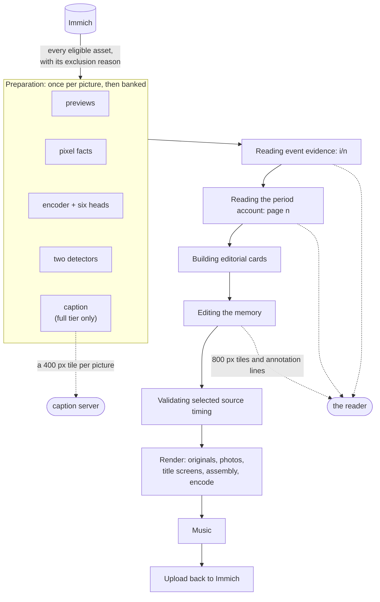
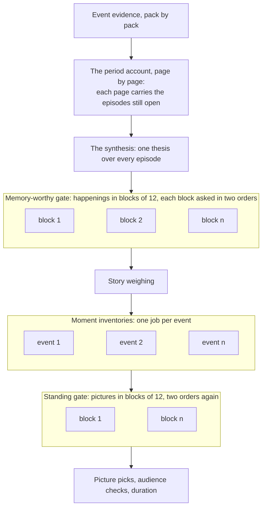

# Pipeline Overview

One `immich-memories generate` run, and one **Cut** on the Memory page, go through the same
lifecycle: **discovery → download → analysis → selection → render → music → delivery →
complete** (`OperationalPhase` in `operations/phases.py`). This page says where the time goes and
which stages have to run on this box.

Solid arrows are this box. The two dotted ones are the only seats that can live somewhere else, and
the only things a picture is ever sent to.

UI, CLI and scheduled memories use the one route. It prepares facts for the whole period, reads
it, weighs its stories, picks the moments, then allocates duration. Missing required facts stop
selection; banked facts and readings are reused. How it decides is in [The Curator](./the-curator.md);
what happens without a model is in [Rules mode](./rules-mode.md).

## Cost classes

| Class | Meaning |
|---|---|
| `local-only` | Needs this machine (or the [inference service](../../deploy/installation/inference-service.md) for the heads and detectors): decode, frame extraction, the encoder and detectors, FFmpeg, title rendering |
| `remotable` | An HTTP request to a model server you point at: captions, the reader, music |
| `network` | Immich API I/O, bounded by your NAS and LAN |
| `cheap` | Python over data already in memory or SQLite |

## The stages of a cut

The stage names are what the run reports (a row on the Memory page, a line in the terminal).

| Stage | What runs | Class |
|---|---|---|
| **Reading dates, places and people** | The source model: every eligible source with its provenance, duration, Live companion and exclusion reason, per window. Then preparation, counted per producer: previews, pixel facts, the encoder with six context heads, the two detectors, and on the `full` tier one caption per picture that has none. Nothing banked is produced twice | `network` for previews; captions `remotable`; heads, detectors, pixels `local-only` |
| **Reading event evidence: i/n** | Paged episode reading over the annotation lines, the cull asked inside each episode. Banked per group and evidence key | `remotable`; `cheap` when banked |
| **Reading the period account** | The period read as an account with a thesis, one bounded repair if malformed. Banked | `remotable`; `cheap` when banked |
| **Building editorial cards** | One card per moment, rendered into the wall the planner reads | `cheap` |
| **Editing the memory: n pictures into …** | The structure and story planners: the memory-worthy gate, the story weighing, the moment picks, the standing gate, the audience checks; each a banked question, the gates asked in two orders. Motion is measured for the chosen Live carriers | `remotable`; motion `local-only` |
| **Validating selected source timing** | Intervals bound to their sources, duration realised | `cheap` |

If the reader stops answering, the Editing stage reports *Waiting for the reader at host:port*
and retries three times before failing.

### What a cut leaves behind

Every attempt is durable under `<cache>/editorial-runs/<key>/attempts/<id>/`, and
`latest-attempt.private.json` points at the newest. Inside: the status (stage, request, outcome,
the duration realisation, a lease that tells an interrupted run from a slow one), the plan (thesis,
stories with weights, every carrier with its reason: what the storyboard and `runs story` read),
the render projection (what shipped, each interval), the selection trace (`runs why` reads it),
every model request and answer, and the evidence hashes per episode. The banks the next cut
reuses are not in the attempt: they are in `annotations.sqlite` and `structure-banks/` beside it.

### Where the time goes

A cold cut pays for every picture never read and every reading of a period nobody has cut. A
warm cut over the same period is mostly the render. There is no depth knob and no shortlist at
the source: every eligible picture is prepared, because a picture the editor never saw is one it
cannot weigh. The levers: put the caption server and the reader where they are fast, prepare a
library ahead with [`prepare`](../cli/prepare.md), and keep the cache. If the render is the slow
part, none of that helps: that is decode, scale, blend and encode, and the levers are a hardware
encoder, a lower resolution and fewer clips.

### What overlaps, and what cannot

Reading is mostly a queue of one. Each page of the period account carries the episodes still open
from the pages before it, so page 5 cannot be asked until page 4 has answered, and every pick below
reads the stages above. Two places do hold independent questions: the moment inventory of one event
knows nothing about the next event's, and the worthiness and standing gates ask in blocks of twelve
that do not see each other. Those are what `advanced.llm.reader_concurrency` overlaps. Nothing else
in the reading can be made to overlap by raising it.

Everything on the spine waits for the box above it. Only the boxes holding several jobs run at
once, and only up to the concurrency limit: unset, it is 1 for a model on your own machine or your
own network and 4 for a public host, because a local server is one process in front of one
accelerator and four requests there queue instead of overlapping.

## Render

`generate_memory()` takes over from the plan under a file lock:

- **Originals** of the selected sources are downloaded (3 workers by default,
  `analysis.download_workers`) and each interval trimmed with FFmpeg. A Live Photo chosen for its
  motion plays its video; one chosen as a still is held.
- **Photos** render frame by frame in Python: Ken Burns is a `cv2.warpAffine` per frame at
  30 fps for the seconds granted, two of them on the blurred-background path (the sharp crop and
  the background) and one when the aspect already matches. HEIC decode
  and gain-map HDR happen here; sources are capped at 1.5× the output size.
- **Title screens** render on the GPU when the kernel library initialises, PIL otherwise, and
  encode with the final video's encoder.
- **Assembly and encode** stream: one FFmpeg decode per clip at a time, crossfades blended into
  one preallocated buffer, raw frames piped into one encode process. Memory stays flat with clip
  count, which is what makes 4K output possible.

Encoder selection is a real probe: NVIDIA, then Apple, then QSV, then VAAPI, each having to encode
one 256×256 frame before it is used (VideoToolbox is taken on FFmpeg's listing). A hardware
encoder that fails mid-run is retried once in software with the same codec. Assembly uses a
hardware **encoder** but a software **decoder**: a GPU speeds up the write side, not the read side.

## Music and delivery

`resolve_music()` walks a fixed chain: an explicit file, then a generator if one is enabled, then
a bundled track chosen by mood; a failed generator falls through and the run is told. ACE-Step
runs in-process (`mode: lib`) or over HTTP; MusicGen is HTTP only. Mixing, ducking and muxing are
FFmpeg. See [Audio & Music](./audio-and-music.md).

Delivery is the optional upload back to Immich. A failure is non-fatal: the video stays on disk,
the run is marked delivery-pending, and secrets are scrubbed from the logged error.

## The caches

| Cache | Location | Holds |
|---|---|---|
| Annotation store | `~/.immich-memories/cache/annotations.sqlite` | every fact per picture and producer; the episode, period, cull and judgment banks |
| Structure banks | `~/.immich-memories/cache/structure-banks/` | the memory-worthy and standing votes, thumbnail hashes, demanded motion |
| Attempts | `~/.immich-memories/cache/editorial-runs/` | one directory per cut |
| Downloaded videos | `~/.immich-memories/cache/video-cache` | 10 GB, 7 days |
| Immich previews | `~/.immich-memories/cache/thumbnails` | 10 GB |
| Clip previews | `~/.immich-memories/cache/preview-cache` | 2 GB |
| Run database | `~/.immich-memories/cache.db` | run history |

Facts are keyed by producer version; changing a version names a new fact generation and the next
cut produces it. Readings are keyed by the exact request, prompt included.

## Related

- [The Curator](./the-curator.md), [Rules mode](./rules-mode.md)
- [Editorial annotation setup](../../deploy/configuration/editorial-preparation.md)
- [Running modes](../../deploy/running-modes.md)
- [Hardware acceleration](../../deploy/hardware/overview.md)
