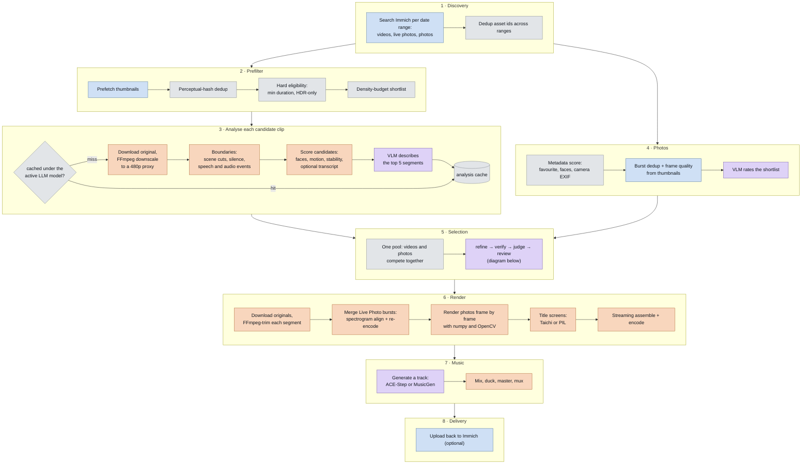
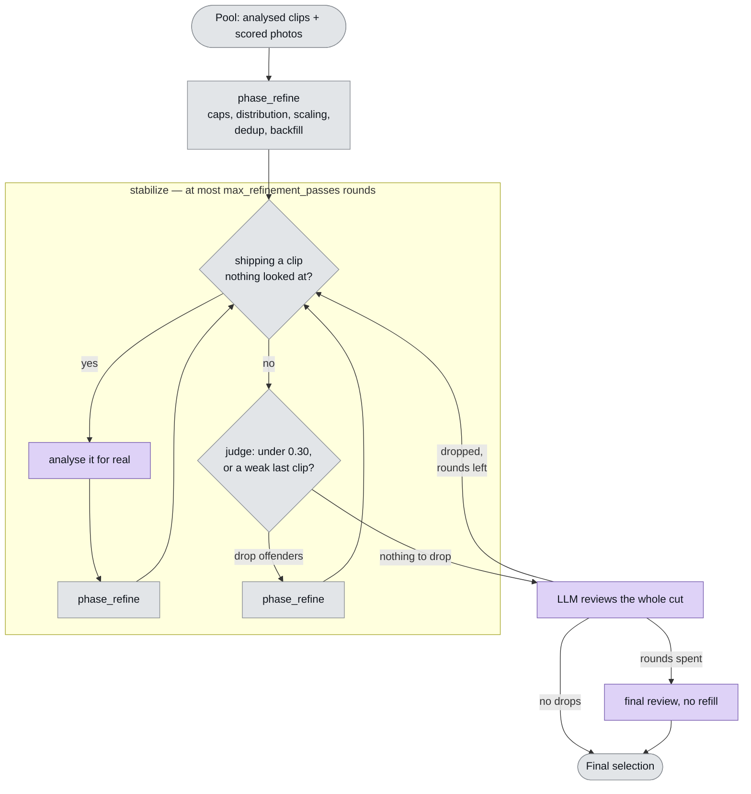

# Pipeline Overview

One `immich-memories generate` run goes through eight phases before an `.mp4`
lands on disk. This page traces all of them against the code and answers the two
questions that matter when you are sizing a machine or hunting a slow step:

- Where does the time go?
- Which stages have to run on this box, and which could run somewhere else?

The outer lifecycle is `OperationalPhase` in `operations/phases.py`:
**discovery → download → analysis → selection → render → music → delivery →
complete**. Inside analysis, `SmartPipeline` reports four sub-phases of its own
(`analysis/progress.py`): **clustering → filtering → analyzing → refining**.

## Cost classes

Every stage below carries one of four labels. They are the whole point of the
page, so they are worth reading first.

| Class | Meaning |
| --- | --- |
| `local-only` | Needs this machine. Video decode, frame extraction, image transforms, FFmpeg assembly, encoding, Taichi title rendering. Nothing about it is a network call you could point elsewhere. |
| `remotable` | An HTTP request to a model server: the vision LLM, the selection reviewer, music generation. Runs wherever you point the config — another box on the LAN, a GPU host, a hosted provider. |
| `network` | Immich API I/O. Bounded by your NAS and your LAN, not by CPU. |
| `cheap` | Pure Python over data already in memory. Milliseconds. |

In the diagram below, blue is `network`, orange is `local-only`, purple is
`remotable`, grey is `cheap`.

## The whole pipeline



### 1. Discovery

`fetch_videos_and_live_photos()` in `cli/_asset_fetch.py` runs one Immich
search per date range, then dedups by asset id. Live Photos are fetched
separately and their video components are removed from the plain video list so
the same footage is not considered twice.

Nothing is downloaded yet. This is pure API round-trips.

### 2. Prefilter

`SmartPipeline.run_analysis()` runs three cheap gates before anything expensive
happens:

1. **Thumbnail clustering.** `ThumbnailPrefetcher` pulls thumbnails (network),
   then `deduplicate_by_thumbnails()` drops near-identical clips using
   perceptual hashes.
2. **Hard eligibility.** Anything shorter than `analysis.min_segment_duration`
   is gone for good; so is anything non-HDR when `hdr_only` is set.
3. **The analysis shortlist.** This depends on `--analysis-depth`:

| Depth | What gets analysed |
| --- | --- |
| `thorough` | Every eligible clip. |
| `auto` (default) | Counts how many clips have no cache entry under the *current* LLM model. At 60 or fewer misses it analyses everything anyway. Past 60, it falls back to the density budget. |
| `fast` | Density-budget shortlist, and non-favourites skip the LLM entirely. |

The density budget (`analysis/density_budget.py`) splits a raw-footage second
quota across time buckets proportional to how many assets sit in each, fills
favourites first, then gap-fills. The result is capped at 1.5× the target clip
count by `_cap_analysis_candidates()`.

The `auto` cutoff at 60 misses is the single biggest lever on cold-run cost:
below it you analyse everything, above it you analyse a shortlist.

### 3. Analysis

This is the expensive phase, and it runs **once per clip** — the cache means
"once ever", not "once per run".

For each candidate, `ClipAnalyzer._analyze_clip_with_preview()`:

1. Checks the analysis cache. A hit ends the story here.
2. Downloads the original and produces a **480p proxy** with FFmpeg
   (`analysis.analysis_resolution`, `analysis.enable_downscaling`). GPU decode
   is used here when `hardware.gpu_decode` is on. Everything *visual* afterwards
   runs against the proxy, never the 4K source; everything *audio* runs against
   the original, because downscaling would have thrown the audio away.
3. `UnifiedSegmentAnalyzer.analyze()` then does, in order:
   - PySceneDetect for visual cut points;
   - FFmpeg `silencedetect` for audio gaps;
   - PANNs audio-content classification and FireRedVAD speech regions, which
     become "protected ranges" a cut is not allowed to land inside;
   - candidate segment generation from the merged cut points;
   - visual scoring of every candidate — faces, motion, stability — sampling
     5 frames per candidate through Apple Vision or OpenCV;
   - optional whisper.cpp transcription of the best segments;
   - **LLM content analysis on the top 5 candidates only**, 2 frames each at
     480px (`content_analysis.analyze_frames`, `content_analysis.frame_max_height`).
4. Writes the result to the cache, stamped with the LLM model name.

Everything in step 3 is `local-only` except the last bullet, which is the only
`remotable` part of clip analysis — and, on a warm run, the only part that has
not been cached away.

Note that `content_analysis.enabled` defaults to **false**. With no LLM
configured the pipeline works fine; it just scores on vision and audio alone,
and the selection reviewer never runs.

### 4. Photos

Photos take a shorter route (`photos/photo_pipeline.py: score_photos()`):
metadata scoring (favourite, face count, camera EXIF) for everything, burst
dedup and frame-quality re-weighting from thumbnails, then a VLM pass over a
shortlist. The shortlist is `min(available, selectable × 3, 200)` — module
constants in `photo_pipeline.py`, not config keys. Photo LLM scores are cached
in `AssetScoreCache`, keyed on the model name, same as clips.

Photos then become `ClipWithSegment` objects with a fixed duration and join the
video pool. From selection onwards there is no photo pipeline and no video
pipeline — there is one pool.

### 5. Selection

The part nobody understands from reading the code. It gets its own diagram.

### 6. Render

`generate_memory()` in `generate.py` takes over. It holds a file lock so two
runs cannot interleave, and it re-enters the download phase — the originals
were never fetched, only 480p proxies. Then:

- **Downloads the originals and trims each selected segment** with FFmpeg
  (`DownloadCoordinator` fetches in parallel; `analysis.download_workers`
  defaults to 3). Segment extraction *can* use hardware decode.
- **Merges Live Photo bursts** where a clip is a burst: probe each component,
  extract mono PCM, cross-correlate spectrograms to align them, then one FFmpeg
  re-encode into a single file. This is the most expensive per-asset local step
  after encoding, and the cross-correlation is an unvectorised Python loop.
- **Renders selected photos** frame by frame in Python. Ken Burns and the
  blurred background are two `cv2.warpAffine` calls per frame, 30fps for
  `photos.duration` seconds — 120 frames per photo at the default 4s. HEIC
  decode and Apple gain-map HDR reconstruction happen here too, and the source
  is capped at 1.5× the output size because a 24 MP HEIC otherwise costs about
  0.63s and 0.32 GB per photo for pixels that get thrown away.
- **Generates title screens**, using the Taichi renderer when Taichi
  initialises and PIL otherwise. Both encode with the same encoder the final
  video uses.
- **Assembles and encodes.** Two or more clips always go through
  `StreamingAssembler`: one FFmpeg decode process per clip at a time, crossfades
  blended with `cv2.addWeighted` into a single preallocated buffer, raw frames
  piped into one FFmpeg encode process. Memory stays flat regardless of clip
  count, which is what makes 4K output possible.

Encoder selection is a real probe, not a capability listing: NVIDIA, then Apple,
then QSV, then VAAPI, and each candidate has to successfully encode one 64×64
frame before it is used. If a hardware encoder fails mid-run the whole encode is
retried once in software with the same codec.

One thing to be clear about, because it changes what hardware helps: **assembly
does hardware-accelerated *encode* but not hardware-accelerated *decode*.**
`FrameDecoder` builds its FFmpeg command with no `-hwaccel` flag, and all
scaling, padding, blurring and captioning in the assembly path is software. A
GPU speeds up the write side of assembly, not the read side.

### 7. Music

`resolve_music()` in `generate_music.py` walks a fixed chain: an explicit
`--music` file wins; otherwise AI generation if a backend is enabled; otherwise
a bundled track chosen by mood. A generation failure falls through to bundled
rather than aborting the run — and the run is told: the substitution comes back
as a warning on the finished artifact, so a dead backend shows up in the UI and
in the nightly notification instead of sounding like working music forever.

ACE-Step has two modes, and which one you pick decides the cost class:

| `advanced.ace_step.mode` | What runs |
| --- | --- |
| `api` (default) | HTTP POST to an ACE-Step server, poll every 3s. `remotable`. |
| `lib` | The model runs in-process on this machine — MLX on Apple Silicon, CUDA on NVIDIA, PyTorch CPU otherwise. `local-only`. |

`lib` silently downgrades to `api` when the `acestep` package is not importable.
MusicGen is HTTP-only. The code puts CPU-only generation at "8+ hours per song";
disabling the ACE-Step language model (`use_lm`, off by default) is documented
in-code as taking a 60s track from roughly 45s to 17s.

Mixing, ducking, mastering and muxing are FFmpeg, so `local-only`.

### 8. Delivery

Optional upload back to Immich. A failure here is non-fatal: the video stays on
disk, the run is marked delivery-pending, and error strings are scrubbed of any
configured secret before they are logged.

## The selection loop

Selection is not a single pass. It iterates, and the iteration is what makes a
warm run cost more than you would expect.



### What each box actually does

**`phase_refine`** (`analysis/clip_refiner.py`) is the deterministic part: cap
photos per day, distribute across the timeline by date (or across overnight
stops for a trip), scale segment durations to fit the target, drop same-moment
duplicates, apply the non-favourite and photo ratio caps, then backfill any
leftover duration budget. No network, no model. Pure logic.

**Verify** exists because a clip can reach the final cut without anything having
looked at it. Two ways that happens: it carries a metadata guess instead of a
real score, or it has a real visual score but no LLM description, so the
reviewer would be handed a bare line. Either way `_needs_a_real_look()` returns
true, the clip is analysed for real, and selection re-runs. On a cold library
this is a download plus a full analysis; on a warm one it is a cache hit.

**Judge** is mechanical and cheap. A non-favourite scoring below
`judge_floor_score` (0.30) never ships. Separately, the chronologically last
clip cannot be both the weakest in the cut and below `judge_boundary_ratio`
(0.6) of the mean — a video should not end on its worst shot. Favourites are
exempt from both rules.

**Review** is one LLM call over the entire cut: every clip's description,
emotion, setting, subjects, audio categories, date and place, in timeline order.
It is asked which clips are redundant, which subject is crowding out the rest,
which clip clashes, and which is not a memory at all. It can drop at most 20% of
the selection in one pass, never a favourite, and any failure or unparseable
answer drops nothing.

### Why it loops

Every drop triggers a re-selection, and a re-selection admits clips that nothing
has judged yet. So verify and judge iterate together until a round changes
nothing, the review runs, and if the review dropped anything the whole
stabilisation runs again. `max_refinement_passes` (10) bounds each of these
loops — YAML `advanced.analysis.max_refinement_passes`, CLI
`--refinement-passes`.

If the review is still dropping clips when the round budget runs out, one final
review runs that drops without refilling — the reasoning being that a cut four
seconds short beats a cut that ends on a photo of a shelf.

**Each review pass is one uncached LLM call.** The per-clip analysis is cached;
this is not. It reads the current selection, which changes every round, so
there is nothing to key a cache on. That is the single most important fact on
this page for anyone wondering why a fully-cached run still takes 30 seconds.

## Stage reference

| Stage | What it does | Cost | Class |
| --- | --- | --- | --- |
| Asset search | One Immich query per date range | A few round-trips | `network` |
| Live Photo discovery | Search + pair still with video component | Extra round-trips | `network` |
| Thumbnail prefetch | Fill the thumbnail cache | One small GET per asset | `network` |
| Thumbnail dedup | Perceptual hash compare | Milliseconds | `cheap` |
| Hard eligibility | Duration and HDR gates | Milliseconds | `cheap` |
| Density budget | Quota per time bucket, favourites first | Milliseconds | `cheap` |
| Analysis proxy | Download original, FFmpeg downscale to 480p | Seconds per clip, dominated by the download on a NAS | `network` + `local-only` |
| Scene detection | PySceneDetect over the proxy | Full decode of the proxy | `local-only` |
| Silence detection | FFmpeg `silencedetect` | One audio pass | `local-only` |
| Audio content | PANNs classification, FireRedVAD speech | Model inference on 16kHz audio | `local-only` |
| Visual scoring | Faces, motion, stability, 5 frames per candidate | Decode plus face detection per candidate | `local-only` |
| Transcription | whisper.cpp on the best segments | Optional, off unless the extra is installed | `local-only` |
| Clip content analysis | VLM on the top 5 segments, 2 frames each at 480px | One HTTP round-trip per segment | `remotable` |
| Photo metadata score | Favourite, faces, camera EXIF | Milliseconds | `cheap` |
| Photo burst dedup | Thumbnail hashes and frame quality | Thumbnail GETs | `network` |
| Photo LLM score | VLM rates each shortlisted photo | One round-trip per photo | `remotable` |
| Subject policy | Ration animals and objects by share of runtime | Milliseconds, but reads LLM category labels | `cheap` |
| `phase_refine` | Caps, distribution, scaling, dedup, backfill | Milliseconds | `cheap` |
| Verify pass | Re-analyse anything shipping unseen | A full analysis per clip, or a cache hit | `local-only` + `remotable` |
| Judge | Score floor and weak-ending rule | Milliseconds | `cheap` |
| Holistic review | One LLM call over the whole cut, per round | 1–3s per call, never cached | `remotable` |
| Source download | Originals for the selected clips | Bounded by NAS and LAN | `network` |
| Clip extraction | FFmpeg trim and re-encode per clip | Can use hardware decode | `local-only` |
| Live Photo merge | Spectrogram align + one re-encode per burst | Unvectorised cross-correlation, then a full transcode | `local-only` |
| Photo render | numpy/OpenCV frame loop, 120 frames per photo | Plus HEIC decode and gain-map HDR | `local-only` |
| Title screens | Taichi GPU kernels, or PIL | Per-frame render plus an encode per screen | `local-only` |
| Assembly + encode | Streaming decode, blend, encode | Hardware encode, software decode | `local-only` |
| Output validation | `ffprobe -count_frames` on the finished file | A full pass over every frame | `local-only` |
| Music generation | ACE-Step or MusicGen | Seconds to minutes on a GPU; hours on CPU | `remotable`, or `local-only` in ACE-Step `lib` mode |
| Mix and master | FFmpeg mixing and ducking | Seconds | `local-only` |
| Upload back | POST the finished file to Immich | One large upload | `network` |

## Where the time actually goes

Numbers below were measured on one library and one machine. They will not be
your numbers, but the *shape* generalises.

### Cold versus warm

| Run | Cold | Warm |
| --- | --- | --- |
| One month, 303 assets, 27 clips analysed | ~377s | 21–37s |
| `year_in_review` 2024 | Did not finish inside 2400s | 399s, with 148 clips cached and 2 analysed |

Cold cost is roughly linear in *clips not yet in the cache*, and each of those
clips costs a download, a downscale, a full local analysis, and up to five LLM
round-trips. Warm cost is almost entirely something else.

### The warm breakdown

On a warm month run, of 31s wall time:

- **26s was network** — Immich reads and model-server calls;
- of that, **11 LLM calls spanned 18s, about 58% of the entire run**;
- actual analyser compute was **~2s**.

Read that again: on a warm run, the analysis the pipeline is named after costs
two seconds. Everything else is waiting on someone else's HTTP.

The 11 calls are not per-clip analysis — that is all cached. They are the
selection loop: each holistic review pass, plus each verify pass that hits a
clip with no LLM description. `max_refinement_passes` is 10 and every round can
cost a review call, so that bound is the main dial, and it is one you can turn.

### What to actually do about it

**The LLM work is the dominant warm cost, and it is remotable. The video and
image work is the part that can only be local.** That is the whole conclusion,
and it points two different levers at two different problems.

If warm runs feel slow:

1. **Move the LLM somewhere faster.** It is an HTTP endpoint. A quicker model
   server, or a smaller model, cuts the largest single line item without
   touching anything else. This is the highest-leverage change available.
2. **Ask for fewer rounds.** `--refinement-passes 3`, or
   `advanced.analysis.max_refinement_passes: 3` in YAML, caps the loop at three
   rounds instead of ten. That is what `preset: fast` sets, and the flag's own
   help calls it the biggest dial on warm-run time. The cost is that a late
   refill may ship less scrutinised than the clips around it.
3. **Turn `content_analysis.enabled` off.** No LLM at all: no per-clip content
   analysis, no reviewer, no verify calls. Selection falls back to vision, audio
   and metadata, which is the default configuration anyway.

Those three are ordered by what they cost you. A faster server changes nothing
about the output. Fewer rounds trades scrutiny for time. Turning the LLM off
trades the whole holistic pass for it.

If cold runs feel slow:

1. **Keep the cache warm.** See below. A cold library is a one-time cost per
   clip; make sure you only pay it once.
2. **Use `--analysis-depth fast`.** Non-favourites skip the LLM entirely.
3. **Give the analysis proxy a faster path.** The 480p downscale is FFmpeg work,
   and `hardware.gpu_decode` applies to it.

If *generation* feels slow — the part after selection — none of the above helps.
That is decode, scale, blend and encode, and the only levers are a hardware
encoder, a lower output resolution, and fewer clips. A faster LLM does nothing
for it.

### Two log lines worth grepping

The pipeline prints its own split at INFO level:

```text
Full pipeline timing (42 clips, 377.0s total): analysis=83.0s (22%), generation=294.0s (78%)
Pipeline timing (42 clips, 294.0s total): download=..., photos=..., assembly=..., music=...
```

The first splits analysis from generation, the second splits generation into its
four parts. Between them you can locate any slow run without instrumentation.

## The analysis cache

Warm runs are fast because of `~/.immich-memories/cache.db` and the media caches
under `~/.immich-memories/cache/`:

| Cache | Location | Default limit |
| --- | --- | --- |
| Analysis results | `~/.immich-memories/cache.db` | 30 days |
| Downloaded videos | `~/.immich-memories/cache/video-cache` | 10 GB, 7 days |
| Thumbnails | `~/.immich-memories/cache/thumbnails` | 500 MB |
| Clip previews | `~/.immich-memories/cache/previews` | 2 GB |

The analysis cache stores segments, scores, audio categories and the LLM's
description for each asset, so a second run over the same period skips the
download, the decode and the model calls in one step.

**The cache is keyed on the semantic model.** `is_compatible_analysis_cache()`
compares the row's `model_version` against `llm.model`, so changing your LLM
invalidates the semantic half of every cached asset. The objective half — the
vision, audio and duration scores — survives, because the LLM only ever adds a
bonus on top of those and treating a model switch as a full miss would demote
the whole library to metadata-guess scoring. In practice: swap models and your
next run re-runs the LLM over everything, but not the local analysis.

Bumping `ANALYSIS_VERSION` invalidates both halves.

## Seeing it for yourself

Selection passes a pool through a dozen filters, caps, scalers and model
judgements. When the result is wrong, the useful question is which stage ate the
clips you expected.

```bash
immich-memories generate --year 2024 --trace-selection selection.txt
```

That writes a funnel — one row per stage, showing what went in, what came out,
and how many favourites survived each step — plus a matching `selection.json`.
A stage that swallowed every favourite is flagged in the report. It was written
after a February that started with 38 favourites and shipped none, and finding
the responsible stage took several rounds of guesswork.

## Related pages

- [Clip Selection & Scoring](./clip-selection-scoring.md) — the scoring weights
  and the density budget in detail
- [LLM Content Analysis](./llm-content-analysis.md) — configuring the vision
  model
- [Photo Support](./photo-support.md) — animation modes and HDR handling
- [Audio & Music](./audio-and-music.md) — the music backends
- [Hardware Acceleration](../../deploy/hardware/overview.md) — what each
  encoder needs
