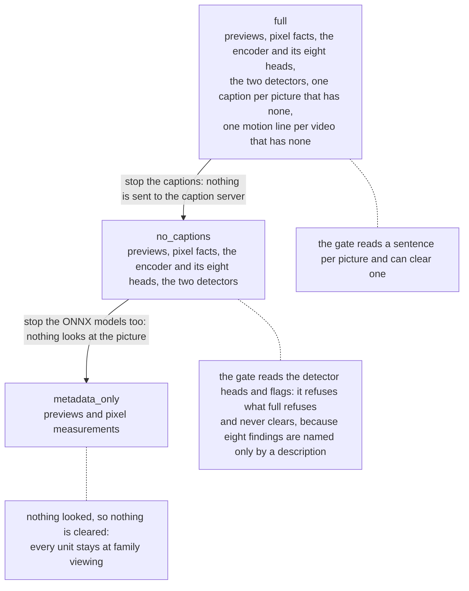

# Editorial annotation setup

Every pin, digest and contract behind preparation. For the stand-up in order, read the
[self-hosting guide](../self-hosting.md); for what each tier costs and loses,
[Running modes](../running-modes.md).

Selection prepares descriptions, context labels and pixel measurements for the whole period, reuses
complete facts from the annotation database, and stops with a count per missing producer when
something the tier demanded is unavailable. New runs use the FAMILY audience: eight findings are
held out at every audience when the evidence identifies them (breastfeeding, bathing, toileting or
changing, intimate hygiene, graphic medical procedures, identifying records, sexual content, adult
changing). A shirtless baby is ordinary family content.

## The three tiers

A tier names the producers a deployment demands. A producer it does not ask for is not missing;
one it does ask for and cannot reach stops the run. Each rung down also takes something away from
the audience gate, which may only ever tighten.



Facts are banked per picture and per producer, so moving between tiers erases nothing and a
`no_captions` library can add captions later, a month at a time.

## Install

```bash
pip install "immich-memories[editorial]"      # ONNX Runtime and Hugging Face Hub, nothing else
pip install "immich-memories[editorial-cuda]" # instead of editorial, on a CUDA host
```

`all` and `all-mac` include `editorial`. Never install `editorial` and `editorial-cuda` together:
`onnxruntime-gpu` already contains the CPU provider, the two distributions own the same import
name, and whichever pip wrote last is the one that answers.

The encoder, its eight heads and both detectors are ONNX sessions on whatever provider ONNX Runtime
has, so `editorial-cuda` puts every seat on the card and plain `editorial` puts every seat on the
CPU, inside the CUDA inference image as well.

## Configuration

The three decisions are the reader, the tier and where the two pinned exports live. Everything else
has a default, and every key is in the
[config reference](../../reference/config-reference.md).

```yaml
advanced:
  triage:
    encoder: ~/.immich-memories/models/triage/dinov2-small.onnx
  editorial:
    reader: auto             # auto | model | rules (auto = rules when llm.model is blank)
    preparation:
      tier: full             # full | no_captions | metadata_only
      caption_base_url: http://localhost:8092/v1
      caption_artifact_id: "" # optional build/revision label for new captions
      caption_api_key: ""    # bearer token, if the server asks for one
      caption_concurrency: 1 # one CPU captioner cannot do four at once
      marqo_onnx: ~/.immich-memories/models/detectors/nsfw-marqo-384.onnx
      allow_model_downloads: false
```

Producer versions live in `editorial.description_model`, `editorial.head_versions` and
`editorial.pixel_producer_key`. Changing a version names a different fact generation; it does not
teach the preparer how to produce it.

## The encoder and the heads

`immich-memories models fetch` downloads `triage.encoder_url` to a temporary file, hashes it, and
only then renames it into `triage.encoder`. The export is
`facebook/dinov2-small@ed25f3a31f01632728cabb09d1542f84ab7b0056`, 88 MB, SHA-256
`478164cd290ee78e5ddb4fcc474136eec714b4b8253a3609cc7164b592e958af`, checked at every run: no other
ONNX conversion passes. The wheel carries the head bundle `public-6heads-v3.npz` (four base heads
on `public-v1`, venue and swim on `oi-v3`): public training coefficients, no library photographs,
no owner-trained heads. Nothing reads `swim` any more: measured against a typed picture reader
over 3,564 photographs it answered `yes` on 551 where the reader saw swimwear on 22.

## Detectors

Two ONNX graphs on the same provider as the encoder. The worker reads previews locally and commits
each batch; nothing is uploaded to Hugging Face. `doc_docling` produces `det-v2`, `nsfw_marqo`
produces `det-v3`; saved `det-v1` facts, and saved `det-v2` exposure facts, migrate on load and are
recomputed on the next run.

| Producer | Artifact | Pinned by |
|---|---|---|
| `nsfw_marqo` | a 22.5 MB ONNX export of `Marqo/nsfw-image-detection-384@0c26ec22111b83f106d72a55f611ec35962bcb65` | `marqo_onnx`, SHA-256 `924658f1ac638d96e9126ecb29de047dc8d31c9c9defcab77a26a5c96ed69e11`, checked on load |
| `doc_docling` | `model.onnx` from `docling-project/DocumentFigureClassifier-v2.0` | revision `2a12e02668b98ca40216eab41cdf19530577cba4` in the Hugging Face cache |

`models fetch` supplies both (`--no-detectors` fetches only the encoder), so
`allow_model_downloads` can stay `false`. With it `true` the worker acquires the Docling snapshot
itself; the sensitive-content export is never fetched from inside a run. `preflight` checks both
digests, and a producer that cannot load names the missing model, the path it looked at and the
command that fixes it.

For Docling, `det-v2` names the extended-optimization graph, because the default ONNX layout
optimizer produced wrong labels on a Celeron J4125. A separate `detector_python` needs
`onnxruntime`, `huggingface-hub`, `numpy` and `Pillow`, and no part of the torch family.

For `nsfw_marqo`, `det-v3` names the version that reads a video on up to eight frames across its
length instead of on the single preview frame Immich serves for it, keeping the strongest answer.
The frames arrive as files from the process that can reach Immich, so the detector worker still
needs nothing but the four packages above. A still is read exactly as `det-v2` read it. Because the
banked row does not record which kind of source it came from, an existing store recomputes this head
for every source. Videos also stay out of an inference-service offload for this head: the service
takes one picture per source and cannot take eight.

A Live Photo's attached clip is read by this head too, under its own asset id, and by nothing else:
no caption, no context head, no pixel fact. A clip with no preview is read on its frames alone. It
is not a candidate, so it is not in the preparation counts and a clip Immich will not serve cannot
block a cut.

## Captions

The endpoint at `caption_base_url` must advertise `smolvlm2-500m-base-public` at `/models` and
serve one of the two accepted artifacts:

| Format | Repository | Revision | Digest |
|---|---|---|---|
| MLX, Apple Silicon | `mlx-community/SmolVLM2-500M-Video-Instruct-mlx` | `fa57db46815177fbdfd65cc85a2b3416a8332268` | `a9839c8f79ecc93e54a00dc73cc0e68ba477debcd065d50c1c289fbb1075f981` |
| GGUF Q8_0, llama.cpp | `ggml-org/SmolVLM2-500M-Video-Instruct-GGUF` | `ccd7aae53bcb1997355c2f094959e72b3642ce17` | `6f67b8036b2469fcd71728702720c6b51aebd759b78137a8120733b4d66438bc` plus `921dc7e259f308e5b027111fa185efcbf33db13f6e35749ddf7f5cdb60ef520b` for the projector |

Copy-paste recipes for both, plus a compose profile and a Kubernetes overlay, are on
[Caption server](../installation/caption-server.md).

The server must accept the compact description/setting JSON schema at temperature zero, repetition
penalty 1.1 and a 140-token cap; the app enforces the alias and three synthetic schema controls
before it sends a library preview. Captions travel as 400 px JPEG tiles at quality 90. Two invalid
completions produce a banked `caption unavailable` outcome; timeouts, missing models and transport
failures stay incomplete and a later run resumes them.

The bank keys on `smolvlm2-500m-base-public@envelope-v3-compact`, which carries no format and no
digest, so swapping one server for the other re-captions nothing and refuses nothing. The two
builds word `setting` differently, so a library captioned by both holds a mix with nothing marking
the seam.

`caption_api_key` travels as `Authorization: Bearer <key>` on the `/models` probe and on every
completion; left blank, no header is sent. The reader's `llm.api_key` is never borrowed for it:
same machine, different endpoint. A 401 or 403 names `caption_api_key` rather than reporting the
endpoint as unreachable. `${MY_KEY}` reads the value out of the environment.

## Motion lines

On `full`, every video in the period gets one banked sentence about what happens in it, from the
same caption server and model. So does every Live Photo whose motion an earlier cut measured at
1.5 or more; one nobody measured yet is not known to play and gets none. The story pick reads that
sentence beside the video's row, so the reader compares a video with a still in text and never
sees a video frame.

The app does not download the video for it. Immich answers byte ranges on its playback rendition,
so preparation reads the index (tens of kilobytes), picks the three keyframes nearest a quarter,
half and three quarters of the clip, and reads only those. FFmpeg copies exactly those packets
out of a sparse local copy and decodes them, which behaves the same on FFmpeg 5.1 (the app
image), 6.1, 7.1 and 8.1. A codec other than H.264, HEVC, VP9 or AV1 also costs its first
keyframe, which FFmpeg needs to read the stream at all. Measured on ten real playbacks of 6 to 49 seconds: 235 to 528 KB and 0.1 to 0.4 s
each, against 10 to 60 MB for the whole file. A clip with a single keyframe is a short one, and
is read whole (0.5 to 2.2 MB for the Live Photo companions measured). The three frames go to the
server as one 960 × 320 JPEG strip with a one-field schema (`description`, 120 characters), under
the same temperature, penalty, token cap and `caption_api_key` as captions.

A whole year of one library, cold, on an Apple Silicon laptop with the MLX captioner: 888 videos in
373 s (0.42 s each), 3,227 range requests, 888 caption calls and 891 MB read. The median video
cost 416 KB. The 54 single-keyframe clips read whole took 394 MB of the total. A warm pass reads
and asks nothing.

The bank keys on the picture, its complete source metadata and
`motion-line-v1@smolvlm2-500m-base-public/3-keyframes-320px`, so a changed source is asked again
and nothing else is. Two invalid answers, a playback Immich answers 404 for, or an index the app
cannot read are banked as settled; timeouts and transport failures stay missing and stop the run
like a missing caption. `caption_concurrency` bounds the requests in flight; keyframe reads run
four at a time.

Each row also records what produced it: a digest of the question asked, the keyframe times it
read, and what made the source owe a line (`video`, or the Live Photo's residual and the
measurement that produced it). Rows banked before this existed have no record and still answer;
the cut counts how many of those it read as `unrecorded` in its motion metrics.

A video's sentence counts only where its motion is measured. On every tier that samples a
video's frames for the exposure head, preparation also measures their optical-flow residual and
banks it under the picture, its source metadata and
`motion-residual-v1@median-flow-v1-detector-frames-320x240`, with the frame count it was measured
on. A video that measures under 1.5 has its sentence withheld (a favourite keeps it); see
[the pipeline](../../create/pipeline.md). A video already prepared before this is sampled once more
for the residual alone; a frame read or measurement that fails is named and never blocks the cut.

`no_captions` and `metadata_only` ask for no motion line. The pick then reads the video's plain
facts instead: its length, and the measured motion of a Live Photo that has one.

## Editing without a language model

`reader: rules` needs nothing beyond the app on `tier: metadata_only`. What it answers in place of
a model is on [Rules mode](../../create/pipeline.md#editing-without-a-language-model), and what it
keeps per memory type is on [Running modes](../running-modes.md). Classifiers are not a guaranteed
upgrade: the measured season cut on `no_captions` got longer and chose more household objects.

Preflight follows the choice: rules skip the reader, `no_captions` skips the caption alias and
`metadata_only` skips the model files. An explicit `reader: model` without `llm.model` is an error.

## Files and cancellation

The annotation database and its SQLite sidecars are restricted to the current user. Previews are
replaced atomically at mode `0600`; a corrupt preview gets one fresh fetch. Cancellation stops
before the next caption request and terminates the detector worker's process group; committed
facts stay for the next run.
