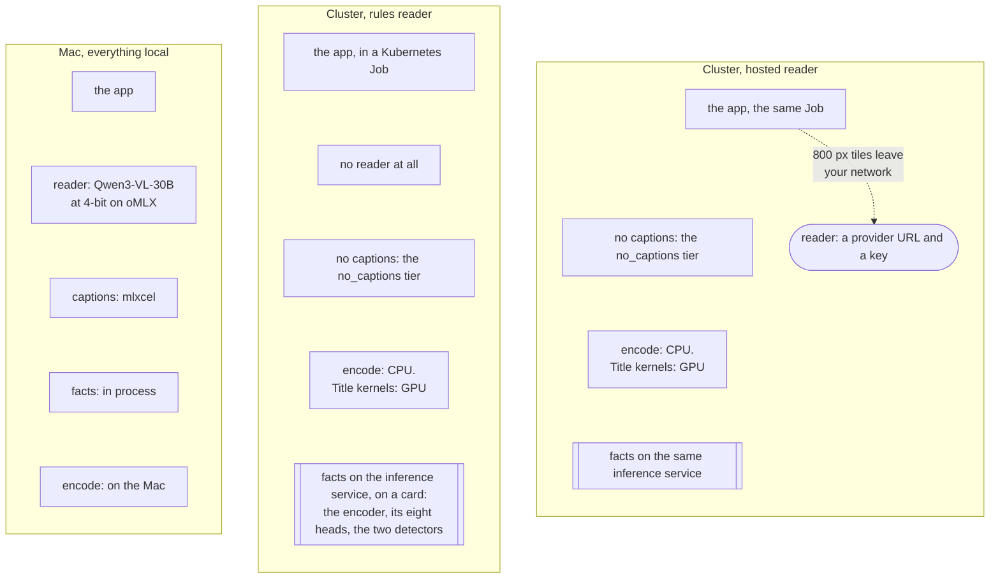

# Running modes and tradeoffs

Two settings decide what a deployment needs and what the cut loses. They are independent.

| Axis | Key | Values |
|---|---|---|
| Who reads the period | `advanced.editorial.reader` | `rules`, `model`, or `auto` (rules when `llm.model` is blank) |
| How much image analysis runs first | `advanced.editorial.preparation.tier` | `metadata_only`, `no_captions`, `full` |

Where the analysis runs is a third, smaller choice: in the app process (the default), or in the
optional [inference service](./installation/inference-service.md) on a CPU or CUDA box, switched
on with one key (`advanced.inference.facts_base_url`). The facts are the same rows either way, so
you can move the service, change its provider or turn it off without re-deriving anything.
Hardware encoders (Quick Sync, VAAPI, NVENC) only change the render; none of them runs inference.

On a cluster, set `advanced.inference.facts_concurrency` with it. It is 8 by default and the app
keeps that many `/facts` requests in flight. At 1, which is what the client used to do, a Job
against a T1000 on `no_captions` spent 42.7 minutes on 3,709 pictures: 0.69 s each, the same rate
a 133-picture scope got, so the wait was the round trip and not the card. A 13,552-picture year
would have cost 2.6 hours of facts before anything was selected. Match it to the service's
`REQUEST_THREADS` and give the pod the CPU for them. `prepare` prints what each side spent: the
`remote_facts` row carries the app's wall clock and a `service s/pic` column beside it.

## The reader

| `reader` | Needs | What you get | What you lose |
|---|---|---|---|
| `rules` | Nothing beyond the app | The ten standard memory types, cut from dates, places, favourites, known people and whatever image facts the tier produced. Repeatable: 72 runs across 12 cases, stable across hash seeds, zero reader requests. On a library a model has read before, the draft also reads what it answered: a picture an earlier cut of any scope refused for the same audience, or a banked episode reading culled, is not offered, and a picture that reading named leads its episode. Still zero reader requests | No story thesis. Custom free-text subjects are refused. No Live Photo motion choice. It can drop an occasion, over-select repeated portraits on a trip, or let a mundane object take a slot in a month or year recap |
| `model`, local | A vision model with a 32k context on a machine you own. Graded on a 30B model at 4-bit, about 17 GB resident, oMLX on an Apple Silicon Mac with 32 GB | The full editor: the period read as a story, pictures weighed in words, a reason under every picture | Time and a second machine. Reading a real month took 19 min on the graded reader on 15 September, and 29 min on 17 September on a machine other work was sharing |
| `model`, hosted | An OpenAI-compatible or Anthropic-compatible endpoint and a key | The same editor, sometimes faster: the same month took 14 min on the quickest hosted reader, EUR 0.054 of tokens at list. The dearest one that finished cost EUR 0.585 and took two hours | Your annotation text and 800 px picture tiles leave your network. Only monthly memories were priced; years and trips were not |

What each model did on one real month, and what stopped three of them:
[Readers](./readers.md). Rules and the local model reader cost nothing in API fees. Electricity and
hardware were not metered.

The two are not exclusive. A model install runs them in series: the rules reader cuts the film
with no model call, and the model then reads the finished cut once and says which of its shots add
nothing to it. It needs a period the library holds an account of, which cataloguing writes;
without one the run plans the film the way `reader: model` always has.
`advanced.editorial.thin_model_layer: false` turns the series off. Described on
[Pipeline](../create/pipeline.md).

`rules` makes no reader request, which is not the same as no model request anywhere in the run. With
an `llm` endpoint configured, the music stage still asks it one question after the render: 854
prompt and 54 completion tokens on the fixture month, 1,033 and 59 on a real one. A rules cell with
no endpoint at all asked nothing.

## The preparation tier

| `tier` | What runs on every picture in scope | What the editor and the gate are handed |
|---|---|---|
| `metadata_only` | Previews and pixel measurements. No ONNX, no captions | Dates, places, favourites, known people, pixel facts. No content evidence at all: every unit stays at family viewing and a `sendable` export is refused outright |
| `no_captions` | The above plus the DINOv2 encoder with eight context heads, the sensitive-content and document detectors | The same, plus a classifier line under every picture. The gate refuses what it would refuse on `full` and can never clear: eight findings (bathing, toileting, medical procedures, identifying records and the rest) are only named by a description, so a clean picture still comes back family-only |
| `full` | All of the above plus one caption per picture from a 500M vision model | A sentence under each picture instead of the facts that funded it. Everything the gate can do |

Five of the eight heads name the scene: where it is, how many people, whether a child is in
it, what is happening, what kind of place. The other three were distilled from a typed picture
reader on the same public corpus and each one adds to a rule a detector already answered, never
replacing it:

| head | what it answers | what it adds |
|---|---|---|
| `frame_kind` | which of seven kinds of frame this is | a picture it calls an empty room, a lone everyday object or a body-part close-up does not stand on its own in the no-model cut. Nothing shipped answered this before. A video is also read on eight frames across its length: one that shows its moment in fewer than three frames of four does not stand on its own either, unless it is a favourite |
| `screen` | is this a photo of a screen | a screen refusal beside the document head's. It ships at one strict band: over 3,564 photographs it said yes 37 times and every one was a screen, so it catches nine more screens for no extra wrong refusal |
| `uncovered_person` | is somebody uncovered | a second opinion beside the sensitive-content detector, which stays the floor. It can add a hold and it can never lift one: a `no` from it is silence, not a clearance |

They cost 0.0013 ms a picture, because the encoder pass the other five already pay for is where
the time goes.

The default is `full`. An install that configures neither `advanced.llm.model` nor a caption
endpoint gets `no_captions` instead, and says so once in the log: a blank `llm.model`
already resolves the reader to `rules`, so `full` would spend every batch on a connection
refused at the default caption address. Stating `tier`, `caption_base_url` or
`caption_artifact_id`, or configuring a model, keeps the tier exactly as written.

Facts are banked per picture and per producer. Changing tiers erases nothing, and a `no_captions`
library can add captions later, a month at a time. The second cut over a prepared period pays
only a preview check.

### What each tier costs to prepare

Cold, one cell each, over the year 2024: 13,544 pictures. The cells asked `prepare` for February,
but `prepare --year Y --month M` dropped the month and prepared the whole calendar year until
[#1056](https://github.com/sam-dumont/immich-video-memory-generator/pull/1056) merged on
17 September 2026, after these cells ran. So every total below is a year, not a month. That still
gives a good idea of the scale, and the per-picture rates are unaffected. `prepare --month` now
prepares only that month, so a month costs its own picture count at the same rate.

| Host | Tier | Per picture | The year 2024 (13,544 pictures) |
|---|---|---:|---|
| Mac M5 Max, facts in process, **two other runs on the machine** | `full` | 0.4778 s | 1 h 47 min, measured 17 September |
| Mac M5 Max, facts in process, **machine to itself** | `full` | 0.2336 s | 53 min, measured 13 to 14 September |
| Cluster pod, facts on a GPU service | `no_captions` | 0.2896 s | 1 h 05 min, measured 17 September |
| Cluster pod, facts on a GPU service | `full` | 1.2268 s | 4 h 37 min, the fixture month's rate multiplied out |
| NAS, facts in process | `no_captions` | 1.4813 s | 5 h 34 min, the fixture month's rate multiplied out |
| NAS, facts on a cluster service | `no_captions` | 0.4460 s | 1 h 40 min, the fixture month's rate multiplied out |

**The two Mac rows are the same work on the same machine, and the difference between them is the
machine, not the software.** The 17 September cell prepared for 107 minutes with another project's
selection run alive in 80 of them and two at once in 52, so 0.4778 s a picture includes whatever
those took off the box. The 13 to 14 September cell had it to itself. Size a Mac somewhere in that
band and expect the lower end on a machine doing nothing else. Only the Mac lane was shared: the NAS
and the cluster rows below each ran on their own host.

The Mac rules cell also prepared a year, in 18 min, and that figure is not in the table because its
cache was already primed: only 5,576 captions were left to do, so it is a partial re-read and not
the rules cost of a year.

No NAS cell in the matrix was set to `full`. A caption on four Celeron cores measured 30.9 s, so ten
thousand pictures is about four days: [NAS + a model box](./common-setups/nas-only.md).

**What degrading the Mac would save has not been measured, and the measurement is owed.** No Mac
cell ran `no_captions` or `metadata_only`, and no cell anywhere ran `metadata_only`. The mechanism
is not in doubt: a tier drops whole producers and changes nothing else, so the shared-machine
1 h 47 min above splits into captions 4,080 s, the two detectors 1,020 s, the encoder and its six
heads 720 s, previews 480 s and pixels 240 s. Drop the captions and the arithmetic says about 39 min; drop the
classifiers as well and it says about 10 min. Those two figures are subtraction, not a stopwatch.

What the degradation costs the cut is a different question again, and it has an answer:
[what the rules cut keeps, per memory type](#what-the-rules-cut-keeps-per-memory-type) below.
Classifiers are not an automatic upgrade there.

## Combinations that were measured

The current numbers are the setup matrix of **17 September 2026**, further down this page: eleven
cells over a fixture month and four over a real one, on the released `0.102.0`.

What follows is a separate benchmark from **12 September 2026**, kept because nothing since covers
what is in it: `metadata_only` on any host, and a reader served over the LAN. Neither has been
measured again.

Selection only, 60-second monthly memory, 1,440 pictures prepared, no render or music.
"Cold" means fresh previews and pixel facts; installation, model download and image pull are excluded.
Single observations under different cache conditions, not a hardware ranking.

| Host and mode | Cold | Repeat |
|---|---:|---:|
| Workstation, rules + `metadata_only` | 55.4 s | 1.4 s |
| Celeron J4125 NAS, rules + `metadata_only` | 279.0 s | 11.1 s |
| Kubernetes pod, rules + `metadata_only` | 65.2 s | 2.1 s |
| Kubernetes pod, rules + `no_captions` | 301.0 s | not a matched pair |
| Kubernetes pod, model reader on the LAN | 985.7 s | not measured |
| NAS, model reader on the LAN | 1,512.5 s (1,278 s of it waiting on 198 reader responses) | not measured |

Offloading the reader to another machine does not remove the wait for its answers. On the NAS, the
cold time splits into 19.9 s of preview access and 190.4 s of pixel facts; on the workstation,
34.7 s and 13.5 s.

Whole films on the workstation, warm cache, 1080p H.265 with bundled music, rules reader: between
56.9 s (on this day) and 287.7 s (trip) for the full CLI run including download, titles, encode
and audio. The [capability report](https://github.com/sam-dumont/immich-video-memory-generator/blob/main/docs/research/2026-09-12-capability-matrix.md)
has the per-product table.

## What to expect on a first run

One 60-second monthly memory per setup, the same month of the same library, measured on
17 September 2026 on the released `0.102.0`. Every cell banked in a cache of its own and started
cold, so the cold columns are a first derivation and not a re-read. Overlap is the share of
pictures a cut has in common with the Mac local-model cut of the same month. The hosts:

- **Mac**: Apple M5 Max, 64 GB. Reader Qwen3-VL-30B-A3B at 4-bit on oMLX, captions from mlxcel.
- **NAS**: Synology, Celeron J4125, 4 cores, no AVX, no CFS controller. Docker, 4 GB per container.
- **Cluster**: a Kubernetes Job with 2 CPU and 4 GiB, the inference service on a CUDA node. CPU
  encode, GPU title kernels. The run did not record which card was behind the service.

Four readers ran: `Qwen3-VL-30B-A3B-Instruct-4bit` on local oMLX, `gpt-5.6-luna` on OpenAI,
`glm-5.3-flash` on z.ai, and the rules reader with no model at all. Those are the shortlist as it
closed on 15 September; earlier alternate local models were dropped and are not in these tables.
What each model did is on [Readers](./readers.md).

:::caution Most of the Mac rows were measured with other work on the machine
A contention log sampled the Mac once a minute through the lane, keyed by which worktree each
concurrent run came from. Per cell:

| Mac cell | Minutes sampled | Another run alive | Most at once |
|---|---:|---:|---:|
| February, local reader, cold preparation | 107 | 80 (75 %) | 3 |
| February, local reader, selection and render | 30 | 29 (97 %) | 1 |
| February, rules, cold preparation | 20 | 20 (100 %) | 1 |
| Fixture, rules, whole cell | 5 | 5 (100 %) | 1 |
| Fixture, local reader, whole cell | 10 | 0 | 0 |
| Fixture, hosted reader, whole cell | not sampled | unknown | unknown |

So every February Mac number and the fixture rules row are **upper bounds**, not quiet-machine best
cases. The fixture local-reader cell is the one Mac cell the log shows running alone, and the fixture
hosted cell ran after the log stopped. The NAS and cluster rows are unaffected: each ran on its own
host.
:::

### The fixture month: 133 pictures, 130 eligible, June 2024

This month exists to show that a setup works and how fast. It is 133 CC0 files, 130 of them
eligible, with no history behind them, so it says nothing about whether a cut is any good. Its
reader prompts are about half the size of a real month's: 1,258 prompt tokens a call against 2,378
on February, same model over both.

<!-- Fields in output/setup-matrix/demo/run1/summary.data.json, per cells[] entry:
     setup id, tier tier, prepare cold timing.prepare_cold_s, prepare warm timing.prepare_warm_s,
     selection timing.selection_s, render timing.render_s, film video.duration_s,
     kept len(selected_asset_ids), overlap overlap_vs_cell_1 against reference_cell mac-local. -->

| Setup | Tier | Prepare cold | Prepare warm | Selection | Render | Film | Kept | Overlap |
|---|---|---:|---:|---:|---:|---:|---:|---:|
| Mac, local 30B reader | `full` | 35 s | 0.7 s | 319 s | 125 s | 56.0 s | 13 | 100 % |
| Mac, rules | `full` | 45 s | 0.7 s | 1 s | 114 s | 60.5 s | 14 | 17 % |
| Mac, hosted reader | `full` | seeded | seeded | 126 s | 89 s | 60.5 s | 14 | 23 % |
| NAS, rules, facts in process | `no_captions` | 180 s | 0 s | 9 s | 1,586 s | 60.0 s | 14 | 13 % |
| NAS, rules, facts on the service | `no_captions` | 59 s | 0 s | 8 s | 1,573 s | 60.0 s | 14 | 13 % |
| NAS, hosted reader | `no_captions` | 53 s | 0 s | 594 s | 1,470 s | 60.5 s | 14 | 23 % |
| Cluster, rules, facts in process | `no_captions` | 43 s | 0 s | 5 s | 294 s | 60.0 s | 14 | 13 % |
| Cluster, rules, facts on the service | `no_captions` | 33 s | 0 s | 5 s | 316 s | 60.0 s | 14 | 13 % |
| Cluster, hosted reader | `no_captions` | 37 s | 0 s | 371 s | 342 s | 60.0 s | 14 | 17 % |
| Cluster, rules, NVENC on a T1000 | `no_captions` | 41 s | 0 s | 5 s | 231 s | not recovered | 14 | 13 % |
| Cluster, rules, captions on | `full` | 180 s | 0 s | 5 s | 295 s | 61.0 s | 14 | 17 % |

The `full` row at the bottom is the caption bill in one line: the same cluster, the same facts
service, 33 s of preparation becomes 180 s on 133 pictures.

The cluster row with its facts in process is there to price the inference service against a pod
deriving its own, not as a setup to copy. On a host with a card, classifiers on the pod's CPU are a
defect.

The Mac hosted row prepared nothing. Its bank was seeded from the Mac local-model cell, which
measures preparation for that host, tier and facts source; only the reader differs. It is also the
one row on this page that did not come from `0.102.0`: every hosted reader was broken in that
release by a config regression, so this cell was re-run from `main` with
[#1071](https://github.com/sam-dumont/immich-video-memory-generator/pull/1071) in it. Its hosted
reader cost **USD 0.0364** at list price for 93 calls, 103,865 tokens in and 13,003 out.

The NVENC cell is the encoder A/B against the row three above it, and it is not a clean pair: the
NVENC Job asked for 1 CPU and the CPU-encode Job for 2, and the card still finished 85 s sooner. A
matched pair with a phase split is on
[the hardware overview](./hardware.md#what-the-card-is-actually-worth), from an earlier run. This
cell's film was behind a broken member in the copy-out archive, so its duration is missing and its
render second is the one to read.

### A real month: February 2024

13 or 14 pictures kept in every cell that finished. Eligible candidates after the scope pass:
**1,417 on the Mac and 1,418 on the cluster**. That one picture is a real difference in
what the two hosts let through, not a rounding artifact, and it is worth knowing before you compare
two cuts made on two machines and wonder why they are not identical.

<!-- Fields in output/setup-matrix/february/run2/summary.data.json, per cells[] entry:
     setup id, tier tier, prepare cold timing.prepare_cold_s, prepare warm timing.prepare_warm_s,
     selection timing.selection_s, render timing.render_s, film video.duration_s,
     kept len(selected_asset_ids), overlap overlap_vs_cell_1 against reference_cell mac-local.
     Picture count is cells[].prepared.pictures, candidates cells[].eligible. -->

The cut read February. The two prepare columns did not: they are the whole of 2024, 13,544
pictures, for the reason [above](#what-each-tier-costs-to-prepare). Selection and render are
February's.

| Setup | Tier | Prepare cold (the year) | Prepare warm | Selection | Render | Film | Kept | Overlap |
|---|---|---:|---:|---:|---:|---:|---:|---:|
| Mac, local 30B reader | `full` | 6,420 s (1 h 47 min) | 2 s | 1,719 s (29 min) | 228 s | 61.1 s | 14 | 100 % |
| Mac, rules | `full` | 1,080 s, cache already primed | 2 s | 15 s | 190 s | 60.4 s | 14 | 17 % |
| Cluster, rules, facts on the service | `no_captions` | 3,900 s (1 h 05 min) | 1 s | 27 s | 428 s | not recovered | 14 | 17 % |
| Cluster, hosted reader | `no_captions` | 3,840 s (1 h 04 min) | 1 s | 724 s (12 min) | 406 s | 57.6 s | 13 | 13 % |
| NAS on compose | `no_captions` | never run | - | - | - | - | - | - |

The cluster hosted row made 110 calls, about 273,500 tokens in and 37,000 out, read off the run log
and rounded at or above 1,000. z.ai returns no price with a completion and there is no list price
for a coding-plan account, so that row has no cost.

The Mac rules row did not pay a cold year: its own cache was already there and only 5,576 captions
were outstanding. Read it as a partial re-read, not as the rules cost of a year.

Two cells are deliberately missing from this table rather than blank in it:

- **The cluster with its classifiers on the pod's own CPU.** On a host with a card, every stage that
  can use the card must, so a CPU classifier row on a cluster is a defect and not a setup to publish.
- **A hosted reader on this month.** Hosted spend stays on the fixture month, where the same readers
  are priced.

**The NAS never ran this month.** Setup got as far as pushing a config to the box and the lane was
stopped, because the arithmetic said what it would cost: the fixture month measured that NAS at
1.4813 s per picture on `no_captions`, and the 13,544 pictures of 2024 the other cells prepared come
to 20,063 s at that rate, 5 h 34 min, before a single picture is read or a frame encoded. That figure is a rate multiplied by a count,
not a wall clock anyone waited through. The NAS render below is a fixture-month measurement and the
only NAS render number that exists.

### What a first run costs, end to end

Three walk-throughs of the same real month, each a **sum** of the measured phases of one cell:
preparation, selection and render were timed separately and added. The preparation in each sum is
the whole year, 13,544 pictures, and the selection and render are February's. Nothing here is a single
stopwatch over the whole thing. The totals are in
[the configuration table](#the-three-configurations-that-ran-a-real-month); what follows is where
each one's time went.

**Mac, local reader, `full` tier.** 64 % of the preparation is captions, one 400 px tile per picture
to the caption server. The two detectors took 1,020 s of the rest, the encoder and its eight heads
720 s, previews 480 s, pixels 240 s. Every second of that is a one-off: the second memory over the
same year prepares in 2 s, so a repeat run is almost all reader.

**Cluster, rules reader, facts on the inference service, `no_captions`.** Preparation is 88 % facts
requests at 0.2509 s a picture, with the classifiers on a card behind the service. Swapping the
rules reader for a hosted one adds 12 min of reading per cut, and a bill nobody could price.

**NAS on compose, `no_captions`.** Not run on this month, and the honest version is arithmetic
rather than a measurement: preparation on the fixture month cost 1.4813 s a picture, so the
13,544-picture year **multiplies out** to 5 h 34 min. The render is the part a warm cache never helps, 1,573 s
for a 60-second film on four Celeron cores against 114 s for the same length on the Mac, so a first
NAS run over a year that size is most of a night and every run after it is about 26 min of render.
Moving the picture facts to a cluster service took that box from 1.4813 to 0.4460 s a picture on the
fixture month, which is a two-thirds cut on preparation and does nothing at all for the render.

### What dominates, per host

**Mac: the captions**, 64 % of the cold preparation and the only reason `full` costs what it does.
**NAS: the render**, 1,573 s for 60 seconds of film, with about 89 % of its preparation in the
classifiers (0.7180 s a picture for the two detectors and 0.5990 s for the encoder and its six
heads, out of 1.4813 s). **Cluster: the render again, at a fifth of the NAS.** The facts service is
what makes the cluster's preparation cheap: on the fixture month the pod paid 0.1863 s a picture to
a GPU-backed service, and the same pod deriving its own facts in process managed 0.2632 s for the
heads and detectors together. The service does not pay for itself on a box that quick, and a Mac
computing the same heads and detectors in process measured 38 to 48 ms a picture on the one fixture
cell that had the machine to itself, and up to 55 ms on the shared one. The service is for
hosts like the NAS, and for putting the classifiers on a card. A CPU-backed service was measured at
0.6083 s a picture on 12 September and has not been re-measured since.

### What overlap means

Overlap counts identical pictures: the cut's asset ids against the Mac local-model cut of the same
month. On February the readers kept 13 or 14 pictures and made a 58 to 61 second film, and the
overlap against the reference ran from 13 % to 17 %. The rules reader keeps the days and loses the
story: 17 % on both months. A low overlap is a different selection of the same
period, not a broken one, and only the model cut carries a reason under each picture. Nobody has
graded which of those cuts is better, and overlap is not that grade.

### How these numbers were taken

One memory per cell, single observations, from the setup matrix run of 17 September 2026 on the
released `0.102.0`. [Setup matrix](../contribute/setup-matrix.md) has every cell, the
cache-per-cell rule that makes the cold columns cold, and the command to run the whole thing again.
The per-cell record, including the cells that failed and what the failure was, is the
[setup matrix report](https://github.com/sam-dumont/immich-video-memory-generator/blob/main/docs/research/2026-09-17-setup-matrix.md).

What is a measurement here and what is not:

- **Measured** and read off one cell's own clock: every number in the two tables above, and both
  encoder rows below.
- **Summed** from measured phases: the end-to-end walk-throughs. Preparation, selection and render
  were timed separately, in that order, and added.
- **Multiplied out** from a measured rate: the NAS over the year the February cells prepared, at
  1.4813 s a picture over 13,544 pictures. Nobody sat through it.
- **An upper bound rather than a best case**: every February Mac row and the fixture rules row.
  Another project's selection run shared that machine, two at once for half of the long preparation.
  The table in the caution above says which cell got what.
- **Never run**: every `no_captions` and `metadata_only` cell on the Mac, and `metadata_only`
  anywhere. The matrix has no `metadata_only` cell at all; the `metadata_only` seconds further up
  this page come from an earlier benchmark on the same NAS, not from these runs.

## What the rules cut keeps, per memory type

Against the model editor's reference cut over the same periods, the rules reader retained these
shares of the known occasions (a lower bound: an alternative picture can carry the same occasion):

| Memory type | Rules + metadata | Rules + classifiers |
|---|---:|---:|
| Special day, on this day, album | 100 % | 100 % |
| Person | 94 % | 94 % |
| Multiple people | 86 % | 86 % |
| Trip | 67 % | 78 % |
| Monthly | 62 % | 62 % |
| Holiday | 46 % | 55 % |
| Season | 45 % | 30 % |
| Year in review | 43 % | 49 % |

Prefiltered requests (a person, an album, one event, a trip) survive rules well. Broad recaps (month,
season, year) are where the model's interpretation earns its cost. Classifiers are not an automatic
upgrade: the season cut with classifiers filled its target but chose more household objects and was
judged less focused than the shorter metadata cut.

## What leaves your network, per mode

Nothing in this table leaves by default. The two third-party hosts (Nominatim and ArcGIS tiles)
are `network:` switches, both off, and a render never downloads a font, and
[Network & Privacy](configuration/network-and-privacy.md) says what each one sends.

| Mode | To the caption server | To the reader | Elsewhere |
|---|---|---|---|
| rules + `metadata_only` | nothing | one question from the music stage after the render, if an `llm` endpoint is configured at all | Immich reads only. Nominatim and map tiles are `network:` switches, both off |
| rules + `no_captions` | nothing | nothing | same, plus: with `advanced.inference.facts_base_url` set, a preview of every picture in the period goes to that service. It is off by default |
| any reader + `full` | a 400 px JPEG of every picture in the period, once | (see next rows) | same |
| `model`, local | as above on `full` | 800 px tiles of a few dozen candidates, plus their annotation lines with people and place names, to a box you own | same |
| `model`, hosted | as above on `full` | the same tiles and lines to the provider | same |

The caption and reader endpoints default to `localhost`. Pointing either at another host is the
consent step; nothing asks twice. The complete list, with the switch for each destination, is on
[Network & Privacy](./configuration/network-and-privacy.md).

## Not measured

- The full product-by-host matrix: every memory type was measured on the workstation only.
- In the setup matrix, anything but `full` on a Mac, and `metadata_only` on any host. The
  `metadata_only` seconds in the older table above are a separate benchmark.
- Hosted cost for anything but one monthly memory. No year, no trip, no season. Only the fixture
  month bought hosted tokens, and only one of the three hosted cells has a published price behind it.
- A NAS over a real month. The whole lane was set up and stopped.
- A cluster with its classifiers on the pod's own CPU, over a real month. Not run, on purpose: on a
  host with a card that is a defect and not a setup to publish.
- Which card answered the facts requests. The run did not record the inference node's product.
- Any controlled quality ranking between readers or providers. The reader table is time and money.

The rules reader is a degraded mode, not an equal-quality alternative. Review the cut before you
share it.

## The three configurations that ran a real month

Other layouts work and are documented; these are the ones with a measurement behind every column.
Four seats decide what you have to stand up: who reads the period, who captions the pictures, where
the encoder and its heads and the two detectors run, and what encodes the film.

The only line that leaves your network is the hosted reader's.

| Configuration | Hardware | First run: 2024 prepared (13,544 pictures), February cut | Every run after | What the cut carries | Tokens at list |
|---|---|---|---|---|---|
| Mac, everything local | one Apple Silicon Mac, 32 GB or more. `reader: model`, `tier: full` | 2 h 19 min with two other runs on the machine, 1 h 14 min on a quiet one | 32 min | a story thesis and a written reason under each picture. The reference cut | nothing |
| Cluster, rules reader | a Kubernetes Job plus the [inference service](./installation/inference-service.md) on a card. `reader: rules`, `tier: no_captions` | 1 h 12 min | 8 min | dates, places, favourites, known people and classifier facts. No thesis, no reason, no custom subjects. 17 % overlap with the reference cut | nothing |
| Cluster, hosted reader | the same, with a provider URL and key | 1 h 22 min | 19 min | a thesis and reasons, no description under a picture, and a gate that can refuse but never clear | no price for this account |

Both Mac figures are real and they bracket the answer. 2 h 19 min is the 17 September sum, measured
with another project's selection run alive for three quarters of the preparation and two at once for
half of it. 1 h 14 min is the same three phases on 13 to 14 September with the machine to itself.
The cluster rows ran on their own host and need no such bracket.

The hosted row's tokens were never priced. z.ai returns no cost with a completion and a coding-plan
account has no published list price, so there is a token count and no money figure.
[Readers](./readers.md) has what each model did, and what the one priced hosted cell cost.

A fourth layout, a NAS with the app and a model on another box, is documented and its render is
measured, but no real month has run on it: [NAS + a model box](./common-setups/nas-only.md). The
5 h 34 min above is what its measured per-picture rate multiplies out to.

The whole stand-up, in order, is the [self-hosting guide](./self-hosting.md).

## Rendering on another machine

The experimental [render worker](https://github.com/sam-dumont/immich-video-memory-generator/tree/main/services/render-worker)
can render certified stitched Live clips through its authenticated job API. A real NVIDIA T1000
check passed with CUDA titles, NVENC, the selected Live duration and retained source audio.
Set [`render.worker_base_url`](../reference/config-reference.md#render-worker) and the shared
worker token to use it from the CLI or web UI. The handoff request carries the Immich API key, so
a non-loopback `http://` worker URL is refused until `render.allow_insecure_http: true` says the
network is trusted; HTTPS needs no opt-in. Selection stays on the app; the worker downloads
the selected sources and returns the base film. Music and upload finish on the app. The setup
timings above continue to describe rendering on the app's own host; NAS worker timings are separate.

Measured on 2026-09-15, replaying the existing February selection:

| App and renderer | Film | Worker job | Whole render handoff |
|---|---|---|---|
| Synology NAS → NVIDIA T1000 | 15 clips, 55 s, 1080p, 10-bit PQ H.265 with audio | 7 min 15 s (`hevc_nvenc`, CUDA titles) | 9 min 26 s, including NAS retrieval, full decode validation and finalization |

All selected clips and intervals passed the receiving app's validation. Local
fallback was disabled. This replay made no model calls and did not repeat
preparation or selection, so it is not a cold-run measurement or a direct speed
comparison with a different cut. [NAS setup](./common-setups/nas-only.md#let-the-gpu-box-render)
has the connection settings; `immich-memories preflight -v` reports worker health.

## Title rendering

Every mode above renders title screens the same way: on the GPU kernels where they exist, and with
PIL where they do not. Which one your machine gets, and what the fallback loses, is on
[Title kernels](./hardware.md#title-kernels).
