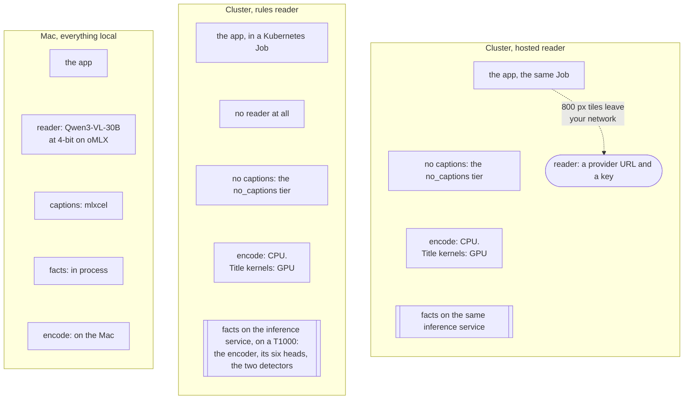

# Running modes and tradeoffs

Two settings decide what a deployment needs and what the cut loses. They are independent.

| Axis | Key | Values |
|---|---|---|
| Who reads the period | `advanced.editorial.reader` | `rules`, `model`, or `auto` (rules when `llm.model` is blank) |
| How much image analysis runs first | `advanced.editorial.preparation.tier` | `metadata_only`, `no_captions`, `full` |

Where the analysis runs is a third, smaller choice: in the app process (the default), or in the
optional [inference service](./installation/inference-service.md) on a CPU or CUDA box, switched
on with one key (`advanced.inference.facts_base_url`). The facts are the same rows either way, so
you can move the service, change its provider or turn it off without re-deriving anything.
Hardware encoders (Quick Sync, VAAPI, NVENC) only change the render; none of them runs inference.

On a cluster, set `advanced.inference.facts_concurrency` with it. It is 8 by default and the app
keeps that many `/facts` requests in flight. At 1, which is what the client used to do, a Job
against a T1000 on `no_captions` spent 42.7 minutes on 3,709 pictures: 0.69 s each, the same rate
a 133-picture scope got, so the wait was the round trip and not the card. A 13,552-picture month
would have cost 2.6 hours of facts before anything was selected. Match it to the service's
`REQUEST_THREADS` and give the pod the CPU for them. `prepare` prints what each side spent: the
`remote_facts` row carries the app's wall clock and a `service s/pic` column beside it.

## The reader

| `reader` | Needs | What you get | What you lose |
|---|---|---|---|
| `rules` | Nothing beyond the app | The ten standard memory types, cut from dates, places, favourites, known people and whatever image facts the tier produced. Repeatable: 72 runs across 12 cases, stable across hash seeds, zero model requests | No story thesis. Custom free-text subjects are refused. No model reranking, no Live Photo motion choice. It can drop an occasion, over-select repeated portraits on a trip, or let a mundane object take a slot in a month or year recap |
| `model`, local | A vision model with a 32k context on a machine you own. Graded on a 30B model at 4-bit, about 17 GB resident, oMLX on an Apple Silicon Mac with 32 GB | The full editor: the period read as a story, pictures weighed in words, a reason under every picture | Time and a second machine. Reading a real month took 19 min on the graded reader, 16 min on the fastest local alternative |
| `model`, hosted | An OpenAI-compatible or Anthropic-compatible endpoint and a key | The same editor, sometimes faster: the same month took 14 min on the quickest hosted reader, EUR 0.054 of tokens at list. The dearest one that finished cost EUR 0.585 and took two hours | Your annotation text and 800 px picture tiles leave your network. Only monthly memories were priced; years and trips were not |

What each model did on one real month, and what stopped three of them:
[Readers](./readers.md). Rules and the local model reader cost nothing in API fees. Electricity and
hardware were not metered.

## The preparation tier

| `tier` | What runs on every picture in scope | What the editor and the gate are handed |
|---|---|---|
| `metadata_only` | Previews and pixel measurements. No ONNX, no captions | Dates, places, favourites, known people, pixel facts. No content evidence at all: every unit stays at family viewing and a `sendable` export is refused outright |
| `no_captions` | The above plus the DINOv2 encoder with six context heads, the sensitive-content and document detectors | The same, plus a classifier line under every picture. The gate refuses what it would refuse on `full` and can never clear: eight findings (bathing, toileting, medical procedures, identifying records and the rest) are only named by a description, so a clean picture still comes back family-only |
| `full` | All of the above plus one caption per picture from a 500M vision model | A sentence under each picture instead of the facts that funded it. Everything the gate can do |

Facts are banked per picture and per producer. Changing tiers erases nothing, and a `no_captions`
library can add captions later, a month at a time. The second cut over a prepared period pays
only a preview check.

### What each tier costs to prepare

Cold, one cell each, February 2024, 13,552 pictures:

| Host | Tier | Per picture | The month |
|---|---|---:|---|
| Mac M5 Max, facts in process | `full` | 0.2336 s | 53 min, measured |
| Mac M5 Max, same work, second cache | `full` | 0.3566 s | 81 min, measured |
| Cluster pod, facts on a GPU service | `no_captions` | 0.2445 s | 64 min, measured |
| NAS, facts in process | `no_captions` | 1.4404 s | 5 h 25 min, multiplied out from the fixture month |
| NAS, facts on a cluster service | `no_captions` | 1.0865 s | 4 h 5 min, multiplied out from the fixture month |

None of those rows is `full` on a slow box. A caption on four Celeron cores measured 30.9 s, so ten
thousand pictures is about four days, and no NAS cell in the matrix was set to `full`:
[NAS + a model box](./common-setups/nas-only.md).

**What degrading the Mac would save has not been measured, and the measurement is owed.** No Mac
cell ran `no_captions` or `metadata_only`, and no cell anywhere ran `metadata_only`. The mechanism
is not in doubt: a tier drops whole producers and changes nothing else, so the 53 minutes above
splits into captions 1,940 s, the two detectors 540 s, the encoder and its six heads 300 s,
previews 240 s and pixels 120 s. Drop the captions and the arithmetic says about 21 min; drop the
classifiers as well and it says about 6 min. Those two figures are subtraction, not a stopwatch.

What the degradation costs the cut is a different question again, and it has an answer:
[what the rules cut keeps, per memory type](#what-the-rules-cut-keeps-per-memory-type) below.
Classifiers are not an automatic upgrade there.

## Combinations that were measured

An earlier benchmark, kept because it is the only place `metadata_only` has ever been timed. The
setup matrix numbers further down are the current ones.

Selection only, 60-second monthly memory, 1,440 pictures prepared, no render or music.
"Cold" means fresh previews and pixel facts; installation, model download and image pull are excluded.
Single observations under different cache conditions, not a hardware ranking.

| Host and mode | Cold | Repeat |
|---|---:|---:|
| Workstation, rules + `metadata_only` | 55.4 s | 1.4 s |
| Celeron J4125 NAS, rules + `metadata_only` | 279.0 s | 11.1 s |
| Kubernetes pod, rules + `metadata_only` | 65.2 s | 2.1 s |
| Kubernetes pod, rules + `no_captions` | 301.0 s | not a matched pair |
| Kubernetes pod, model reader on the LAN | 985.7 s | not measured |
| NAS, model reader on the LAN | 1,512.5 s (1,278 s of it waiting on 198 reader responses) | not measured |

Offloading the reader to another machine does not remove the wait for its answers. On the NAS, the
cold time splits into 19.9 s of preview access and 190.4 s of pixel facts; on the workstation,
34.7 s and 13.5 s.

Whole films on the workstation, warm cache, 1080p H.265 with bundled music, rules reader: between
56.9 s (on this day) and 287.7 s (trip) for the full CLI run including download, titles, encode
and audio. The [capability report](https://github.com/sam-dumont/immich-video-memory-generator/blob/main/docs/research/2026-09-12-capability-matrix.md)
has the per-product table.

## What to expect on a first run

One 60-second monthly memory per setup, the same month of the same library, app image `0.84.1`.
Every cell banked in a cache of its own and started cold, so the cold columns are a first
derivation and not a re-read. Overlap is the share of pictures a cut has in common with the Mac
local-model cut of the same month. The hosts:

- **Mac**: Apple M5 Max. Reader Qwen3-VL-30B-A3B at 4-bit on oMLX, captions from mlxcel.
- **NAS**: Synology, Celeron J4125, 4 cores, no AVX, no CFS controller. Docker, 4 GB per container.
- **Cluster**: a Kubernetes Job with 1 CPU and 4 GiB, the inference service on an NVIDIA T1000 8 GB. CPU encode, GPU title kernels.

The hosted rows on the NAS and the cluster read with Melious `gemma-4-31b`, which turned out to
refuse every picture it was sent, so those cuts were made without the picture pass. Their timings
stand as measurements of that run. What each model did, and what stopped three of them, is on
[Readers](./readers.md).

### The fixture month: 133 pictures, 130 eligible, June 2024

This month exists to show that a setup works and how fast. It is 133 CC0 files, 130 of them
eligible, with no history behind them, so it says nothing about whether a cut is any good. Its
reader prompts are about half the size of a real month's: 1,258 prompt tokens a call against 2,378
on February, same model over both. Two of the three cells that stopped on February finished it.

<!-- Fields in output/setup-matrix/demo/run1/summary.data.json, per cells[] entry:
     setup id, tier tier, prepare cold timing.prepare_cold_s, prepare warm timing.prepare_warm_s,
     selection timing.selection_s, render timing.render_s, film video.duration_s,
     kept len(selected_asset_ids), overlap overlap_vs_cell_1 against reference_cell mac-local. -->

| Setup | Tier | Prepare cold | Prepare warm | Selection | Render | Film | Kept | Overlap |
|---|---|---:|---:|---:|---:|---:|---:|---:|
| Mac, local 30B reader | `full` | 22 s | 0.4 s | 218 s | 49 s | 55.5 s | 15 | 100 % |
| Mac, rules | `full` | 22 s | 0.4 s | 1 s | 50 s | 55.0 s | 15 | 15 % |
| NAS, rules, facts in process | `no_captions` | 180 s | 0 s | 5 s | 1,483 s | 54.0 s | 15 | 15 % |
| NAS, rules, facts on the service | `no_captions` | 120 s | 0 s | 5 s | 1,453 s | 55.0 s | 15 | 15 % |
| NAS, hosted 31B reader | `no_captions` | 120 s | 0 s | 662 s | 1,380 s | 55.0 s | 15 | 25 % |
| Cluster, rules, facts in process | `no_captions` | 43 s | 0 s | 1 s | 331 s | 58.0 s | 14 | 16 % |
| Cluster, rules, facts on the service | `no_captions` | 90 s | 0 s | 2 s | 313 s | 58.0 s | 14 | 16 % |
| Cluster, hosted 31B reader | `no_captions` | 120 s | 0 s | 563 s | 304 s | 58.5 s | 14 | 32 % |
| Cluster, rules, NVENC on a T1000 | `no_captions` | 35 s | 0 s | 2 s | 226 s | - | 15 | 15 % |
| Cluster, rules, same job, CPU encode | `no_captions` | 36 s | 0 s | 1 s | 265 s | 54.5 s | 15 | 15 % |
| Cluster, rules, captions on | `full` | 540 s | 0 s | 2 s | 286 s | 56.0 s | 13 | 12 % |
| Cluster, hosted 31B reader, captions on | `full` | 180 s | 0 s | 261 s | 237 s | 55.0 s | 15 | 43 % |

The last two rows are the same cluster at `full`: captions take a 43 s preparation to 540 s on 133
pictures, which is the tier's whole cost in one line. The T1000 pair above them is the encoder A/B,
and its phase split is on [the hardware overview](./hardware.md#what-the-card-is-actually-worth);
the NVENC cell's film came back truncated on copy-out, so its duration is blank and its render
second is the one to read.

### A real month: 13,552 pictures, February 2024

13,552 pictures in the month, 15 kept in every cell that finished. Eligible candidates after the
scope pass: **1,417 on the Mac and 1,418 on the cluster**. That one picture is a real difference in
what the two hosts let through, not a rounding artifact, and it is worth knowing before you compare
two cuts made on two machines and wonder why they are not identical.

<!-- Fields in output/setup-matrix/february/run2/summary.data.json, per cells[] entry:
     setup id, tier tier, prepare cold timing.prepare_cold_s, prepare warm timing.prepare_warm_s,
     selection timing.selection_s, render timing.render_s, film video.duration_s,
     kept len(selected_asset_ids), overlap overlap_vs_cell_1 against reference_cell mac-local.
     Picture count is cells[].prepared.pictures, candidates cells[].eligible. -->

| Setup | Tier | Prepare cold | Prepare warm | Selection | Render | Film | Kept | Overlap |
|---|---|---:|---:|---:|---:|---:|---:|---:|
| Mac, local 30B reader | `full` | 3,180 s (53 min) | 1 s | 1,143 s (19 min) | 81 s | 55.0 s | 15 | 100 % |
| Mac, rules | `full` | 4,860 s (81 min) | 2 s | 8 s | 86 s | 54.5 s | 15 | 25 % |
| Cluster, rules, facts on the service | `no_captions` | 3,840 s (64 min) | 1 s | 17 s | 362 s | 54.0 s | 15 | 25 % |
| Cluster, hosted 31B reader | `no_captions` | 3,960 s (66 min) | 1 s | 1,832 s (31 min) | 380 s | 54.5 s | 15 | 20 % |
| NAS on compose | `no_captions` | never run | - | - | - | - | - | - |

The cluster row cost EUR 0.143 at list price for its reader, 112 calls and 40 picture tiles.

**The NAS never ran this month.** Setup got as far as pushing a config to the box and the lane was
stopped, because the arithmetic said what it would cost: the fixture month measured that NAS at
1.4404 s per picture on `no_captions`, and 13,552 pictures at that rate is 19,520 s, 5 h 25 min,
before a single picture is read or a frame encoded. That figure is a rate multiplied by a count,
not a wall clock anyone waited through. The NAS render below is a fixture-month measurement and the
only NAS render number that exists.

### What a first run costs, end to end

Three walk-throughs of the same real month, each a **sum** of the measured phases of one cell:
preparation, selection and render were timed separately and added. Nothing here is a single
stopwatch over the whole thing. The totals are in
[the configuration table](#the-three-configurations-that-ran-a-real-month); what follows is where
each one's time went.

**Mac, local reader, `full` tier.** 61 % of the preparation is captions, one 400 px tile per picture
to the caption server. The two detectors took 540 s of the rest, the encoder and its six heads 300 s,
previews 240 s, pixels 120 s. Every second of that is a one-off: the second memory over the same
month prepares in 1 s, so a repeat run is almost all reader. The rules cell paid 4,860 s for the same
preparation in its own cache, so the same work on the same host measured 53 min once and 81 min the
other time.

**Cluster, rules reader, facts on the inference service, `no_captions`.** Preparation is 87 % facts
requests at 0.2445 s a picture, with the classifiers on a T1000 behind the service. Swapping the
rules reader for a hosted one adds 31 min of reading and EUR 0.143 of tokens per cut.

**NAS on compose, `no_captions`.** Not run on this month, and the honest version is arithmetic
rather than a measurement: preparation on the fixture month cost 1.4404 s a picture, so 13,552
pictures **multiplies out** to 5 h 25 min. The render is the part a warm cache never helps, 1,483 s
for a 54-second film on four Celeron cores against 81 s for the same length on the Mac, so a first
NAS run over a month that size is most of a night and every run after it is about 25 min of render.
Moving the picture facts to a cluster service took that box from 1.4404 to 1.0865 s a picture on the
fixture month, a 25 % cut and not a rescue.

### What dominates, per host

**Mac: the captions**, 61 % of the cold preparation and the only reason `full` costs what it does.
**NAS: the render**, 1,483 s for 54 seconds of film, with about 90 % of its preparation in the
classifiers (0.6930 s a picture for the two detectors and 0.5963 s for the encoder and its six
heads, out of 1.4404 s). **Cluster: the render again, at a quarter of the NAS.** The facts service is
what makes the cluster's preparation cheap: on the fixture month the same pod paid 0.6083 s a picture
to a CPU-backed service and 0.1957 s to a GPU-backed one. A pod deriving its own facts in process
managed 0.2555 s there, so the service does not pay for itself on a box that quick, and a Mac
computing the same heads and detectors in process measured 23 to 40 ms a picture. The service is for
hosts like the NAS, and for putting the classifiers on a card.

### What overlap means

Overlap counts identical pictures: the cut's asset ids against the Mac local-model cut of the same
month. On February every reader kept 15 pictures and made a 54 to 55 second film, and the overlap
against the reference ran from 11 % to 30 %. The rules reader keeps the days and loses the story:
15 % on the fixture month, 25 % on February. A low overlap is a different selection of the same
period, not a broken one, and only the model cut carries a reason under each picture. Nobody has
graded which of those cuts is better, and overlap is not that grade.

### How these numbers were taken

One memory per cell, single observations, from the setup matrix runs of 13 and 14 September 2026 on
app image `0.84.1`. [Setup matrix](../contribute/setup-matrix.md) has every cell, the
cache-per-cell rule that makes the cold columns cold, and the command to run the whole thing again.

What is a measurement here and what is not:

- **Measured** and read off one cell's own clock: every number in the two tables above, and both
  encoder rows below.
- **Summed** from measured phases: the end-to-end walk-throughs. Preparation, selection and render
  were timed separately, in that order, and added.
- **Multiplied out** from a measured rate: the NAS on February, at 1.4404 s a picture over 13,552
  pictures. Nobody sat through it.
- **Never run**: every `no_captions` and `metadata_only` cell on the Mac, and `metadata_only`
  anywhere. The matrix has no `metadata_only` cell at all; the `metadata_only` seconds further up
  this page come from an earlier benchmark on the same NAS, not from these runs.

## What the rules cut keeps, per memory type

Against the model editor's reference cut over the same periods, the rules reader retained these
shares of the known occasions (a lower bound: an alternative picture can carry the same occasion):

| Memory type | Rules + metadata | Rules + classifiers |
|---|---:|---:|
| Special day, on this day, album | 100 % | 100 % |
| Person | 94 % | 94 % |
| Multiple people | 86 % | 86 % |
| Trip | 67 % | 78 % |
| Monthly | 62 % | 62 % |
| Holiday | 46 % | 55 % |
| Season | 45 % | 30 % |
| Year in review | 43 % | 49 % |

Prefiltered requests (a person, an album, one event, a trip) survive rules well. Broad recaps (month,
season, year) are where the model's interpretation earns its cost. Classifiers are not an automatic
upgrade: the season cut with classifiers filled its target but chose more household objects and was
judged less focused than the shorter metadata cut.

## What leaves your network, per mode

| Mode | To the caption server | To the reader | Elsewhere |
|---|---|---|---|
| rules + `metadata_only` | nothing | nothing | Immich reads; Nominatim for trip GPS; map tiles for title screens |
| rules + `no_captions` | nothing | nothing | same, plus: with `advanced.inference.facts_base_url` set, a preview of every picture in the period goes to that service. It is off by default |
| any reader + `full` | a 400 px JPEG of every picture in the period, once | (see next rows) | same |
| `model`, local | as above on `full` | 800 px tiles of a few dozen candidates, plus their annotation lines with people and place names, to a box you own | same |
| `model`, hosted | as above on `full` | the same tiles and lines to the provider | same |

The caption and reader endpoints default to `localhost`. Pointing either at another host is the
consent step; nothing asks twice. The complete list, with the switch for each destination, is on
[Network & Privacy](./configuration/network-and-privacy.md).

## Not measured

- The full product-by-host matrix: every memory type was measured on the workstation only.
- In the setup matrix, anything but `full` on a Mac, and `metadata_only` on any host. The
  `metadata_only` seconds in the older table above are a separate benchmark.
- Hosted cost for anything but one monthly memory. No year, no trip, no season.
- A NAS over a real month. The whole lane was set up and stopped.
- Any controlled quality ranking between readers or providers. The reader table is time and money.

The rules reader is a degraded mode, not an equal-quality alternative. Review the cut before you
share it.

## The three configurations that ran a real month

Other layouts work and are documented; these are the ones with a measurement behind every column.
Four seats decide what you have to stand up: who reads the period, who captions the pictures, where
the encoder and its heads and the two detectors run, and what encodes the film.

The only line that leaves your network is the hosted reader's.

| Configuration | Hardware | First run over a 13,552-picture month | Every run after | What the cut carries | Tokens at list |
|---|---|---|---|---|---|
| Mac, everything local | one Apple Silicon Mac, 32 GB or more. `reader: model`, `tier: full` | 1 h 14 min | 21 min | a story thesis and a written reason under each picture. The reference cut | nothing |
| Cluster, rules reader | a Kubernetes Job plus the [inference service](./installation/inference-service.md) on a card. `reader: rules`, `tier: no_captions` | 1 h 10 min | 6 min | dates, places, favourites, known people and classifier facts. No thesis, no reason, no custom subjects. 25 % overlap with the reference cut | nothing |
| Cluster, hosted reader | the same, with a provider URL and key | 1 h 43 min | 37 min | a thesis and reasons, no description under a picture, and a gate that can refuse but never clear | EUR 0.143 |

One fact about the hosted row rather than a judgement of it: the model those cluster cells ran
answers HTTP 400 for every picture it is sent, so that cut was made with no picture observations in
it. The timings and the token count are of that run as it happened.
[Readers](./readers.md) has what each model did.

A fourth layout, a NAS with the app and a model on another box, is documented and its render is
measured, but no real month has run on it: [NAS + a model box](./common-setups/nas-only.md). The
5 h 25 min above is what its measured per-picture rate multiplies out to.

The whole stand-up, in order, is the [self-hosting guide](./self-hosting.md).

## Title rendering

The experimental [render worker](https://github.com/sam-dumont/immich-video-memory-generator/tree/main/services/render-worker)
can render certified stitched Live clips through its authenticated job API. A real NVIDIA T1000
check passed with CUDA titles, NVENC, the selected Live duration and retained source audio.
App-side handoff and NAS month timings are still being completed in #931; the setup timings above
continue to describe rendering on the app's own host.

Every mode above renders title screens the same way: on the GPU kernels where they exist, and with
PIL where they do not. Which one your machine gets, and what the fallback loses, is on
[Title kernels](./hardware.md#title-kernels).
