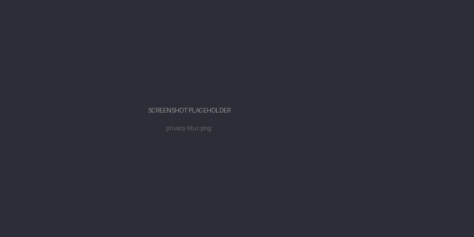

# Privacy Mode

Privacy mode (also called demo mode) blurs all video content and mutes speech in the final output. It's for situations where you want to demo the app or share a screen recording without showing your actual footage.


## What it does

When privacy mode is on:

- All video clips get a heavy blur filter applied via FFmpeg before assembly
- Clips with detected speech get their audio muted
- Title screens stay unblurred — the generated text, map animations, and location cards are unaffected

The result is a video that demonstrates the timing, transitions, music, and structure of the memory without revealing any personal content.



## How to enable

### UI toggle

In the sidebar, there's a "Demo mode" switch. Toggling it on also blurs thumbnails in the clip review screen (via a CSS class on `<body>`), so even the preview doesn't show your footage.

### CLI flag

Pass `--privacy-mode` to the `generate` command:

```bash
immich-memories generate --privacy-mode --year 2024
```

## What stays unblurred

Title screens are always rendered clean:
- The opening title card with your trip name or year
- Animated satellite map fly-over
- Location interstitial cards
- The ending screen

Only the actual video clips get the blur treatment.

## Notes

Speech detection relies on the audio analysis phase having run. If a clip's audio hasn't been analyzed, it won't be muted — but it will still be blurred. You can run analysis first with `make analyze` or let it happen automatically as part of the generation pipeline.
