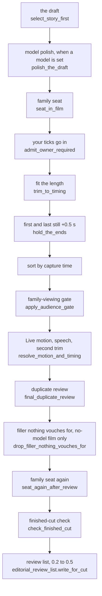
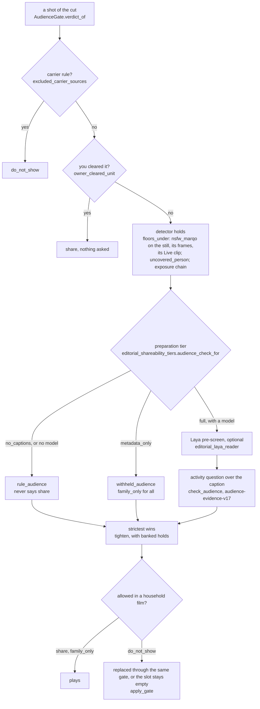

# Family, audience and duplicates

Reader: power user, with a newcomer summary first.

Once the draft is cut, a few passes make sure it is a film you'd show. Your partner, who is on 300
pictures of the month and starred in none, gets a shot. A picture the family-viewing gate refuses
leaves and another frame of the same moment takes its place. Two near-identical photos of the same
sunset, or the same hiking trail filmed twice twenty minutes apart, become one. Then the finished
cut is checked against everything the passes promised.

All of it runs on a plain NAS, and no model is asked anything to do it. A model tier adds one
reading: the audience check over the ingest caption.

## After the draft

The order, as `_select` in `editorial_structure_planner.py` runs it:

Each pass writes what it did to `derived-decisions/<name>.private.json` in the run's attempt
directory, and `runs why <asset-id>` reads it back.

## The family seat

Shots follow favourites and stories, so someone photographed all month and starred in none of it can
end up in no shot. The seat fixes that on every tier (`editorial_family_seat.py`).

- **Who is owed one.** A close family member (partner, child or parent, as confirmed in
  `people.yaml`) on at least 20 of the period's pictures, or 5 % of them, and in none of its shots.
  The two numbers are `advanced.editorial.people.seat_min_pictures` and `seat_min_share`. Only
  pictures the film could show count: someone whose every picture is refused as a shot is owed
  nothing, and the record says so.
- **In a film about a person**, close family is relative to that person as well as to you: in a film
  of your partner, their parents count, though to you they're in-laws. The same set drives big
  stories, the duplicate review and the model polish.
- **Which frame.** Their best frame by standing, in the story that holds most of their pictures,
  that clears the story's standing bar and that no hold refuses.
- **Whose place.** Added when the film has a slot and the time for one more shot. Otherwise it
  replaces the weakest shot of that story, or else the film's weakest shot in a story that keeps
  another one. A favourite, another seat, or someone's only close-family shot is never displaced.

The seat survives the passes after it. The duplicate review never removes a close family member's
only shot: of two look-alikes, the other one leaves, and a refill must still show them. When
everything has run, anyone who lost their only shot anyway (to the gate or the trim) is seated
again, through the same rules plus the gate's verdict on the new frame. Records:
`family-seat.private.json` and `family-seat-after-review.private.json`, which name people by
relation only.

Setting roles takes five minutes: [Teach it your family](../get-started/who-is-who.md).

## The family-viewing gate

Every shot gets one of three verdicts, and the strictest reading wins:

| Verdict | Meaning |
|---|---|
| `share` | fine for anyone |
| `family_only` | fine for the household, held back from anything wider |
| `do_not_show` | leaves the film |

Every film the app cuts is a household film: `family_only` shots play in it, `do_not_show` shots
leave. A shot that leaves is replaced from its own moment first, then from a moment of the same story
the film doesn't show yet, never within five minutes of a shot of the same moment, and each
replacement is judged by the same gate before it takes the slot. When every offer is refused, the
slot stays empty.

**What every tier reads.** The `nsfw_marqo` detector on the still, on up to eight frames spread
across a video, and on a Live Photo's clip; the `uncovered_person` head as a second opinion; and the
exposure chain: a five-minute capture run is held whole when at least half of it and at least three
of its captures are flagged (`editorial_exposure_chains.py`). All of these give `family_only`.
Nothing a later reading says lifts a detector's hold. Only you do, one picture at a time, after
looking at it (see [Your word on a picture](#your-word-on-a-picture)). A false positive costs a shot
in a wider film; a false negative puts the wrong picture in front of the wrong people.

**On a plain NAS** (`no_captions`, or any film with no model), the answer is `family_only` for every
shot, with the finding that holds it. The heads can't see the private activities only a written
description names, so "no detector objected" is never read as a clearance. What leaves a household
film on a NAS is what the carrier rules catch.

**With a model and captions** (`full`), the reader answers an activity question over each shot's
ingest caption, written at ingest by SmolVLM2 500M. It never sees the picture. Eight findings give
`do_not_show`: breastfeeding, bathing, toileting or changing, intimate hygiene, a graphic medical
procedure, an identifying record, sexual content, adult changing. The v17 checks
(`audience-evidence-v17-every-finding-needs-its-activity`) hold a finding only when the caption
states the activity: a pool or the sea is never a bath, a race bib never an identifying record. A
flagged shot the reader called `share` gets one more question about whether anyone is uncovered,
which can only tighten. A shot with no caption stays `family_only`.

**Laya** is an optional local pre-screen for that activity question: a 0.4B model reading the compact
caption, Apple silicon only, on the polish route. Turn it on with `advanced.editorial.laya_audience`
after `pip install laya-mlx` and `immich-memories models fetch --laya`. A shot it leaves unanswered
goes to the text model; detector holds apply either way.

**`advanced.editorial.strict_sharing`** (on by default) is for a film cut for outside the household:
there, any shot a head or an exposure flag marked stays at `family_only` even when the reader said
`share`. Every cut the app makes today is a household film, so it changes nothing yet.

**The review list.** Every run writes `review-before-sharing.private.json` in its attempt directory:
the shots whose exposure probability sits between 0.2 and 0.5 that nothing else already holds.
Nothing in the cut changes. The run summary prints the count, and `runs why` shows the note.

## Your word on a picture

You answer a hold per picture, in the media pool, on the storyboard or with `pictures` in the CLI.
The walkthrough with screenshots is on [Overrule it](./overrule-it.md#your-word-on-a-picture). The
rules:

- **Clear hold** is offered where something holds the picture: a detector flagged it or its Live
  clip, or an earlier cut banked a hold (a caption that names a private moment, most of its capture
  run flagged). A cleared unit is `share` in `AudienceGate.verdict_of` before any check runs, on every
  tier, and no banked hold or earlier refusal comes back. A unit is cleared only when you cleared
  every picture it shows. A carrier rule still refuses first.
- **Never use** writes `never_auto`: the picture stays evidence that its moment happened and is
  never a carrier. A tick doesn't bring it back.
- **Undo** forgets the decision, and the banked holds apply again, since clearing never deleted them.

Nothing clears a hold by itself: no reading, no model, no bulk action. The decisions are
`source='owner'` rows in the library's annotation store (`store/owner_decisions.py`), one per
picture, so they last across runs and scopes and the web page and the CLI can't overwrite each
other's. They stay off the line a reader sees, so a decision re-asks no reading. `runs why ASSET_ID`
prints yours last.

## Duplicates

Sameness is decided in three places, from what ingest banked (the preview hash and the scene print).
No tier asks a model to compare two pictures.

1. **Bursts, before the editor.** Photos within `photos.burst_window_seconds` (300) of each other
   **and** within `photos.burst_hash_threshold` (8) bits on a preview hash are one burst; the
   favourite survives it, else the best frame. A photo with no hash is kept.
2. **Inside a story, while the cut is built.** A 10-bit hash check against the shots around it (see
   [Picking each shot](./picking-shots.md#what-a-frame-must-pass)).
3. **Over the finished cut** (`review_cut_by_cached_hashes`):
   - a preview hash within 6 bits, inside the same story or the same day;
   - a scene print (the pooled DINOv2 vector of the preview, banked in `scene-prints.sqlite`) at a
     cosine of 0.65 or more, within 14 days, across stories. That catches the same trail at dusk
     shot twice from different spots, which hashes as strangers. Two favourites are the same scene
     only within 2 days of each other: the same pose in the same place on consecutive days is one
     moment you starred twice, and further apart it is two moments.

Which frame stays: one you ticked, then the favourite, then the one that moves (a video before a Live
Photo), then a close family member's only shot, then (between two favourites) the one with more
faces Immich found and then the sharper, then the earlier one. A moving frame is never a
repeat of a still. A scene repeat is less certain than a hash repeat, so it leaves only when a
replacement takes its slot or the film still reaches 85 % of its length without it. Two starred
twins are the exception: the second leaves either way, and its slot goes to a refill when there is
one. The one limit: a twin never leaves unreplaced when the film would then hold fewer than 3 shots
or under 20 % of its length, the point where it gives up and makes no film. The record names each such pair under `collapsed_favourites`. Every
replacement passes the family-viewing gate first. The `final_duplicate_review` record lists each
removal, the distance or cosine behind it, and who kept the slot.

## The finished-cut check

Each pass keeps its promise when it runs, and a later pass can undo it without knowing. So after
the last pass the cut is read once against all of them (`editorial_cut_invariants.py`):

1. every close family member the seat owes a shot has one, or the seat recorded why not;
2. no non-favourite carries a moment whose favourite could have carried it (a favourite folded into
   its starred twin counts as shown by the twin);
3. in a film split into years or ranges, every one with a story has a shot;
4. a Live Photo whose clip measured at least 1.5 with its subject in frame plays as motion;
5. nothing a carrier rule or the gate refuses, and nothing the gate never judged, is in the cut;
6. the cut is in capture order.

It changes nothing and asks nothing. Each broken promise is a warning in the log, naming the pass
that last touched the picture, and a row in `derived-decisions/cut-invariants.private.json`.
`runs show` prints the count.
