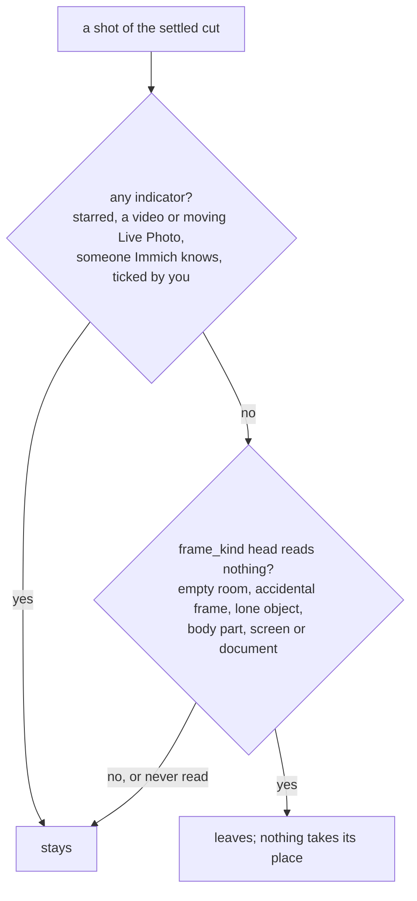

# Length, quiet weeks and filler

Reader: power user, with a newcomer summary first.

A film's target length is where it starts, not a promise. A month with three photographed days
gets about 20 seconds, not a minute, and a quiet month with a week of nothing in it spends no shot
on that week. When a film runs out of pictures worth showing, it ends early. A shorter film with
every shot earned beats a full one padded with the fridge, the ceiling and a screenshot.

How the target itself is set (per memory type, per active day, `--duration`) is on
[Memory types](../make/memory-types.mdx#how-long-a-film-runs).

## How long a shot is held

The constants live in `analysis/editorial_structure_budget.py`.

| Shot | Hold |
|---|---|
| A still, no-model draft | 4.0 s when starred or someone Immich knows is in it, 3.5 s otherwise |
| A still, model-planned film | 4.0 s |
| A video | its length, up to 6.0 s; to the end of a sentence when someone is talking at the cut, never past 12 s from the start |
| A video under 2.0 s | not a shot at all |
| A Live Photo playing as motion | its clip, up to 6.0 s |
| A Live Photo playing as its still | 4.0 s |
| The film's first and last still | +0.5 s, never past 5.0 s |

## Fitting the length

A film has more candidate shots than seconds, so two passes fit it.

**The trim** (`trim_to_timing_budget`, run after the draft and again once motion and speech are
measured) drops whole shots, lightest story first: `none` and `glimpse` stories, then the extra
shots of the lightest story, then its only shot, and the heaviest story's only shot last. Inside one
story the latest shot goes first. A picture you ticked is never dropped, and a favourite is never
dropped while a shot nothing vouches for (no star, no recorded video, nobody Immich knows, not ticked)
is still in the film.

**The shave** takes 0.5 s off the longest hold, over and over, while the film is over length. It
never takes a hold under 3.5 s (or under the shot's own length, if that was shorter) and never
cuts through a sentence. A video is never dropped for being long.

## Quiet weeks get no shot

On the no-model path, a happening with no indicator of its own reads as background, and background
weighs `none`, which is 0 slots (`GATE_WEIGHT` and `weight_caps`, see
[Moments, episodes and stories](./moments-and-stories.md#how-much-a-story-weighs)). An indicator is
any of: a favourite, a video, close family in it, a day four times busier than your median day, being
away from home or outside your 12 usual cities, or being the only happening of a part the film must
cover.

A week of ordinary evenings at home with no star, no video and no close family is exactly that
case. Three favourites or a big close-family story still lift a story to `major`, so a quiet week
that holds something you care about is never quiet to the editor.

## Filler nothing vouches for

A quiet month can still have more slots than shots anyone vouches for, and the leftover slots go to
whatever stands. So a no-model film gets one last removal pass (`drop_filler_nothing_vouches_for`,
PR #1250), after the duplicate review:

It runs on the no-model film, and on a model film whose polish did not run. A polished film skips
it: the model's vote already asked which shots add nothing. What left is listed by id and head label
in `derived-decisions/unvouched-filler.private.json`.

## Going short, on purpose

The draft tries to reach its length before it gives up the seconds:

- **Depth.** When a story has slots left after every pass, it spends them inside the moments it
  already shows (`editorial_story_depth.py`): first moments no pick took, alternating between
  capture groups, then up to 3 frames of each chosen moment, furthest in time from the frames
  already in. Every one must stand and must not look like its neighbours. A film of one repeated
  scene stays short.
- **Readmission.** A frame refused for looking like another, or for crowding its place, comes back
  when nothing else can fill the slot. A favourite refused for crowding its place comes back sooner:
  before a shot nothing vouches for keeps the slot it freed. That shot leaves (the weakest first, a
  story's only shot last) and is listed under `displaced_for_a_favourite` in
  `derived-decisions/story-selection.private.json`.
- **With a model**, a film still short by S seconds reads up to 2 × ceil(S / 3.5) episodes it never
  reached, and seats the ones whose reading records something
  ([What a model adds](./what-a-model-adds.md#a-short-film-gets-one-more-look)).

What never happens: a slot filled with a frame nothing vouches for, a filler frame dropped by the
pass above refilled, or a film padded with a still repeated for time.

The run record says how it landed: `near_target` when the film is within 15 % of its content length,
`search_limited` or `editorial_shortfall` when it ran shorter, with the seconds behind it.
