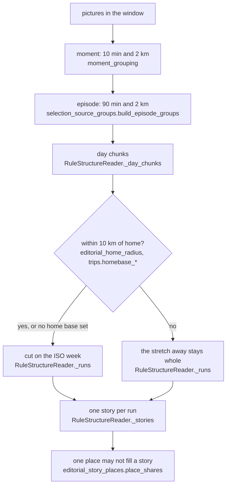
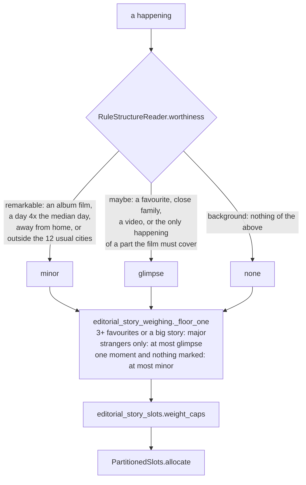

# Moments, episodes and stories

Reader: power user, with a newcomer summary first.

A Saturday at the dog park is one **moment** if you shot it in ten minutes, and an afternoon of
them (park, café, the walk home) is one **episode**. A week of ordinary evenings at home is one
**story**; so is a ski week away, however long it lasts. The editor weighs the stories against each
other and hands each one the number of shots its weight earns. A marathon you ran, with 400
pictures in a day, weighs more than a Tuesday with three. A quiet week at home with nothing starred, no video
and no close family in it gets nothing at all.

Everything on this page is the no-model path, which is the draft every film starts from.

## From pictures to stories

| Unit | Rule | Where |
|---|---|---|
| Moment | a picture joins the open moment when it is within 10 minutes and 2 km of that moment's last picture; with no GPS, time alone decides | `moment_grouping.py`: `MOMENT_WINDOW_MINUTES`, `MOMENT_RADIUS_METRES` |
| Episode | the same test at 90 minutes and 2 km; every moment sits in exactly one episode | `EPISODE_WINDOW_MINUTES`, `build_episode_groups` |
| Capture run | captures each within five minutes of the one before; it spaces shots and is the unit of the exposure rule | `MIN_GAP_IN_CAPTURE_GROUP_SECONDS` |
| Day chunk | same calendar day, or starting within 6 hours of the last picture (a late night stays one night); split only when more than 90 minutes pass **and** the city changes | `RuleStructureReader._day_chunks` |
| Story | a run of consecutive photographed days: at home, cut on the ISO week; away, kept whole; a day back home ends it | `RuleStructureReader._runs` |

"Away" is more than 10 km from `trips.homebase_latitude` / `homebase_longitude`. Without a home base
nothing is away, so a three-week holiday arrives as three weekly stories. Setting it is step one of
[Teach it your family](../get-started/who-is-who.md).

**One place does not take a film.** Inside a story, each place may hold only the share of shots its
days (or its moments, on a one-day story) earn against the rest, on the same square-root curve a trip
allowance uses. A story that only ever visited one place is never bounded. A picture refused for its
place comes back when nothing else can fill the slot.

## How much a story weighs

Each happening is first read for whether it is worth remembering, from facts alone.

The mapping from the reading to a weight is `GATE_WEIGHT` in `editorial_story_replies.py`:
remarkable seeds `minor`, maybe seeds `glimpse`, background gets `none`. Then the floor and ceiling:

- **Three favourites** in a story raise it to `major`.
- **A big story** is raised to `major` too: one that is both dense (at least
  `advanced.editorial.people.big_story_density`, 2.0 by default, times the period's median
  photographed day, in pictures per day) **and** mostly close family (at least
  `big_story_family_share`, 0.3, of its pictures show a partner, child or parent). Density alone
  never does it: a race day full of strangers has the pictures and not the people.
- **Present** stories (remarkable, or holding a favourite, or close family) are floored at `minor`.
- **Strangers only**: when the film knows people at all, a story with nobody known in it, no
  favourite and nothing remarkable is capped at `glimpse`.
- **One moment** and nothing that makes it present: capped at `minor`.

"The 12 usual cities" is literal: the twelve cities most pictures of the window were taken in. A
happening whose main city is not one of them reads as remarkable even with no home base set.

## Weight to shots

The film's slot count is its target length divided by the average hold of its material (about 4 s
a shot), and each weight has a ceiling:

| Weight | Shots it may take out of `n` slots |
|---|---|
| `dominant` | ceil(n / 2) |
| `major` | ceil(n / 4) |
| `minor` | 2, or 1 in a film under 8 slots |
| `glimpse` | 1 |
| `none` | 0 |

Slots are handed out in order: one for each `major` story, then one `minor` per day, then `major`
stories up to their ceiling, the remaining `minor` stories, one `glimpse` per day, and whatever is
left deepens the heavier stories one moment at a time.

**Every year gets a shot.** A person film longer than 18 months (548 days) is split into calendar
years, a person film over several date ranges into those ranges, and a custom film over several
ranges likewise. Before any story takes a second shot, each year (or range) that holds a funded
story gets one. The finished-cut check reports a year left without one. A year-in-review film is one
year, so this does not apply to it.

## When the model plans the whole film

On a model install, a film over several separate windows (on this day across years, a holiday
across years, a birthday film) has no single period account to polish, so the model plans it whole, and so
does any film with `advanced.editorial.thin_model_layer: false` (see [What a model adds](./what-a-model-adds.md)). Only that route adds these:

- **Trips fold into one story** (`editorial_story_trips`), with a reserve of
  `round(slots / 2 * sqrt(trip days / film days))` shots, at least one.
- **Recurring activities become one thread** (`editorial_story_threads`): four Saturdays at the same
  climbing gym are one story, one per calendar year in a film longer than 18 months, so a year of
  progress still shows.
- **`dominant`** is set by the model naming at most two central stories. The no-model draft never
  sets it, so its heaviest weight is `major`.
