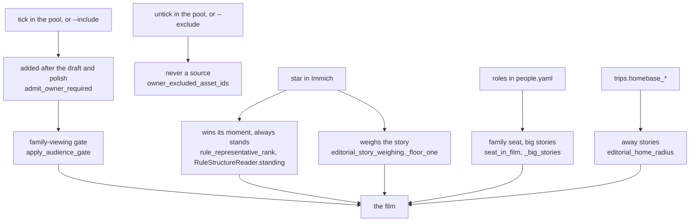

# Overrule it

Reader: power user, with a newcomer summary first.

The editor's choices are defaults, and you have the last word on most of them. Star the pictures
that matter in Immich before you cut. After a cut, untick what you don't want in the media pool,
tick what you do, and cut again. Tell the app who your family is and where home is. When a choice
still puzzles you, `runs why` says which rule made it.

The one thing you can't overrule is the family-viewing gate: a tick never puts back a picture the
gate refused.

## Where each lever acts



## Star it in Immich

A favourite is the strongest signal you can give, and it costs nothing. What a star guarantees:

- it wins its moment over every other frame, and always stands on its own;
- its story counts as present, so it gets at least a `minor` weight; three favourites make it `major`;
- the duplicate review keeps it over a look-alike you didn't star, and two favourites are the same
  scene only on the same day;
- the model's vote never removes it, and a polish refill picks it first inside its moment.

What it doesn't guarantee: a place in the film. The gate, the five-minute spacing and the length
still apply.

## Tick and untick

On the Memory page, **Open the media pool** shows every picture with an **Include** checkbox and,
after a cut, what the cut did with it ([The web UI](../make/web-ui.mdx#the-media-pool)).

- **Untick** a picture and it is never a source: the next cut can't use it anywhere.
- **Tick** a picture the cut left out and **Cut again** keeps it, in its own story at its capture
  time, without re-arguing the rest. It goes in after the draft and the model polish, and the trim
  and the duplicate review never remove it.
- The family-viewing gate still judges it. A ticked picture the gate refuses is named in
  `derived-decisions/owner-required-after-audience.private.json`.

The CLI does the same with `generate --include ASSET_ID` and `--exclude ASSET_ID`, both repeatable.
The web pool's ticks live in your session; **Start over** forgets them.

## Tell it who's who

Roles in `people.yaml` (**Settings > People**) are what the editor reads as close family: partner or
spouse, child, parent. Only what you confirmed counts, never the scan's guesses. They drive the
[family seat](./family-audience-duplicates.md#the-family-seat), big stories, the strangers-only cap,
and the polish never dropping a close relative's only shot. Siblings and grandparents are family and
don't trigger these rules. Setup: [Teach it your family](../get-started/who-is-who.md).

`trips.homebase_latitude` and `homebase_longitude` decide what "away" means: without them no story is
away from home.

## The keys

| Key | Default | Turn it when |
|---|---|---|
| `advanced.editorial.people.seat_min_pictures` | 20 | a close relative on fewer pictures should still be owed a shot |
| `advanced.editorial.people.seat_min_share` | 0.05 | the same, as a share of the period |
| `advanced.editorial.people.big_story_density` | 2.0 | busy family days should weigh `major` sooner, or later |
| `advanced.editorial.people.big_story_family_share` | 0.3 | the share of close-family pictures a big story needs |
| `photos.burst_window_seconds` | 300 | bursts should merge over a shorter or longer span; 0 turns it off |
| `photos.burst_hash_threshold` | 8 | frames of a burst must look closer, or may differ more |
| `advanced.editorial.reader` | `auto` | you want the no-model film even with a model configured: `rules` |
| `advanced.editorial.thin_model_layer` | `true` | you want the model to plan every film whole: `false` |

Everything else in selection is a measured constant in the code, named on the page that describes
it, and listed in the [config reference](../reference/config-reference.md) when it is a key.

## What you can't change

- **A detector's hold.** Nothing in the app lifts one. It only matters for a film cut for outside the
  household, which the app doesn't make yet.
- **`do_not_show`.** It is a verdict of the gate, from a carrier rule or a reading of the caption,
  and not a setting. A picture that gets it leaves the cut, and a frame of the same moment takes its
  place when one passes.

## Read why

```bash
immich-memories runs why 3f1c9a2e-...   # one picture: every pass, the one that dropped it, and why
immich-memories runs story              # the storyboard of the latest cut, story by story
immich-memories runs show 20260913_08   # a run, with its count of broken promises
```

The pool shows the same answer under every thumbnail. More in [runs](../make/cli/runs.md).
