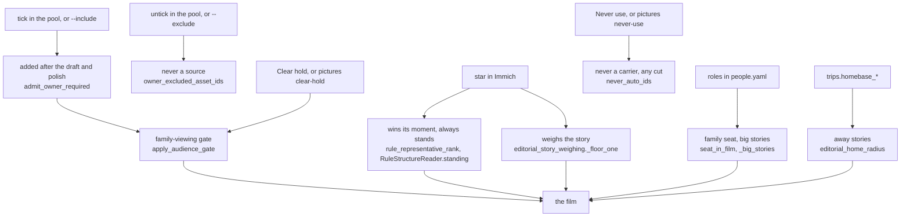
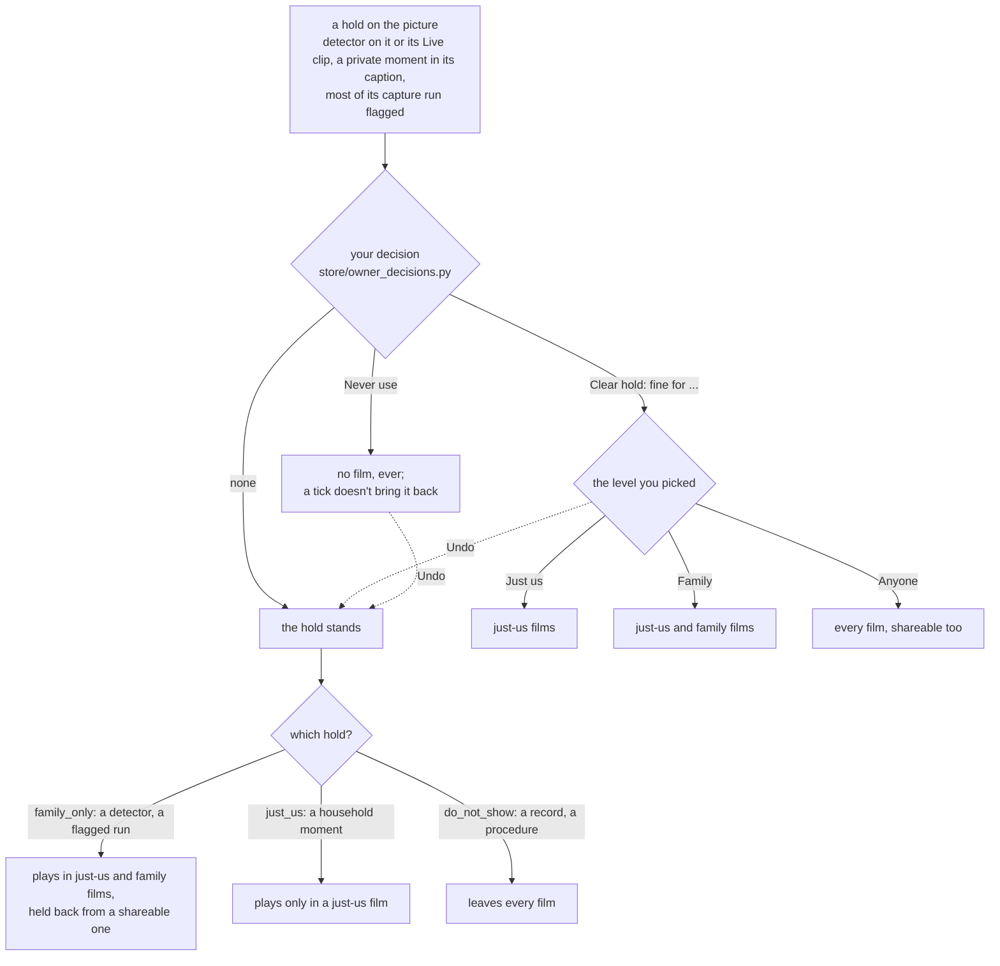

import ThemedScreenshot from '@site/src/components/ThemedScreenshot';

# Overrule it

Reader: power user, with a newcomer summary first.

The editor's choices are defaults, and you have the last word on most of them. Star the pictures
that matter in Immich before you cut. After a cut, untick what you don't want in the media pool,
tick what you do, and cut again. Tell the app who your family is and where home is. When a choice
still puzzles you, `runs why` says which rule made it.

A tick never puts back a picture the family-viewing gate refused. Clearing the picture's hold does,
one picture at a time, after you've looked at it. **Never use** keeps a picture out for good.

## Where each lever acts



## Star it in Immich

A favourite is the strongest signal you can give, and it costs nothing. What a star guarantees:

- it wins its moment over every other frame, and always stands on its own;
- its story counts as present, so it gets at least a `minor` weight; three favourites make it `major`;
- the duplicate review keeps it over a look-alike you didn't star. Two near-identical favourites
  taken within 2 days of each other are one moment: the best of them stays (a video, then more
  faces, then the sharper, then the earlier) and the other's slot is refilled;
- the model's vote never removes it, and a polish refill picks it first inside its moment;
- a shot nothing vouches for never takes its place: not when the place bound refuses it, not in the
  trim.

What it doesn't guarantee: a place in the film. The gate, the five-minute spacing and the length
still apply.

## Tick and untick

On the Memory page, **Open the media pool** shows every picture with an **Include** checkbox and,
after a cut, what the cut did with it ([The web UI](../make/web-ui.mdx#the-media-pool)).

- **Untick** a picture and it is never a source: the next cut can't use it anywhere.
- **Tick** a picture the cut left out and **Cut again** keeps it, in its own story at its capture
  time, without re-arguing the rest. It goes in after the draft and the model polish, and the trim
  and the duplicate review never remove it.
- The family-viewing gate still judges it. A ticked picture the gate refuses is named in
  `derived-decisions/owner-required-after-audience.private.json`.

The CLI does the same with `generate --include ASSET_ID` and `--exclude ASSET_ID`, both repeatable.
The web pool's ticks live in your session; **Start over** forgets them.

## Pick who it's for

<ThemedScreenshot name="memory-brief-sharing" alt="The brief's Sharing select on Just us" />

Each film is cut for one sharing level: **Who will watch it** in the brief, `generate --sharing`, and
`defaults.sharing` for the rest (`family` unless you change it).

- **Just us**: the household. A bath or a nappy change the caption names plays too.
- **Family**: the default. Those private moments stay out; everything the family may see plays.
- **Shareable**: anyone. Only what nothing held back plays: no detector flag, no private moment, and
  on a NAS nothing the detectors didn't read as clean.

Details: [Sharing levels](./family-audience-duplicates.md#sharing-levels).

## Your word on a picture

Some pictures are held by the family-viewing gate: a nudity detector flagged the picture or its Live
clip, or an earlier cut read a private moment in its caption. Detectors miss both ways, and a swim
in a lake looks a lot like what they're trained to catch. Holds only ever lean cautious, so a held
picture you know is fine is yours to clear. And some pictures you just never want in a film. Both
are one click on the picture, in the media pool or on the storyboard.

A held picture says why, in plain words, with **Clear hold** under it:

<ThemedScreenshot name="pictures-pool-held" alt="A pool card: the swim picture, 'Held: a nudity detector flagged it.', then Clear hold and Never use" />

**Clear hold** asks first, and shows you the picture while it does. It also asks how far the picture
may go: **Just us** (only films for the household), **Family** (the default: family films too) or
**Anyone** (shareable films too). The app never clears a hold on its own, and there's no bulk clear.

<ThemedScreenshot name="pictures-clear-dialog" alt="The dialog: 'Clear this picture's hold?', the picture, the reason, Fine for Just us, Family or Anyone, and Cancel or Clear hold" />

Once cleared, the card says so, and **Undo** is there if you change your mind:

<ThemedScreenshot name="pictures-pool-cleared" alt="The same card after clearing for anyone: 'You cleared its hold for anyone (a nudity detector flagged it).', Never use and Undo" />

**Never use** keeps a picture out of every film from the next cut on. In the pool it also unticks
it; on the storyboard the shot says so until you cut again.

<ThemedScreenshot name="pictures-pool-never-use" alt="A pool card after Never use: 'You'll never use this picture.', Undo, and Include unticked" />

<ThemedScreenshot name="pictures-storyboard-never-use" alt="A storyboard shot after Never use: 'You'll never use this picture.' and Undo" />

What each answer does, film by film:



Nothing is re-asked once you've cleared a picture, on any tier. A carrier rule isn't a hold: a screenshot or a document is refused for what
it is, and clearing doesn't change that.

Unlike a tick, your decisions last: they're kept with the library, not the session, every tier reads
them, and the web page and the terminal see each other's. A Live Photo is one picture, so a decision
covers its clip too. The terminal does the same:

```bash
immich-memories pictures show 3f1c9a2e-...        # what holds it, and what you decided
immich-memories pictures clear-hold 3f1c9a2e-... --level family  # asks first; --yes skips it
immich-memories pictures never-use 3f1c9a2e-...
immich-memories pictures undo 3f1c9a2e-...
immich-memories pictures list                     # every decision you've made
```

The rules behind it are on [Family, audience and
duplicates](./family-audience-duplicates.md#your-word-on-a-picture).

## Tell it who's who

Roles in `people.yaml` (**Settings > People**) are what the editor reads as close family: partner or
spouse, child, parent. Only what you confirmed counts, never the scan's guesses. They drive the
[family seat](./family-audience-duplicates.md#the-family-seat), big stories, the strangers-only cap,
and the polish never dropping a close relative's only shot. Siblings and grandparents are family and
don't trigger these rules. Setup: [Teach it your family](../get-started/who-is-who.md).

`trips.homebase_latitude` and `homebase_longitude` decide what "away" means: without them no story is
away from home.

## The keys

| Key | Default | Turn it when |
|---|---|---|
| `advanced.editorial.people.seat_min_pictures` | 20 | a close relative on fewer pictures should still be owed a shot |
| `advanced.editorial.people.seat_min_share` | 0.05 | the same, as a share of the period |
| `advanced.editorial.people.big_story_density` | 2.0 | busy family days should weigh `major` sooner, or later |
| `advanced.editorial.people.big_story_family_share` | 0.3 | the share of close-family pictures a big story needs |
| `photos.burst_window_seconds` | 300 | bursts should merge over a shorter or longer span; 0 turns it off |
| `photos.burst_hash_threshold` | 8 | frames of a burst must look closer, or may differ more |
| `advanced.editorial.reader` | `auto` | you want the no-model film even with a model configured: `rules` |
| `advanced.editorial.thin_model_layer` | `true` | you want the model to plan every film whole: `false` |

Everything else in selection is a measured constant in the code, named on the page that describes
it, and listed in the [config reference](../reference/config-reference.md) when it is a key.

## What you can't change

- **A detector's hold, in bulk.** Nothing lifts holds for you, or many at once. You clear them one
  picture at a time.
- **A carrier rule.** A screenshot, a document or a face close-up is refused by what it is, not by who
  may see it, and clearing a hold doesn't change that. `do_not_show` from a caption reading is a hold,
  and you can clear it.

## Read why

```bash
immich-memories runs why 3f1c9a2e-...   # one picture: every pass, the one that dropped it, and why
immich-memories runs story              # the storyboard of the latest cut, story by story
immich-memories runs show 20260913_08   # a run, with its count of broken promises
```

The pool shows the same answer under every thumbnail. More in [runs](../make/cli/runs.md).
