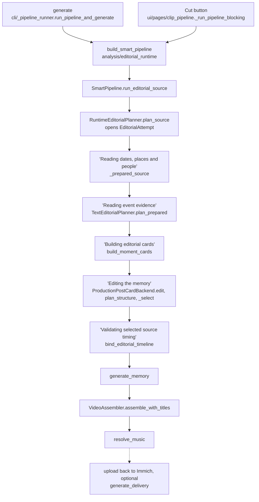
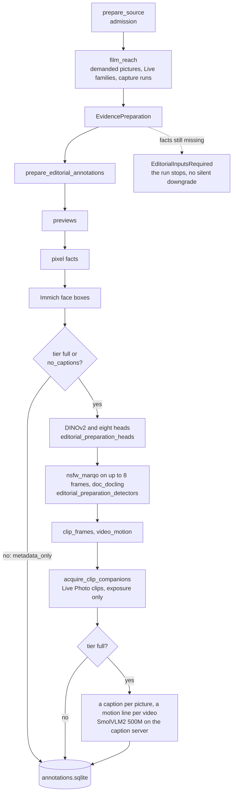

# From library to film

Reader: newcomer and power user. The first two sections are for everyone; the rest follows the
route through the code, for when you want to see every step.

## The short version

You pick a period: a month, a year, a trip, a person. The editor reads what Immich already knows
about every picture in it (when, where, who, whether you starred it, whether it moves), groups the
pictures into moments and the moments into stories, decides which stories earn a place in a film
of that length, picks the best frame of each moment it funds, and checks the finished cut against
a list of promises before anything renders.

On a plain NAS that is the whole editor. No model is asked anything, and the cut is the real film,
the one most installs ship. With a model configured it gets better: a text model reads what the
period was about, drops the shots that add nothing and fills the freed seats
([What a model adds](./what-a-model-adds.md)). That model only ever reads text. Pictures are looked
at once, when they are prepared, by small local models (eight classifier heads, two detectors, and
on the `full` tier a caption model). Nothing looks at a picture after that, on any tier.

## The house rules

These hold on every tier.

- **Always chronological.** The film plays in the order things happened. The editor decides what
  goes in and how long it stays, never when.
- **Your star wins its moment.** A favourite beats every other frame of its moment and always stands
  on its own. It does not buy a place by itself: the family-viewing gate, the capture spacing and
  the duplicate review still apply.
- **Stories are weighed, days aren't counted.** A week with nothing marked gets no shot; a stretch
  away from home or an unusually busy day does. See [Moments, episodes and stories](./moments-and-stories.md).
- **Videos are first class.** A video always plays, and a Live Photo plays as motion when its clip
  moves and shows its subject. See [Picking each shot](./picking-shots.md).
- **Close family gets a shot.** A partner, child or parent who is all over the period and in none of
  its shots gets a seat. See [Family, audience and duplicates](./family-audience-duplicates.md).
- **Short beats a guess.** When the material runs out, the film runs shorter than its target rather
  than pad with a frame nothing vouches for. See [Length, quiet weeks and filler](./length-and-filler.md).
- **Your tick outranks the editor.** A picture you tick in the pool goes in, one you untick never
  does. Only the family-viewing gate outranks a tick. See [Overrule it](./overrule-it.md).
- **The finished cut is checked.** Once every pass has run, the cut is read against these promises.
  A broken one is a warning in the log and a row in the run's records.

## The route through the code

A **Cut** on the Memory page and `immich-memories generate` take the same route. The quoted stage
names are what the Memory page and the terminal print.

`_select` in `analysis/editorial_structure_planner.py` is where the film gets decided. Everything the
other pages of this section describe happens inside it.

## Preparation: what gets read, and when

A film prepares only its **reach**: the pictures it could select (for a person film, the ones that
person is in), the other stills of their Live Photo bursts, and every picture of the same
five-minute capture run, because the exposure rule reads the whole run. The rest of the window is
read as Immich metadata only, since moments and episodes are cut from all of it. A cut that selects
a picture it never prepared stops rather than ship it. `immich-memories prepare` reads a whole scope
ahead of time if you'd rather pay once, up front.

Admission refuses a few things before anything is read: a video over five minutes
(`max_source_video_seconds`), the video half of a Live Photo (it plays inside its still), anything
tagged `immich-memories/generated` or listed in this install's upload receipts (a film this app made
is not footage), and pictures that look forwarded rather than shot on your camera. After the heads
run, screenshots and photos of screens go too: a phone-screen pixel size, the `screen` head, or the
document detector calling it a screenshot, a table or a QR code.

The eight heads are small classifiers over one pinned DINOv2 encoder: `location`, `people`,
`children`, `activity`, `venue`, `frame_kind`, `screen` and `uncovered_person`. The two detectors are
`nsfw_marqo` (exposure) and `doc_docling` (documents). Every fact is banked in `annotations.sqlite`
under its producer's version, so the next cut asks nothing twice.

The three preparation tiers (`advanced.editorial.preparation.tier`):

| Tier | What reads the pixels | When you get it |
|---|---|---|
| `no_captions` | previews, pixel facts, face boxes, the eight heads, the two detectors | the default with no `llm.model` set |
| `full` | the same, plus a caption per picture and a motion line per video from a caption server | with a model reader, or set by hand |
| `metadata_only` | previews, pixel facts, face boxes; no heads | set by hand; every shot is held to the family |

`no_captions` needs `immich-memories models fetch` once. Captions are an add-on:
[Add captions](../better/captions.md).

## What a run leaves behind

Every cut writes a durable attempt under `~/.immich-memories/cache/editorial-runs/`, with each pass's
decisions in `derived-decisions/*.private.json`. `immich-memories runs why <asset-id>` reads them for
one picture, `runs story` prints the storyboard, and `runs show` prints the run with its count of
broken promises. See [runs](../make/cli/runs.md).
