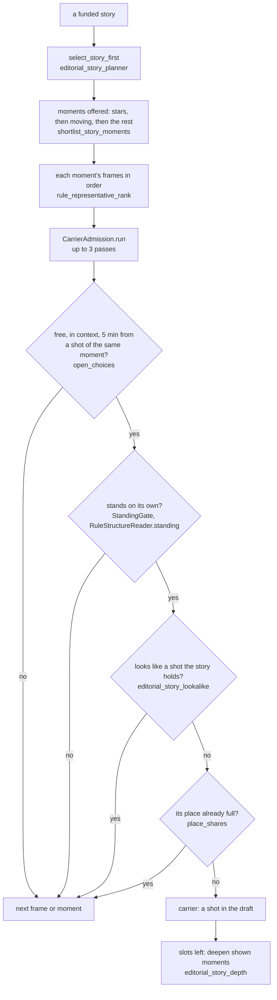
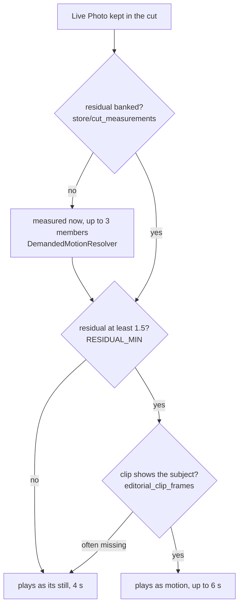

# Picking each shot

Reader: power user, with a newcomer summary first.

Once a story has its shots, each one has to be a moment and a frame. You shot 30 frames of the
agility run in four minutes: that is one moment, and it gets one frame. The one you starred wins.
Without a star, the one that moves wins (a video, or a Live Photo whose clip moves), then the frame
with more of the people Immich knows, then the frame where the runner you named fills the picture
over the one where they're a speck at the edge, then the sharp one over the blurry one. Only then
does the clock decide.

Every rule here runs on a plain NAS. With a model, the draft is picked exactly this way and the
model then polishes it ([What a model adds](./what-a-model-adds.md)).

## The chain

## Which frame carries a moment

`rule_representative_rank` (`editorial_rule_quality.py`) sorts a moment's frames by these keys, in
order. Each key only breaks the ties of the one before it.

1. **Your favourite.**
2. **A frame an earlier model reading named** for its episode. Empty on a library no model has
   read; on one that has, the no-model draft reads it for free.
3. **It moves**: a video, or a Live Photo whose clip measured at least 1.5 (see below).
4. **More people Immich knows** in it, or more faces.
5. **The frame shows the person**: a subject rung from 1 to 3, one point for having a face's width
   of air to every border and one for being the largest face in the picture
   (`subject_framing.py`). In a person film only that person's face counts, and a bigger face of
   someone else costs the rung.
6. **More of the frame** is that person.
7. **No pixel warning**: `SOFT (blurry)`, `DARK` or `BLOWN OUT` lose.
8. **The `people` head saw somebody.**
9. **The middle of the burst** over its first and last frames.
10. **The clock.**

On a story with more moments than `max(6, 3 × its shots)`, the moments offered to it are also sorted
first: starred ones, then moving ones, then lively ones, and it reaches for a few more moving
moments if the list filled up with stills. Below that size every moment is offered.

**Strangers come last.** A moment whose people are all strangers to your library (faces nobody
named, hidden people, or people only the `people` head saw) is not "lively" for that sort, and when
the draft picks a story's moments without a model it takes them after every other moment of the
story: stars, then the rest spread over the story's span, then the strangers. So a frame of the crowd
at a race loses its one slot to a frame of the same day with someone you named in it. A moment with
no people at all (a view, a place) is not demoted, and a library that names nobody keeps its order.

## What a frame must pass

**Free.** Not already a shot, and not a picture the carrier rules keep as evidence only
(`excluded_carrier_sources`): a document the detector names, a screen the `screen` head flags, a
still at an exact phone-screen size, and, where there is a caption, a caption about a screen, a face
close-up, medical care or a grid of identical items.

**Spaced.** Two shots of the same moment must be at least five minutes apart in capture time.

**Standing.** Does it stand on its own? Objects and empty rooms out, people and animals in. No
model is asked, on any tier: `RuleStructureReader.standing` scores every picture 0, 1 or 2 from its
facts, and `StandingGate` refuses a score under 1.

- A favourite scores 2, always.
- 0 when its video frames mostly miss the subject (`frames=subject_often_missing`: fewer than 6 of
  8 sampled frames show a moment), or when the points table below says it carries nothing.
- Otherwise the heads decide: people, an activity, or an outdoor or public place scores 2; nobody,
  no activity and a private interior scores 0; an indoor scene with nobody in it scores 1.

The points table (`editorial_standing_facts.py`) comes in two versions, and the caption version in
two fits: one for a library where Immich reads faces, one for a library where it recognised nobody
at all (face recognition off, or only pets and places). Weights were fitted on a public CC BY corpus
against a hosted reader's answers and rounded to half points; nothing in it came from anyone's
library.

| | Heads only (`no_captions`) | Heads and caption, faces read | Heads and caption, no faces |
|---|---|---|---|
| Refuses at | 3.0 points | 4.5 points | 4.5 points |
| `frame_kind` | empty room 4, accidental frame 4, lone object 3.5, body part 2.5, record 2.5, screen or document 2 | the four "nothing" kinds 2, record or screen 1, scenery -1 | the four "nothing" kinds 2.5, record or screen 1.5, scenery -0.5 |
| People head | two -0.5, small group -1, crowd -1.5 | two -0.5, small group -1, crowd -1.5 | two -0.5, small group or crowd -1 |
| Flags | children -1, document +1, screen +1, `BLOWN OUT` +1.5, `SOFT` +0.5 | children -0.5, document +1, screen +1, `BLOWN OUT` +1.5, `SOFT` +1 | children -0.5, document +1, screen +1, `BLOWN OUT` +2, `SOFT` +1 |
| Face | | people head saw somebody, Immich found no face +1 | |
| Caption | | nobody alive +1.5; objects +1, screens and devices +1; feet or hands, food, room or furniture, plants, text or signs +0.5 each; goods on display (a shelf, products, a showroom) make the frame a lone object | nobody alive +2; the same words; goods on display +1 |

Two short cuts sit above the table. A frame the head calls a people moment is never refused when it
is sharp, not dark, and Immich found a face on it. A picture whose caption names a person is never
refused when Immich found a face on it, and one that names an animal never is (a stuffed dog or a
statue of one still counts as an object). The frame head calls a pair of legs in a mirror a people
moment too; with no face in it, it is counted like anything else. A picture of your cat asleep on the
sofa stands; the sofa alone does not. In a library where Immich recognised nobody, an empty face list
says nothing, and the heads and the caption are taken at their word.

The same face rule decides whether a picture "shows life" for the gate: a picture with life in a
major story is only ordered, never refused, and a person Immich found no face for no longer counts.

Once a moment's frames are through the gate, the ones that stand are sorted again: favourite first,
then the higher standing score, then the order above. A still that scores 2 can beat a video that
scores 1.

**New.** The story's next shot must not look like one it already holds: a preview hash within 10
bits, compared inside the same story or the same calendar day, against the shots of its own moment
and the kept shot just before and after it. A video or a moving Live Photo is never a repeat of a
still, and a favourite is never refused for looking like a picture you did not star. A refused frame
comes back when nothing else can fill its slot. No model compares pictures, on any tier.

## Videos and Live Photos

A video always plays, from 2 seconds long (shorter clips are stubs and never become shots) up to a
6-second hold. When someone is mid-sentence at the cut, the end stretches to the end of what they
say, never more than 12 seconds from the start.

A Live Photo plays as motion on every tier, the plain NAS included, when its clip moves and shows its
subject. The motion is measured during the cut, for the Live Photos the cut kept, and banked
per picture so the next cut reads it instead (`store/cut_measurements`).

The residual is the optical flow left after the camera's own movement is taken out, over 12 frames
at 320x240. A clip only ever costs a Live Photo its motion, never its place: a starred Live Photo
whose clip is mostly pocket lining plays as its still. The burst and stitching rules are on
[Photos, Live Photos and HDR](../make/photos-and-live-photos.md#live-photos).

A true video whose sampled frames mostly miss its subject scores 0 on standing and is refused,
unless you starred it: a starred video of a wall means something happened there.

## With a model planning the whole film

On the model's own route (films over several windows, or `thin_model_layer: false`), the model picks
the moments of each story from a shortlist of their captions, and reads each video's motion line: the
sentence the caption server wrote at ingest from three keyframes. A Live Photo's sentence reaches it
only once its residual measured at least 1.5, and a video whose frames measured under 1.5 has its
sentence withheld unless you starred it. Standing, spacing and the look-alike check are the same
facts as above.
