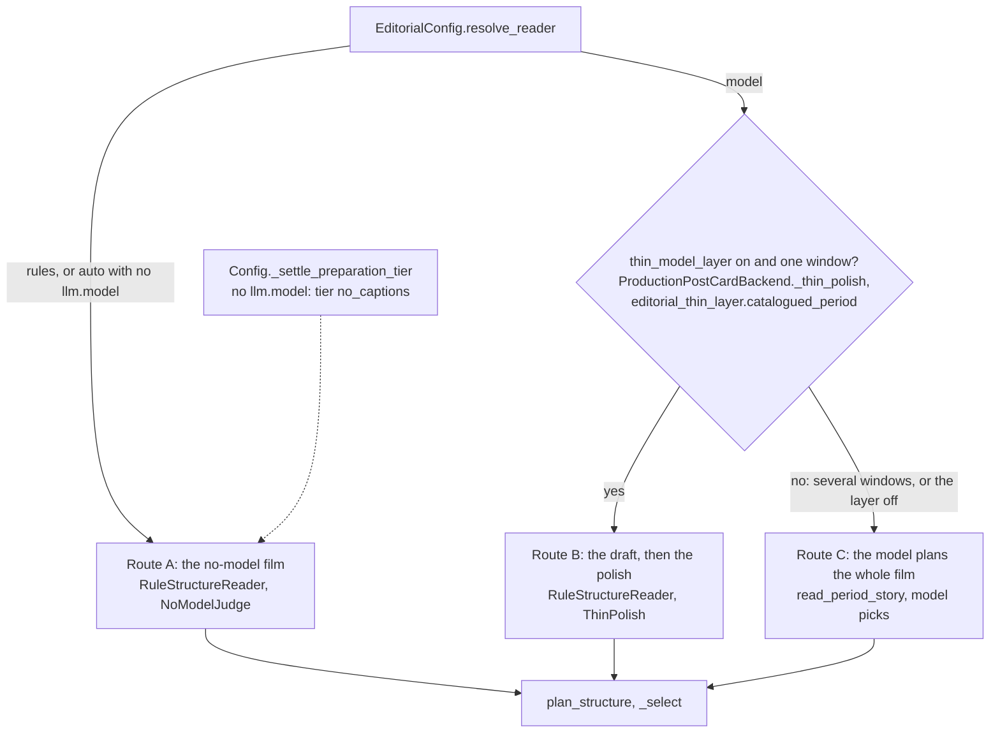
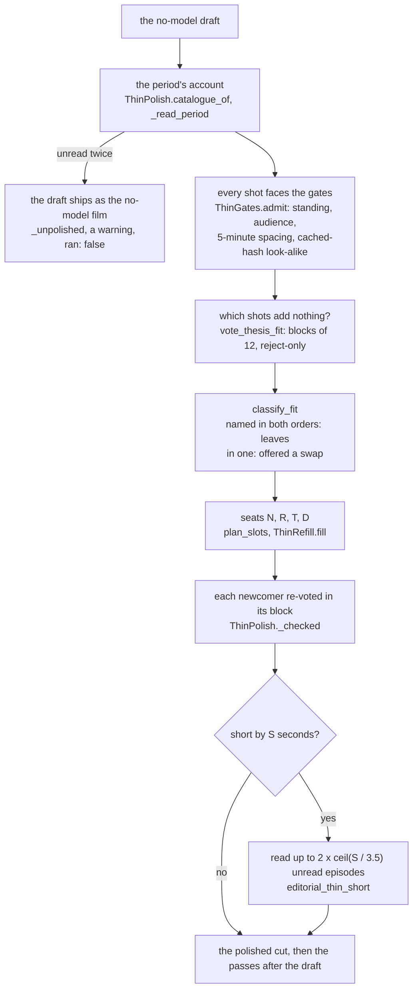
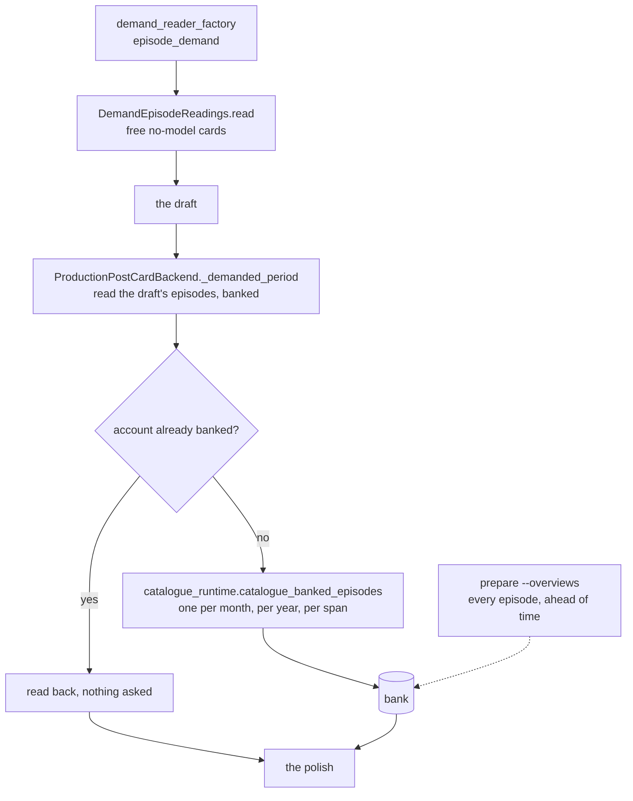

# What a model adds

Reader: power user, with a newcomer summary first.

Without a model, the editor cuts the whole film from facts: that draft is the film. With a model
configured, the draft gets better. A text model reads what the period was about, looks at the finished
draft as a list of lines, names the shots that add nothing to it, and fills the freed seats with
moments the library records something about. With captions (the `full` tier) it also reads each
shot's caption to catch private moments the heads can't see. It writes the title and picks the music's mood.

What it never does: look at a picture. Pictures are read once, when they are prepared. The model
gets text only (the captions and the facts ingest banked), on every route. What it costs to run and
where to run it is on [Make it better](../better/overview.md).

## Which route a cut takes

- `advanced.editorial.reader` is `auto` by default: rules when `llm.model` is blank, the model
  otherwise. `model` with no `llm.model` is an error that preflight reports.
- **Route B** covers every film over one window: a month, a year, a season, a trip, a fortnight, a
  special day, a person film from a birth date to today. That is almost every film.
- **Route C** is for films over several windows (on this day across years, a holiday across years, a
  birthday film), which have no single period to hold an account of, and for any film with
  `advanced.editorial.thin_model_layer: false`. There the model reads the period's stories, weighs
  them, folds trips and recurring activities, and picks the moments. Standing, spacing, the
  look-alike check and every pass after the draft stay the same facts.

## The polish (Route B)

**The vote.** The model gets the draft as text, in blocks of at most 12 shots, under the period's
account and whose film it is. It answers one question, reject-only: which of these shots add
nothing? Each block is asked in source order, and in a second, hashed order only when the first named
a shot it may move. A shot both orders name leaves. A shot one order names is offered a swap from its
own story and keeps its place until one passes.

**What the vote can't touch.** A favourite, a picture an episode reading recorded as worth a place of
its own, the only shot of a close family member, and a story's only shot that isn't a portrait
(a place outdoors, a crowd, a race, a party: the frame, people, activity and location heads
say which; an empty interior doesn't count). Left alone,
the vote reads a road race as filler and a posed selfie as the point. A block made only of those is
not asked. Only a
gate removes them. Your ticks are added back after the polish either way.

**Seats.** A refusal is a seat, not a hole. N seats take only the room the draft left unused, at
the 3.5 s minimum hold. R and T seats take the seconds the removed shot held, so every removal is
refilled even when the draft already filled the film; the length is the one the render timing gives
the draft, not a rough reserve. When nothing is left to refill a removal, the record says so.

| Seat | What it is for |
|---|---|
| N | a story the library records something about and the draft gave no shot |
| R | replaces a shot the vote named in both orders |
| T | replaces a shot a gate refused |
| D | swaps out a shot one order named; needs no room |

A seat's page is its own story's pictures, or, when the story has nothing left, the pictures of the
stories the film already holds, nearest in time first. The refused moment comes first, then the
moments the cut lacks, moving ones first, the favourite first inside a moment. A refill's page puts
the kind of shot its story holds fewer of (portrait or texture) on top of all that. The model picks
from 12 rows at most; the facts then say whether the pick stands, and a failed pick gets one more
try, as does an R or T pick a gate refuses. `thin-polish.private.json` records the shot-kind mix of
the draft and of the polished cut. Every newcomer is voted
on again inside the block it joined, and one the vote refuses brings back the shot it replaced.

### A short film gets one more look

On a cold library, a story the draft never reached has no reading, so it can never show it holds
something worth a place. When the polished film is short by S seconds, the polish reads at most
2 × ceil(S / 3.5) of those unread episodes (a week the film doesn't reach first, then a day, then by
worthiness, close family, motion and standing), and opens at most ceil(S / 3.5) N seats for the
stories whose reading records a moment. A story whose reading records nothing gets no seat, and the
film stays short.

**The budget.** 4 questions per 12 draft shots (the vote and the audience question, each in two
orders), 4 per seat, and one per three episodes the short-film look reads. `thin-polish.private.json`
records what it asked against that budget, and the run logs a warning when it goes over.

**When the account can't be read**, it is asked once more. A second failure ships the no-model film
exactly: the run logs *The model polish did not run (...); the film is the rules draft*, the record
says `ran: false` with the reason, and the filler pass of the no-model film runs.

## Reading on demand

A model film pays for what it shows. Nothing is read in advance: the draft is built for free, then
only the episodes its shots sit in are read, with a lean prompt that asks what happened, one
representative and the moments worth a record. The period's account is written from those readings
plus the free no-model cards of every other episode.

Accounts are one per calendar month, one per year, and for a longer window one per calendar year it
touches plus one over the span, up to 8 per request. Each is keyed by exactly what it summarises and
the model that wrote it, so a second cut of the same period asks nothing again.
`immich-memories prepare --overviews` reads a whole window ahead of time instead; it needs a model reader.

`advanced.llm.reader_concurrency` sets how many independent requests overlap. Unset, it is 1 for a
server on your own machine or network and 4 for a public host.

## What else the model writes

- **The title**, for person, month, season, year, album, holiday, on-this-day and special-day films;
  trips only with `--llm-title`, and `--no-llm-title` keeps the template. With no model the template writes it.
- **The music's mood**, from the film's story titles and captions, in one text call
  (`audio/text_mood.mood_for_cut`). With no model the clips' own mood decides, or "calm".
- **The thesis**, the period's account in up to 150 words. It steers the vote; the storyboard shows
  one when the model planned the whole film (Route C).

The captions under the pictures are dates and places from Immich metadata on every tier.

## The keys

| Key | Default | What it does |
|---|---|---|
| `advanced.editorial.reader` | `auto` | `rules`, `model`, or `auto` (rules when `llm.model` is blank) |
| `advanced.editorial.thin_model_layer` | `true` | `false` makes the model plan every film whole (Route C) |
| `advanced.editorial.thin_batched_audience` | `false` | asks the audience question of 12 shots per request, in two orders |
| `advanced.editorial.laya_audience` | `false` | a local pre-screen for the audience question ([details](./family-audience-duplicates.md#the-family-viewing-gate)) |
| `advanced.llm.reader_concurrency` | unset | requests in flight: 1 local, 4 hosted when unset |
