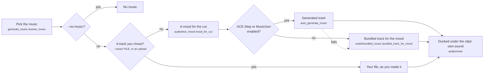

# Title screens, maps and music

Reader: newcomer first. The power-user parts (languages, place names, where a title came from) are further
down.

The clips are the film, but the cards around them are what make it read as a memory and not an FFmpeg concat
of your camera roll:

- **Intro card**: a blurred, darkened frame from the first clip behind white text, 3.5 seconds
  (`title_screens.title_duration`). Title and subtitle shrink together when the pair would pass 80 % of the
  frame height.
- **Month dividers**: at each month change in a single-year film spanning four months or more. The first
  month gets none: the intro already said it. `month_divider_threshold` sizes a budget, and when the budget
  binds the first month changes win, so a thin January can keep its card while a busy November loses one.
- **Trip map**: a satellite fly-over from home to the destination, in place of the intro. Off by default, see
  [The map fly-over](#the-map-fly-over).
- **Location cards**: the city name between trip segments.
- **Ending**: a fade to white, no text.

All of this works on a plain NAS. Titles come from templates, the special-day catalogue and your album names; a
reader only rewrites people and occasion titles (see [When a model names the film](#when-a-model-names-the-film)).

A configured LLM can write titles and choose music mood from the cut's text on every selection
tier, including NAS. These requests send no pictures and need no local GPU. If the model is
missing or fails, the template title and local music mood still work. Adding a text model does
not opt you into using it to caption pictures.

`title_screens.enabled: false` turns every card off. The other keys are in the
[config reference](../reference/config-reference.md#title-screens).

## Styles

Every title is Montserrat, white on a dark palette. The date and place captions burned on clips use Outfit.
Both ship inside the package (OFL-1.1).

| Style | Palette | Character |
|-------|---------|-----------|
| `modern_warm` | Warm charcoal/stone | Bold, semibold. Amber accents |
| `elegant_minimal` | Deep navy/black | Clean, medium weight. Cyan accents |
| `vintage_charm` | Warm charcoal | Nostalgic. Amber/gold accents |
| `playful_bright` | Deep teal | Energetic, semibold. Teal accents |
| `soft_romantic` | Dark amber-tinted | Gentle scale-in. Warm amber accents |

`style_mode: auto` (the default) picks the palette from the film's mood: happy, nostalgic and romantic get
`warm_dark`, calm and peaceful `deep_teal`, energetic and playful `midnight`, exciting `cinematic_dark`.
`style_mode: random` picks a named style.

The renderer is picked for you: GPU kernels where Metal, CUDA or Vulkan start, Pillow elsewhere (static
gradients, same text). Which one your box gets is on [Hardware encoding](../run/hardware.md#title-kernels).

Preview a card without running anything:

```bash
immich-memories titles test --year 2025 --style elegant_minimal
immich-memories titles test --month 6 --year 2025 --type month
immich-memories titles test --year 2025 --locale fr --orientation portrait
```

## Every alphabet

Montserrat draws Latin, Polish, Czech, Turkish and Vietnamese included. A letter it lacks comes from Noto
Sans, word by word, so `DEUX SEMAINES EN CRÈTE · Κρήτη` keeps its French in Montserrat and its Greek in Noto.
A word never switches typeface halfway through.

| Script | Where the font comes from |
|---|---|
| Latin, Greek, Cyrillic, Vietnamese | inside the package (Noto Sans) |
| Arabic, Hebrew, Thaana, the Indic scripts, Sinhala, Thai, Lao, Khmer, Myanmar, Armenian, Georgian, Ethiopic | `titles fonts --install` (3.8 MB for all of them) |
| Chinese, Japanese, Korean | `titles fonts --install` (Noto Sans CJK, 39.5 MB) |

The Docker image runs that install at build time, each file checked against a pinned SHA-256, so a Docker
user has every alphabet out of the box. On pip or uv, run it once:

```bash
immich-memories titles fonts --install
```

That command is the only thing that ever downloads a font. A render never does: a letter no installed font
has draws as a box, and the log names the command once. Where the files come from is on
[Privacy](../run/privacy.md).

Arabic and Hebrew run right to left and Arabic letters join; the Indic scripts form their clusters. That is
HarfBuzz and FriBiDi through Pillow. The Docker image has both. Elsewhere, install FriBiDi from the system
(`apt install libfribidi0`, or `brew install fribidi` and start the app with
`DYLD_FALLBACK_LIBRARY_PATH=/opt/homebrew/lib`). Without it the letters still draw, unjoined.

Greek in capitals drops its stress accents, the way Greek signs print it (`ΗΡΑΚΛΕΙΟ`, and `ΜΑΪΟΣ` where the
accent kept two vowels apart). Chinese characters use the Simplified forms unless the title holds kana
(Japanese forms) or Hangul (Korean).

## Languages

`title_screens.locale` sets the language of everything the film prints: titles, months, weekdays, trip cards,
holidays. `auto` (the default) follows the host's locale.

A film whose window is exactly a meteorological season opens on the season's name (`Summer 2025`, `Été 2025`,
`2025年の夏`), counted in your home's hemisphere: with `trips.homebase_latitude` south of the equator, 1 December to
the end of February is `Summer 2024–25`. Without a home base, or for any other window, the months name it (`June to
August 2025`).

The web UI's suggested title is the same template in the same language, so with no reader a French trip made
in the wizard opens on "DEUX SEMAINES EN CRÈTE, GRÈCE, ÉTÉ 2025", exactly as the CLI would.

| Language | Code | Trip titles |
|---|---|---|
| English | `en` | full: "A WEEK IN THE NETHERLANDS" |
| French | `fr` | full: "UNE SEMAINE AUX PAYS-BAS" |
| Dutch | `nl` | full: "op Kreta", "in de Verenigde Staten" |
| German | `de` | full: "auf Kreta", "in der Schweiz" |
| Spanish | `es` | full: "en el Reino Unido" |
| Italian | `it` | full: "a Creta", "negli Stati Uniti" |
| Portuguese (Brazil) | `pt-BR` | full: "na Itália", "nos Estados Unidos" |
| Portuguese (Portugal) | `pt-PT` | full: "em França", "no Japão" |
| Polish | `pl` | full for the places it lists, the fallback design for the rest |
| Swedish | `sv` | full: "på Kreta", "i Italien" |
| Russian | `ru` | fallback design |
| Japanese | `ja` | fallback design |
| Chinese (Simplified) | `zh-Hans` | fallback design |
| Korean | `ko` | fallback design |

:::caution[Twelve of these catalogues were drafted by an AI]
Months and weekdays come from CLDR, so they are right everywhere. The rest of the wording lives in one
catalogue per language under `src/immich_memories/locales/`. English and French are written by hand. The
other twelve catalogues, and the preposition rules for Dutch, German, Spanish, Italian, Portuguese, Polish
and Swedish, were drafted by an AI and checked by tests, not yet by native speakers. Each file says so at the
top. A fix is a one-line pull request.
:::

"Fallback design" means the trip card never guesses a preposition: the place is the big line, the duration and
date sit under it. A wrong preposition never reaches the screen.

Why these fourteen: Immich publishes no usage numbers per language, and 44 of its languages on
[Hosted Weblate](https://hosted.weblate.org/projects/immich/) are 95 % translated or more. The first ten are
the Western European and American languages with the most speakers, plus Dutch; the last four are the largest
non-Latin ones.

## Trip titles: the place at the right scale

A trip is named after the smallest place that holds 85 % of its located pictures, counted per picture: the
city, else the island, else the region, else two regions, else the country, else the countries in the order
you crossed them. A day with forty pictures in one town weighs more than a travel day with two.

The places are Immich's own reverse geocoding (GeoNames, offline) plus a small bundled table of islands,
because GeoNames files most islands under a region. No outside call.

| Scale | English | French |
|---|---|---|
| A country | `IN THE NETHERLANDS`, `IN ITALY` | `AUX PAYS-BAS`, `EN ITALIE` |
| An island | `IN CRETE, GREECE`, `IN CYPRUS` | `EN CRÈTE, GRÈCE`, `À CHYPRE` |
| A region | `IN APULIA, ITALY` | `DANS LES POUILLES, ITALIE` |
| Two regions | `IN UTAH AND NEVADA, UNITED STATES` | `DANS L'UTAH ET AU NEVADA, ÉTATS-UNIS` |
| A city | `IN LAS VEGAS, UNITED STATES` | `À LAS VEGAS, ÉTATS-UNIS` |
| Several countries | `ACROSS BELGIUM → SPAIN` | no phrase, place first |

The full title adds the length and the season or month: `TWO WEEKS IN CRETE, GREECE, SUMMER 2025`.

Immich stores places in English. Country, island and region names are translated offline (CLDR and the bundled
tables). City names stay as Immich stored them unless you switch on `network.geocoding`, which asks Nominatim
for the name in the film's language, one request per distinct place on the cut. What that sends is on
[Privacy](../run/privacy.md).

## Date and place captions

`generate --add-date --add-place` burns small translucent captions on the clips: 48 px on a 1080p frame at
85 % opacity, each one appearing when it changes. Captions stay clear of dissolves so two never overlap, and a
caption in any alphabet draws with the title fonts above, HDR included.

The date says only what is new: the weekday and day inside one month, the day and month inside one year, the
full date across years. Each language writes it its own way (`10. AUGUST`, `10 DE AGOSTO`, `10 SIERPNIA`,
`8月10日`).

Places you are at all the time stay unlabelled (the name of your own town over every third clip is noise). A
spot is familiar when it recurs within 250 m of the picture over many weeks in several years; a yearly summer
holiday never qualifies. `trips.homebase_latitude` and `trips.homebase_longitude` mark home too, and the home
country drops out of domestic captions. The scan reads metadata only, is cached for seven days under
`cache.directory/familiar-places/`, and is skipped in privacy mode.

## The map fly-over

The fly-over needs satellite tiles from a third party, so it is off until you say so:

```yaml
network:
  map_tiles: true
```

Off, a trip film opens on the ordinary title card and nothing about where you went leaves the machine. On, the
camera starts over home at city zoom, flies out to the destinations and settles where every pin shows, in
`title_duration`. Long distances use a Van Wijk zoom (the d3 `interpolateZoom` path, which pulls out further
the further apart the points are); short hops pan. Tiles come from ArcGIS World Imagery at
`server.arcgisonline.com`, no key, a few hundred per fly-over. A box that cannot reach it renders grey frames
and the run carries on.

## When a model names the film

Make it better (optional): with a [reader](../better/reader.md) configured, the model names people and
occasion films ("Ada and her grandparents" instead of three stacked full names). `--llm-title` adds trips,
`--no-llm-title` pins the template everywhere, and `--title` always wins.

The title reader gets facts, never pictures and never coordinates: first names, birth dates and ages, the
relations your [people file](../get-started/who-is-who.md) confirms, the special-day catalogue's words, the
album that holds most of the cut, and the place names by day. A capitalised word found in none of those facts
gets the title refused in favour of the template, and so does a country, island or region the facts do not
name, even as the title's first word. A trip title has to name the trip's place. Refusing
costs a plainer title, so the check leans towards refusing.

### Where the title came from

Every render stores the source of its opening title on the run. `immich-memories runs show <run-id>` prints it
as **Title From**:

| Source | The title is |
|---|---|
| `override` | what you typed: `--title`, or your edit in the web UI |
| `album` | an album film's album name |
| `occasion` | a holiday's name, or the special-day catalogue's title |
| `model` | what the title reader wrote |
| `place` | a trip title, built from where it went |
| `fallback` | the template: the year, the dates, the people |

`fallback` on a film you expected the model to name means the reader was not asked, failed, or had its title
refused.

## Music



The mood comes from text only. With a reader configured, `mood_for_cut` sends the saved cut's text (story
labels, captions of kept pictures) and gets back a mood, an energy, a tempo and up to five genres; no picture
goes out. Without a reader, or when that call fails, the film gets the mood its clips carry, else `calm`.

A generator that fails falls through to a bundled track, and the swap comes back as a warning on the finished
video and in the notification, so a dead backend never passes for working music.

The bundled tracks come with the `music` extra, which the Docker image and the `all` extra include: 28
royalty-free tracks in five moods (calm, energetic, happy, nostalgic, tender), about 30 s each, looped with a
crossfade. They were generated locally with ACE-Step from nothing sampled; tempo, key and seed per track are in
`LICENSE-MUSIC`. A pip install without the extra renders silent unless you pass a file. In a film with photos,
the pick prefers a track whose beat lands within 0.2 beats of the photo cadence.

Ducking is a sidechain compressor keyed on the clips' audio, so speech, laughter and wind all lower the music.
`--music-volume` (0.0 to 1.0, default 0.5) maps onto -20 dB to 0 dB before ducking. When a generator gave four
stems, vocals duck most and drums keep their rhythm. None of the ducking constants is a config key.

| Where | Switch |
|---|---|
| CLI | `--music PATH`, `--no-music`, `--music-volume` |
| Web UI, Generation Options | **Background music**: None, Upload file, Bundled, AI Generated, and the volume slider |
| Config | `advanced.ace_step.enabled`, `advanced.musicgen.enabled` |

### Generated music {#install-locally-on-a-mac}

Generated music (ACE-Step on a Mac or a GPU box, MusicGen on a server) is an add-on with its own install and
memory needs: [Generated music](../better/music.md).

### The music commands

```bash
immich-memories music search --mood happy --genre acoustic --limit 5
immich-memories music add compilation.mp4 output.mp4 --music ~/Music/track.mp3 --fade-in 3 --fade-out 5
immich-memories music add compilation.mp4 output.mp4 --mood nostalgic
```

`music search` reads `audio.local_music_dir` (`~/Music/Memories`). `music add` mixes a track under a video you
already have, with the same ducking. Without `--music` it picks a track from that folder by `--mood`, and by
`calm` when you give none. A standalone video has no cut text to read, and no command here sends a frame to a
model: pictures are read once, at ingest. The old `music analyze` and `music add --analyze-frames` did, and are
gone. Every flag is in the
[CLI reference](../reference/cli-reference.md#music).
