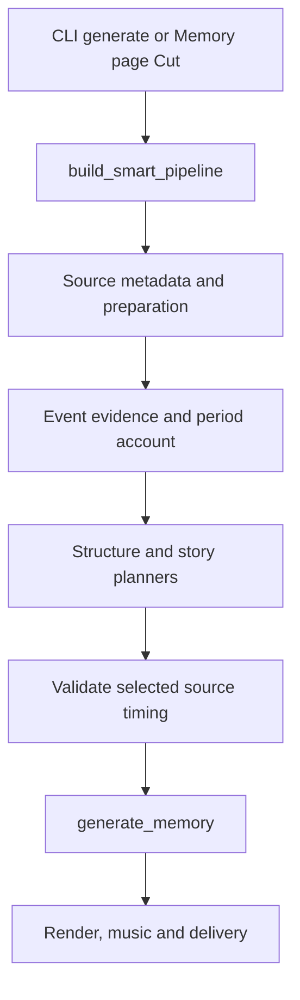

# Codebase Architecture

The CLI, Memory page and automation use one editorial route. Automation decides which
memory to request; the editor decides which sources appear in it. Rendering consumes that
plan. The module-by-module map is in [ARCHITECTURE.md](https://github.com/sam-dumont/immich-video-memory-generator/blob/main/ARCHITECTURE.md).

## Selection before rendering

`analysis/editorial_runtime.py` builds a `RuntimeEditorialPlanner` and injects it into
`SmartPipeline`. The planner prepares the requested sources, reads the period, chooses the
stories and carriers, then certifies their timing. `SmartPipeline` projects the result into
a `PipelineResult`; it does not score or rank clips itself.

The model and rules readers share source preparation, timing and rendering. Preparation
tier is configured separately: rules mode with the default full tier still needs the
caption and inference producers.

`generate_memory()` takes selected clips and handles download, extraction, assembly, music
and optional upload. An empty clip list is an error. The outer lifecycle is
`OperationalPhase` in `operations/phases.py`: discovery, download, analysis, selection,
render, music, delivery and complete.

## Main boundaries

| Boundary | Responsibility |
|---|---|
| `EditorialRuntimePorts` | Provider and people-loader dependencies |
| `ProductionPostCardBackend` | Connect text orchestration to structure planning |
| `StructurePlannerPorts` | Judgments called by the structure planner; source, banks and audience arrive in `StructurePlanningInput` |
| `EditorialAttempt` | Durable status, requests, plan and process lease |
| `VideoAssembler` | Compose probing, clip encoding, assembly, audio mixing and title insertion |
| `ImmichClient` | Compose search, all-assets, asset, person and album API services |
| `TitleScreenGenerator` | Compose rendering, endings and trip screens |

Attempts live under `<cache>/editorial-runs/<key>/attempts/<id>/`. Facts and readings use
`annotations.sqlite`; structure judgments and motion facts also use `structure-banks/`.
The Memory page and `runs` commands read these records. They can contain private library
information.

The streaming assembler decodes a clip at a time, blends frames and pipes them into FFmpeg.
`EncodingPlan` supplies one output contract; `output_contract.py` validates the finished
file before publishing it. Photo animation, certified Live Photo motion and title screens
feed this same assembly path. Quadrants supplies kernel title rendering on a working GPU
or CPU backend, with PIL as the fallback.

## The inference service

`services/inference/immich_memories_inference/` serves `/ping`, `/health` and `/facts` in
its own image. It imports the app's inference implementations; the app talks to it over
HTTP. Encoder device selection and detector execution are separate: the detector
constructors currently use CPU ONNX sessions.

## Dependency rules

`make arch-check` reads the contracts in `pyproject.toml`:

- Analysis, processing, titles, people, store, triage and operations cannot import UI.
- Those packages and audio cannot import CLI.
- The app cannot import the inference service package.
- The inference service cannot import UI or CLI.

Use constructor injection and Protocol contracts for service dependencies. The import
checker covers the listed package directions; it does not enforce every naming convention
or private-module boundary.

## Where to add a change

| Change | Files to start with |
|---|---|
| Immich API operation | The matching service in `api/`, then the delegating method in `api/immich.py` |
| Editorial decision | `analysis/editorial_runtime.py`, the relevant reader or planner, and its contract |
| Rendering behavior | `processing/encoding_plan.py`, the assembler or the relevant photo/title renderer |
| Memory type | `memory_types/registry.py`, a `@register_preset` factory and any date builder |
| CLI command | A module under `cli/`, registered in `cli/__init__.py` |
| Documentation page | `docs-site/docs/`, then its page ID in `docs-site/sidebars.ts` |

`OFFERED_MEMORY_TYPES` in `registry.py` supplies the CLI and Memory page's offered types.
A new type needs a preset registration and an entry there. Regenerate the CLI reference and update the configuration reference when their public
interfaces change; drift gates check both against the code.

Use `make ci` for the local gates and `make docs-build` for documentation changes. The
[testing guide](../contribute/testing.md) covers the test matrix, integration suites and
checks that run only in GitHub Actions.
