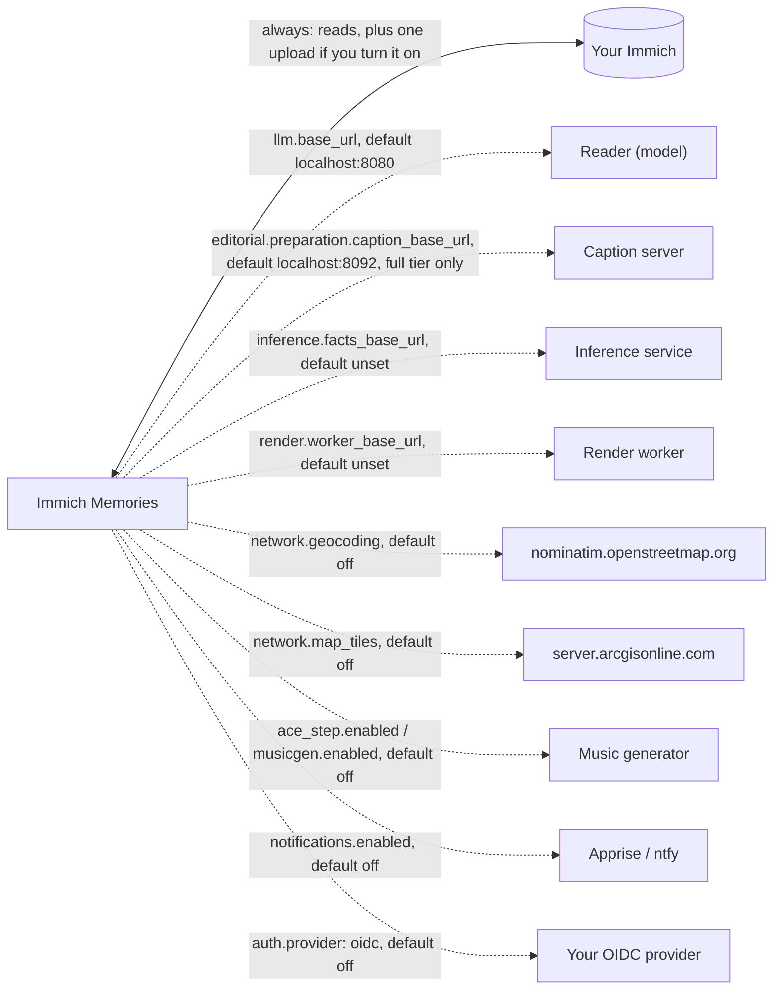

# Privacy: what leaves your network

Reader: newcomer and power user.

**A default run talks to your Immich server and nothing else.** No telemetry, no update check, no
analytics, no font or model download while a film renders. Every other host on this page is a
switch you turn on, and each one says below what it sends. The list comes from a sweep of the
source and is kept by hand: if you find a call that is not here,
[open an issue](https://github.com/sam-dumont/immich-video-memory-generator/issues).



Solid is the one connection every run makes. Dotted is a switch, labelled with the key that turns
it on and its default. The reader, captioner and music generator default to this machine, so even
turned on they leave your network only when you point them somewhere else.

What that means per setup:

- **A plain NAS (the default).** Your Immich server. That's the whole list.
- **A reader or caption server on your own box or LAN.** Still your network. The pictures the
  caption server reads land on that box's disk and in its logs.
- **A hosted reader.** The annotation text of the candidates, and the names on it, go to that
  provider. No picture does. Pointing `llm.base_url` at it is the consent step; nothing asks twice.

## What Immich sees

The app reads your library and never edits it. Metadata, previews and originals come down; for a
video, preparation reads the index and three keyframes of its playback rendition by byte range.

The one write is delivery, and only with `upload.enabled: true` (off by default):

1. the finished film is uploaded as a new asset;
2. it gets the tag `immich-memories/generated` once Immich has finished reading the file, so a
   later run knows the film is its own and never uses it as source footage;
3. with `upload.album_name` set, it goes into that album (created if missing);
4. an earlier upload of the same recipe, recognised as the app's own, moves to Immich's trash.
   Trash, not a delete: you can restore it.

`immich-memories config test` is read-only: it checks the connection and the API version and
touches nothing.

## Everything that can leave, and when

| Destination | When | What leaves your network | Default |
|---|---|---|---|
| Your Immich server | always | the reads above; the film, its tag and its album with upload on | upload off |
| `llm.base_url` (reader) | a model reads a period | text only: the annotation lines of the candidates, with people and place names, and the Immich album names holding those pictures. Never a picture | blank `llm.model`: no call |
| `llm.base_url` (titles) | a people or occasion film's opening title, whenever a reader is configured; trips only with `--llm-title` | text only: first names, birth dates and ages, the relationships your people file records, the span, place names, the album the cut mostly sits in | `--no-llm-title` or `--title` |
| `llm.base_url` (music, special days) | music selection and special-day scans, with a model | text only: the cut's story labels and captions; for a day, capture times, places, coordinates and recognised names | no model: no call |
| `api.openai.com`, `api.anthropic.com`, `api.z.ai` | `llm.provider` is `openai`, `anthropic` or `zai` and `base_url` is left at its default | the reader rows above, to that vendor | set `base_url` yourself |
| `caption_base_url` | `tier: full` only, the first time a picture a cut can reach is prepared | a 400 px JPEG per picture; a strip of three keyframes per video and per playing Live Photo; `caption_api_key` as a bearer token if set | `localhost:8092`; `no_captions` sends nothing |
| `inference.facts_base_url` | preparation, when set | each picture's preview, for the heads and detectors | unset: the app runs them itself |
| `render.worker_base_url` | rendering on another box | the chosen cut, plus your Immich URL and API key so the worker can fetch the clips | unset: renders here |
| `nominatim.openstreetmap.org` | `network.geocoding: true` | each trip's centre, and the rounded coordinates of places the film shows | off |
| `server.arcgisonline.com` | `network.map_tiles: true` | tile requests over the trip area and your home base | off |
| `ace_step.api_url`, `musicgen.base_url` | AI music through a remote API | mood, tempo and genre text; MusicGen is also sent the generated track, for stem separation | off |
| Apprise or ntfy targets | `notifications.enabled: true` | memory type, outcome, duration, output path, a redacted error tail; a frame if `attach_thumbnail: true` | off |
| Your OIDC provider | login with `provider: oidc` | the standard OIDC flow with PKCE | basic auth |
| Hugging Face, `github.com` | only when you run `models fetch` (and ACE-Step or Demucs on first use) | nothing about your library: pinned weights, checked by SHA-256 | a run never downloads |
| `raw.githubusercontent.com` | only `titles fonts --install`, or while the Docker image builds | nothing about your library: 42 Noto files, 43 MB | a render never downloads |

`preflight` prints one row per outside switch you turned on, naming the host. A default install
prints none.

## The one picture seat

| Seat | Setting | What it is shown |
|---|---|---|
| captioner | `editorial.preparation.caption_base_url` | 400 px tiles, a 960 × 320 strip of three keyframes per video, no metadata |

A model looks at a picture once, at ingest: the captioner above, plus the heads and detectors,
which run in the app or on `advanced.inference.facts_base_url`. After that, no model looks at a
picture again. The rules editor drafts the film from the text and facts ingest banked, and a
reader, when you add one, reads that same text.
A film you share outside the family also leaves out every picture a detector or an exposure flag
marked, whatever the reader says about it (`advanced.editorial.strict_sharing`, on by default).

Two features ask a reader something besides the editor, and both send text only. Music
selection reads the cut's text (thesis, story titles, ingest captions) and falls back to the clips'
own mood, then `calm`; `music add` on a standalone video takes `--mood` or plays calm, and sends
nothing. A special-day scan uses prepared captions for a day with at least 20 described pictures
over 6 hours of the clock, and the day's recorded facts below that.

## Fonts

A render never downloads a font. Titles need a face for every alphabet, and where it comes from
depends on how you installed:

- **Docker:** the image fetches all 42 Noto script files at build time, each checked against a
  SHA-256 pinned in the code. A running container has every script and asks nobody.
- **pip / uv:** the wheel carries the title families and Noto Sans (Latin, Greek, Cyrillic,
  Vietnamese). Arabic, Hebrew, the Indic scripts, Thai, Chinese, Japanese, Korean and the rest are
  43 MB, so they come from one explicit step:

```bash
immich-memories titles fonts --install
```

It fetches from `raw.githubusercontent.com` (the Noto project's repositories, pinned to one commit
and one tag) and refuses any file whose digest doesn't match. Skip it, and a title with letters no
installed font covers draws what it can and logs one line naming the step.

## Geocoding and maps

Both off. Both worth turning on if you are fine with what they send.

```yaml
network:
  geocoding: false
  map_tiles: false
```

**`geocoding`** asks Nominatim about each trip's centre and about the places the cut actually
shows, rounded to 2 decimals (about a kilometre): one request per place at Nominatim's one a second,
cached under `cache.directory/place-names/`. Only clips that already show a place are asked about,
so home and the neighbourhoods you see every week are never sent, and the library itself is never
geocoded. What it buys: city names in the film's language ("Nicosie" instead of "Nicosia"). Trips
are named at the right scale without it, from what Immich already stored, and country names are
translated offline either way. A nightly `auto run` that finds a trip geocodes it the same way.

**`map_tiles`** fetches ArcGIS World Imagery for the trip fly-over, the static trip map and the
background of location cards: hundreds of tiles for a fly-over, a handful for a card. Off, a trip
opens on the ordinary title card and location cards keep their text on the style's background.

Privacy mode does not stop either call: with `geocoding: true` the real coordinates have been asked
about before the fake city is picked.

## Thumbnails in the web UI

Your browser fetches every thumbnail from the app itself (`/media/thumb/<asset id>`), out of the
cache preparation filled, behind the same login as every page, and only for assets the current
session prepared.

## Privacy mode

For showing someone how the app edits without showing your pictures.

```bash
immich-memories generate --privacy-mode --year 2024
```

In the web UI, set `server.enable_demo_mode: true` and a **Demo mode** switch appears in the
sidebar; on, it blurs every image and video the UI shows.

| Data | What happens |
|------|-----------------|
| Video | Whole-frame blur plus a noise texture on every pixel of every clip, inside the encode |
| Audio | 200 ms segment reversal and a 300 Hz lowpass on all clip audio: voices, no words |
| GPS | The whole memory moves onto one fake city, each clip keeping its bearing and distance from the centre; home base moves with it |
| Place names | The fake city's name |
| Person names | One of twelve fake names, picked by a hash of the real one, so a person gets the same alias every run |
| Titles and maps | Fake names and the fake city; the fly-over flies to the fake destination |

The move is the same every run, so repeated renders give nothing away by averaging. Two gaps: the
output file name is built before anonymisation, so rename it before sharing, and privacy mode
changes what the film shows, not what the app sends.
