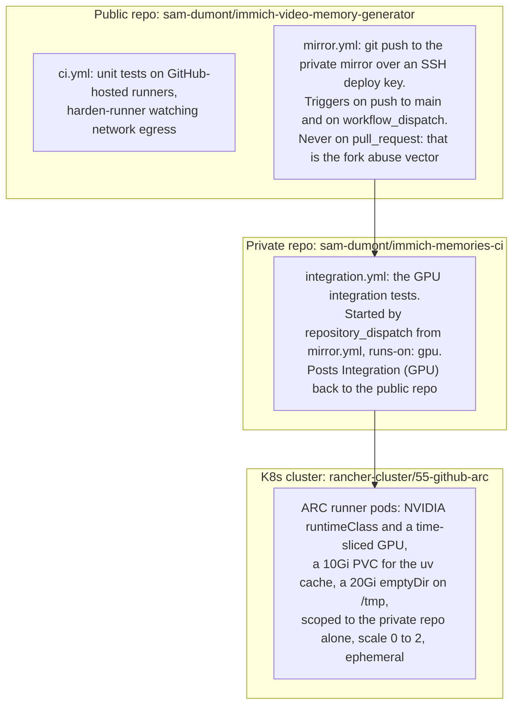

# GPU integration tests

## Why a private mirror?

Self-hosted runners (with GPU access) **cannot safely run on public repos**. Anyone can
fork the repo, submit a PR with a modified test file (crypto miner, data exfiltration),
and the runner would execute it. GitHub's own docs warn against this.

## Public repo, private mirror, cluster



## Security layers

| Layer | Protection |
|-------|-----------|
| No `pull_request` trigger | Fork PRs never reach GPU runner |
| `workflow_dispatch` only for branches | Only repo owner can trigger manually |
| `github.repository` guard | Extra check against fork execution |
| ARC scoped to private repo | Runner only accepts jobs from `immich-memories-ci` |
| Ephemeral pods | Each job gets a fresh container, no persistence |
| SSH deploy key (not PAT) | Narrowly scoped: write access to one repo only |
| `harden-runner` on public CI | Monitors network egress, detects supply chain attacks |

## Running GPU tests

**Automatic (post-merge):** Every push to `main` triggers integration tests automatically.

**Manual (pre-merge):** Test a specific branch before merging:
```bash
gh workflow run mirror.yml -f branch=feat/my-feature
```

**Direct (on private repo):**
```bash
gh workflow run integration.yml -R sam-dumont/immich-memories-ci -f suite=assembly
```

## Config

The runner gets `~/.immich-memories/config.yaml` from the `IMMICH_MEMORIES_CONFIG` secret
(base64-encoded). Paths are overridden via env vars (pydantic-settings):

- `IMMICH_MEMORIES_CACHE__DIRECTORY=/tmp/immich-cache`
- `IMMICH_MEMORIES_CACHE__DATABASE=/tmp/immich-cache/cache.db`
- `IMMICH_MEMORIES_OUTPUT__DIRECTORY=/tmp/immich-output`
- `UV_CACHE_DIR=/home/runner/.cache/uv` (PVC-backed, persistent)

## Updating config

When your local config changes:
```bash
base64 < ~/.immich-memories/runner-config.yaml | gh secret set IMMICH_MEMORIES_CONFIG -R sam-dumont/immich-memories-ci
```

Point that at a config written for the runner, not at your own. base64 is an encoding, not
encryption, and your working `config.yaml` holds your Immich API key, any provider keys, and host
paths under your home directory. Keep a separate file with the runner's Immich URL and key and
nothing else.
